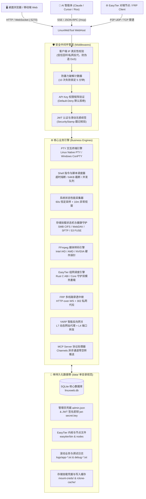
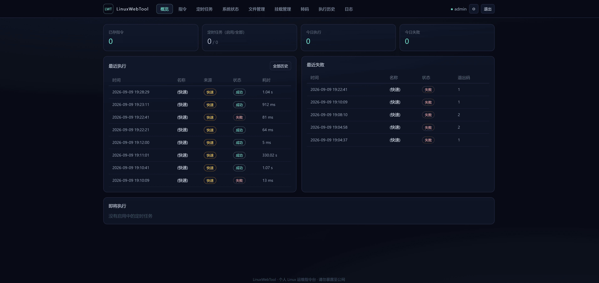
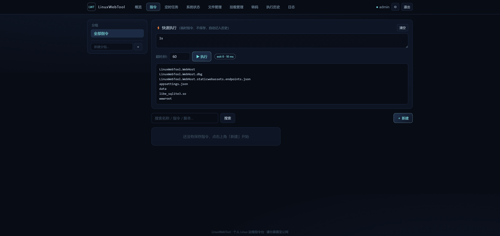
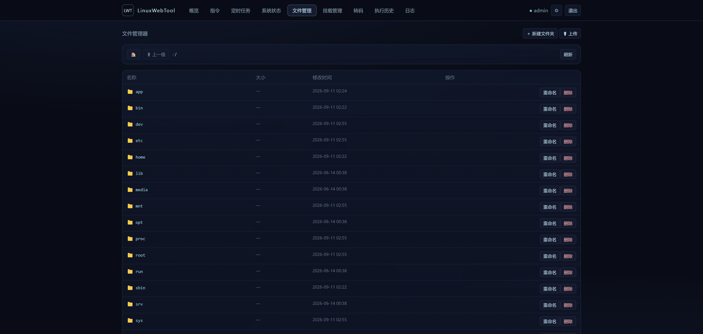
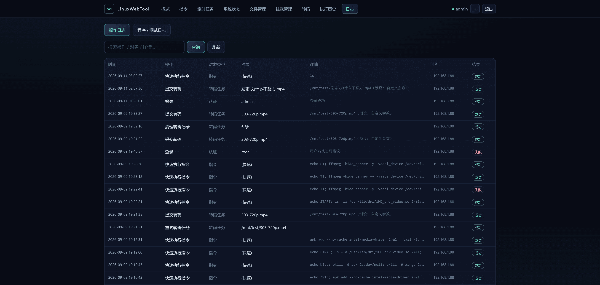
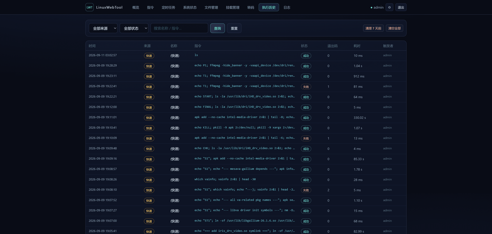
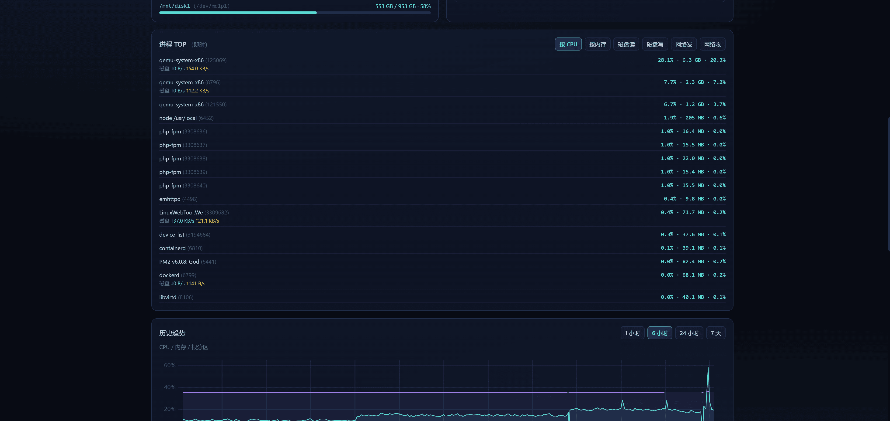
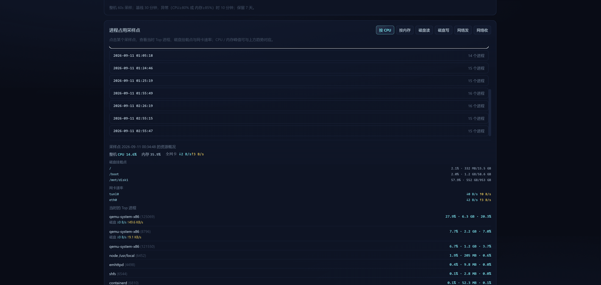
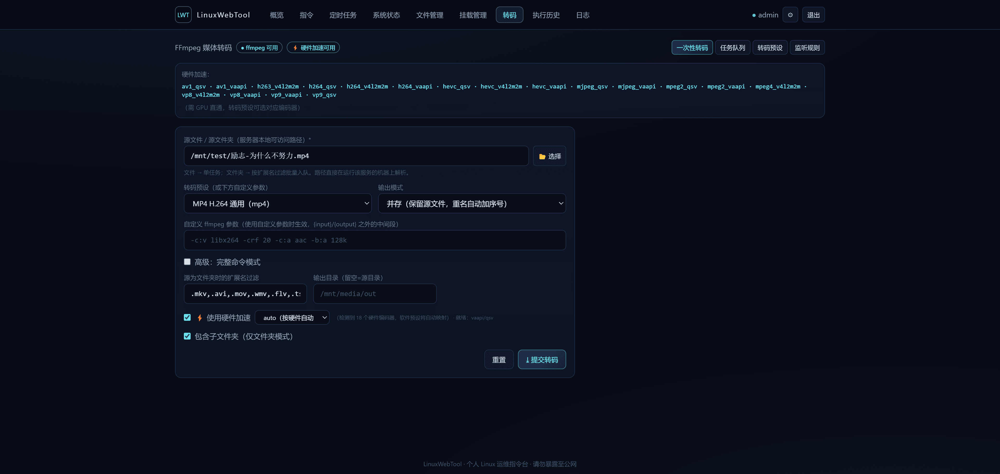
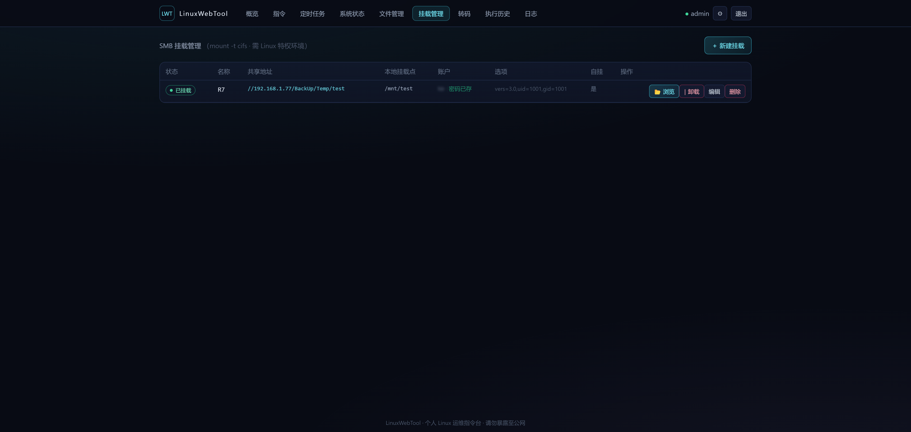

<div align="center">

# LinuxWebTool (LWT)

专为个人极客与私有家庭服务器打造的轻量级 Native AOT 全栈 Linux 运维控制台、P2P 虚拟局域网与智能网关。

<p>
  <a href="#对比优势">对比优势</a>
  •
  <a href="#核心特性">核心特性</a>
  •
  <a href="#系统架构">系统架构</a>
  •
  <a href="#效果预览">效果预览</a>
  •
  <a href="#快速部署">快速部署</a>
  •
  <a href="#高阶能力指南">高阶能力指南</a>
  •
  <a href="#安全体系与权限控制">安全体系</a>
  •
  <a href="#本地开发与架构门禁">架构门禁</a>
  •
  <a href="#关键配置">配置说明</a>
</p>

[](https://dotnet.microsoft.com/)
[](https://learn.microsoft.com/en-us/dotnet/core/deploying/native-aot/)
[](https://vuejs.org/)
[](LICENSE)
[](https://github.com/csvkse/LWT/releases)
[](https://github.com/csvkse/LWT/releases)
[](https://github.com/csvkse/LWT/stargazers)
[](https://github.com/csvkse/LWT/forks)

[在线架构设计规范](./docs/dev/architecture-gates.md) · [安全与权限审计报告](./docs/auth-and-permission-audit-report.md) · [权限治理实施方案](./docs/auth-and-permission-remediation-plan.md) · [JWT 无感续签规范](./docs/jwt-expiration-and-auto-renewal-plan.md)

</div>

---

## 项目简介

**LinuxWebTool (LWT)** 是一个专为 **超低资源占用、零外部运行时依赖、高安全可控与全场景运维** 设计的新一代轻量级私有云服务器管理平台。项目后端完全基于 **.NET 10 Native AOT（Ahead-Of-Time 提前编译）** 极致构建，前端采用 **零构建本地原生 Vue 3 ESM 单页系统**，兼具极致的毫秒级冷启动与超低内存消耗（冷启动基准内存仅约 **30~50 MB**）。

传统服务器面板（如宝塔、1Panel、Cockpit）常因依赖庞大的 Python/Go/Node.js 运行时或多进程容器，动辄占用数百兆内存，并伴随公网端口暴露、云端账号绑定、频繁联网上报等安全顾虑。LinuxWebTool 针对家庭 NAS（群晖/绿联/飞牛/极空间）、迷你主机（Intel N100 / AMD 迷你 PC）、云服务器及局域网 Linux 设备做了极致裁剪与原生能力整合：

- **自动化指令与交互终端**：沉淀常用指令/多行 Bash 脚本，支持 Cron 定时调度；内置集成 xterm.js，Linux 走原生 PTY、Windows 走 ConPTY，支持断线无感重连与后台会话托管。
- **系统全景资源观测**：CPU / 内存 / 磁盘分区 / 实时网速 / 进程 TOP 毫秒级刷新；后台 60 秒恒定采集入本地 SQLite，保留 7 天历史曲线，支持 Docker 穿透采集宿主机全部分区。
- **多协议全能存储挂载**：原生支持 `mount -t cifs` SMB 网络共享，以及通过 rclone / FUSE 挂载 WebDAV、SFTP 和 AWS S3 兼容对象存储，具备双重健康探测与断线自愈。
- **智能媒体转码中心**：集成 FFmpeg 视频/音频格式处理，内置 Intel VA-API、AMD Gallium、NVIDIA NVENC/CUDA 真实硬件加速探针与目录监听自动转码。
- **EasyTier 去中心化虚拟组网**：深度融合 Rust 原生驱动内核，支持 P2P UDP NAT 打洞直连、全互联拓扑与多实例管理；提供 Web 端内核一键云端拉取与本地双模热重载升级。
- **FRP 穿透与 YARP 智能网关**：内置 HTTP-over-WebSocket 多线路反向穿透隧道与 302 内网代拉；基于 YARP 构建 L7 网站即席代理与 L4 TCP/UDP 高性能端口转发。
- **AI 智能体原生生态 (MCP Server)**：原生集成 Model Context Protocol (MCP) 服务端，支持 SSE 下行管道与直接 JSON-RPC，让 Claude、Cursor、Roo Code 等 AI 智能体直接安全调用终端指令与服务器管理接口。
- **高等级安全与权限矩阵**：单管理员机制、随机盐哈希、SecurityStamp 改密即失效、JWT 无感滑动续签、API Key 细粒度权限矩阵（Default-Deny 默认拒绝）与防爆破 IP 锁定。

> ⚠️ **安全红线**：本工具具有执行系统 Shell 及宿主硬件交互的最高能力。**请务必优先部署在私有局域网、内网穿透加密隧道或仅绑定本机环回，切勿在未加设安全防护的情况下直接裸露在公网**。

---

## 目录

- [对比优势](#对比优势)
- [核心特性](#核心特性)
- [系统架构](#系统架构)
- [效果预览](#效果预览)
  - [首页与指令管理](#首页与指令管理)
  - [文件、日志与执行历史](#文件日志与执行历史)
  - [系统状态、转码与存储挂载](#系统状态转码与存储挂载)
- [快速部署](#快速部署)
  - [方式一：桌面端（自包含单文件，推荐开箱即用）](#方式一桌面端自包含单文件推荐开箱即用)
  - [方式二：Docker 容器（极客推荐，多硬件架构）](#方式二docker-容器极客推荐多硬件架构)
  - [方式三：Linux systemd 系统服务常驻](#方式三linux-systemd-系统服务常驻)
  - [方式四：源码克隆与本地开发调试](#方式四源码克隆与本地开发调试)
  - [单卷持久化设计（data/ 目录规范）](#单卷持久化设计data-目录规范)
- [高阶能力实战指南](#高阶能力实战指南)
  - [1. EasyTier 虚拟局域网与 P2P UDP 流量卸载](#1-easytier-虚拟局域网与-p2p-udp-流量卸载)
  - [2. YARP 智能网关与端口转发](#2-yarp-智能网关与端口转发)
  - [3. AI 智能体集成：MCP Server 连接配置](#3-ai-智能体集成mcp-server-连接配置)
  - [4. FFmpeg 硬件转码加速与 GPU 直通排查](#4-ffmpeg-硬件转码加速与-gpu-直通排查)
- [安全体系与权限控制](#安全体系与权限控制)
  - [凭据优先级体系](#凭据优先级体系)
  - [安全戳记与改密即刻失效机制](#安全戳记与改密即刻失效机制)
  - [API Key 细粒度权限矩阵 (Default-Deny)](#api-key-细粒度权限矩阵-default-deny)
  - [反代 IP 辨析与防暴力破解锁定](#反代-ip-辨析与防暴力破解锁定)
- [本地开发与架构门禁](#本地开发与架构门禁)
- [关键配置 (appsettings.json)](#关键配置-appsettingsjson)
- [常见问题 (FAQ)](#常见问题-faq)

---

## 对比优势

| 维度 | 传统自建面板 (宝塔 / 1Panel) | 官方控制台 (Cockpit) | SSH 终端 / 裸脚本工具 | LinuxWebTool (本项目) |
| :--- | :--- | :--- | :--- | :--- |
| **运行时依赖** | 强依赖外部 Python/Go 运行环境及 Docker | 依赖 PAM、Systemd 与发行版套件 | 依赖客户端本机 SSH 环境 | **Native AOT 零依赖**：单二进制文件自包含，无需装 .NET |
| **内存与资源占用** | 较大（通常常驻 150MB ~ 500MB+） | 中等（多守护进程模型 80MB ~ 200MB） | 0（按需启动连接） | **极致轻量**：基准冷启动仅需 **30MB ~ 50MB** 内存 |
| **离线内网适应度** | 差（初次登录常强绑手机/强制外网通信） | 较好（无强制联网） | 极佳 | **极佳**：前端内置 Vendor 零外部 CDN，**离线纯内网 100% 正常运行** |
| **交互式终端** | WebSSH 模拟，后台易断开 | 基础终端支持 | 纯客户端 CLI 窗口 | **原生 PTY/ConPTY 双模**：带后台缓冲托管、支持无感重新连接 |
| **存储挂载管理** | 通常仅支持基础本地磁盘分区 | 仅基础 LVM/NFS 分区挂载 | 需手写 `/etc/fstab` 与凭据挂载 | **全协议一体化**：SMB、WebDAV、SFTP、S3 FUSE 自动断线重连 |
| **内网组网与穿透** | 需额外装第三方穿透插件容器 | 不支持 | 需手动常驻部署 FRP/ZeroTier | **内置集成**：原生 EasyTier P2P 组网 + FRP 隧道 + YARP 智能网关 |
| **AI 智能体生态** | 无原生协议支持 | 无原生协议支持 | 依赖外部本地 CLI 工具代理 | **原生内置 MCP Server**：为 Claude / Cursor 赋能专属运维智能体 |
| **数据备份与迁移** | 分布在 `/www` 或各大系统目录，割裂 | 依赖系统配置文件迁移 | 散落的 dotfiles 脚本 | **单一数据卷 `data/`**：数据库、凭据、配置单目录打包即可平移 |
| **代码架构与可靠性**| 业务耦合重，无公开严格门禁体系 | 发行版维护周期较长 | 个人自用脚本缺乏自动化测试 | **24 项后端架构门禁 (LinuxArch001~024)** + 前端架构守卫 |

---

## 核心特性

| 功能模块 | 对应路由 / 入口 | 核心能力说明 |
| :--- | :--- | :--- |
| **常用指令控制台** | `/api/Commands`<br/>`/#/commands` | 保存 Linux 指令为一键功能；支持分组命名、拖拽置顶、参数模板、超时防护（默认 60s）、输出截断（64KB）与最大 4 并发队列。 |
| **交互式原生终端** | `/api/Terminal`<br/>`/#/terminal` | 基于 xterm.js 与 WebSocket。Linux 环境调用原生 PTY，Windows 调用 ConPTY；支持断网后台持续挂起运行、实时输出恢复与无感重连。 |
| **定时任务自动化** | `/api/Schedules`<br/>`/#/schedules` | 引用指令库 + Quartz.NET 引擎；支持 Unix 5 段与 Quartz 6 段 Cron 表达式无缝归一化，提供即席测试与下次执行时间预估。 |
| **系统状态全景图** | `/api/SystemStatus`<br/>`/#/status` | CPU / 内存 / 网卡实时吞吐 / 磁盘挂载 / 进程 TOP 10s 自动刷新；后台 60s 周期采样持久化，uPlot 渲染 7 天精细性能曲线。 |
| **多协议存储挂载** | `/api/SmbMounts`<br/>`/api/WebDavMounts`<br/>`/#/mounts` | Linux 原生 `mount -t cifs` SMB 共享，以及基于 rclone/FUSE 驱动的 WebDAV、SFTP 和 S3 存储挂载，带 600 权限凭据隔离与故障自愈。 |
| **FFmpeg 媒体转码**| `/api/Transcode`<br/>`/#/transcode` | 单文件或文件夹批量任务队列；内置 Intel iHD (VA-API/QSV)、AMD Gallium、NVIDIA NVENC 硬件探针；支持网络盘轮询与本地事件自动转码。 |
| **EasyTier 虚拟组网**| `/api/EasyTier`<br/>`/#/easytier` | 深度集成 Rust 驱动去中心化全互联 P2P 局域网；支持 Web 端内核云端一键升级与本地双模热重载，提供完整网络拓扑可视化与 UDP 打洞。 |
| **FRP 反向穿透隧道**| `/api/FrpTunnel`<br/>`/#/frp` | 基于 HTTP-over-WebSocket 的反向代理隧道；支持多线路智能轮询容灾、302 自动重定向代理与私网代拉，安全穿透内网服务。 |
| **家庭智能网关** | `/api/Gateway`<br/>`/#/gateway` | 基于高性能 YARP 引擎构建；支持 L7 网站即席代理、正则路由重写、访问白名单与安全阻断，以及 L4 高吞吐 TCP/UDP 端口转发。 |
| **AI MCP 服务端** | `GET /mcp/sse`<br/>`POST /mcp` | 原生兼容 Model Context Protocol 协议规范；采用 Channels 异步下行管道（零 CPU 空转），赋能 AI 智能体直接调用 LinuxWebTool。 |
| **细粒度 API Key** | `/api/ApiKeys`<br/>`/#/keys` | 针对第三方调用与 MCP 客户端提供权限矩阵控制；支持 Scopes 细分，纳秒级前缀格式拦截，实行 Default-Deny 默认拒绝原则。 |
| **安全认证与续签** | `/api/Auth`<br/>`/#/login` | 单管理员机制、随机盐哈希加密；安全戳记（SecurityStamp）改密即刻失效旧会话；JWT 无感滑动窗口自动续期；连续 10 次密码错误 IP 锁定。 |
| **执行审计与日志** | `/api/History`<br/>`/api/Logs`<br/>`/#/history` | 审计数据库记录完整指令调用流水；按天滚动程序运行日志（`app-*.txt`）与调试日志（`debug-*.txt`），支持 Web 前端动态 tail 实时查看。 |

---

## 系统架构

LinuxWebTool 采用严格的 **功能垂直切片（Feature Vertical Slices）与整洁架构分层**。运行时划分为核心安全中间件管道、领域执行引擎与统一的单数据卷存储层：



---

## 效果预览

### 1. 首页控制台与指令管理





### 2. 文件管理与调用审计历史







### 3. 系统状态全景、采样曲线、媒体转码与存储挂载









---

## 快速部署

### 方式一：桌面端（自包含单文件，推荐开箱即用）

从 [GitHub Releases](https://github.com/csvkse/LWT/releases) 下载对应平台的最新稳定版发布包（当前最新：**`v0.2.3`**）。全平台均采用 **.NET 10 Native AOT 自包含发布**，目标机**无需安装 .NET 运行时**，解压即可运行：

| 操作系统与架构 | 安装包文件名 | 运行方式 |
| :--- | :--- | :--- |
| **🐧 Linux x64** | `linuxwebtool-linux-x64.tar.gz` | `tar -xzf linuxwebtool-linux-x64.tar.gz && ./start.sh` |
| **🐧 Linux ARM64** | `linuxwebtool-linux-arm64.tar.gz` | `tar -xzf linuxwebtool-linux-arm64.tar.gz && ./start.sh` |
| **🪟 Windows x64** | `linuxwebtool-win-x64.zip` | 解压后直接双击运行 `start.bat`（或 `LinuxWebTool.WebHost.exe`） |

- **默认访问入口**：`http://localhost:5270/app/`（可通过启动参数 `--urls http://0.0.0.0:5270` 或环境变量 `ASPNETCORE_URLS` 调整监听网卡）。
- **管理员初始密码**：首次启动程序时，系统会自动生成随机强密码，回显在**终端启动日志**中，并安全落盘至 `data/admin.json`。
- **系统服务注册**：包内自带开箱即用的 `linuxwebtool.service` systemd 配置文件。
- **平滑升级方式**：下载新版压缩包直接解压覆盖程序文件，**仅需保留 `data/` 目录**，全量历史数据与配置丝毫无损。

---

### 方式二：Docker 容器（极客推荐，多硬件架构）

使用 GitHub Packages (GHCR) 预构建镜像，包含全平台与主流 GPU 加速支持。

```bash
# 1. 拉取最新镜像
docker pull ghcr.io/csvkse/lwt:latest

# 2. 极简基础运行（适合纯指令调度、系统观测与常规运维）
docker run -d --restart unless-stopped \
  -p 5270:5270 \
  -v linuxwebtool-data:/app/data \
  --name linuxwebtool \
  ghcr.io/csvkse/lwt:latest

# 查看首次生成的初始管理员密码：
docker exec linuxwebtool cat /app/data/admin.json
```

#### 镜像 Tag 选用说明（按需精简硬件驱动）：
- `latest`：**全能通用镜像**（默认），内置 Intel iHD、AMD 与 NVIDIA 基础运行库，体积相对完整。
- `latest-intel`：**推荐 Intel 核显（N100 / 11~14代 CPU）**，仅内置 Intel iHD 驱动，镜像体积精简 ~42MB。
- `latest-amd`：针对 AMD 锐龙 APU / 独立显卡优化，仅集成 Mesa VA-API 驱动层。
- `latest-nv`：针对 NVIDIA 独显加速，需配合 `--gpus all` 透传宿主驱动。

#### 全能特权模式（推荐家庭 NAS 宿主机）：
要在容器中同时运行 **EasyTier 虚拟网卡**、**SMB / WebDAV / S3 FUSE 存储挂载** 以及 **自动采集宿主机全部磁盘**，需赋予对应设备与命名空间能力：

```bash
docker run -d --restart unless-stopped \
  --name linuxwebtool \
  -p 5270:5270 \
  -v linuxwebtool-data:/app/data \
  --privileged --pid=host --user root \
  --device=/dev/net/tun --device=/dev/fuse --device=/dev/dri \
  ghcr.io/csvkse/lwt:latest
```

#### Docker Compose 生产推荐配置：

```yaml
services:
  linuxwebtool:
    image: ghcr.io/csvkse/lwt:latest # Intel N100 可替换为 ghcr.io/csvkse/lwt:latest-intel
    container_name: linuxwebtool
    restart: unless-stopped
    privileged: true               # 必需：授予 nsenter 跨命名空间磁盘采集与存储挂载权限
    pid: host                      # 必需：共享宿主机 PID 命名空间
    user: root                     # 必需：root 权限以操作底层驱动
    ports:
      - "5270:5270"
      - "11010:11010/udp"          # 推荐：映射 EasyTier P2P 打洞监听端口
    devices:
      - /dev/net/tun:/dev/net/tun  # 启用 EasyTier TUN 虚拟网卡
      - /dev/fuse:/dev/fuse        # 启用 WebDAV / SFTP / S3 FUSE 存储挂载
      - /dev/dri:/dev/dri          # 启用 Intel / AMD GPU 硬件转码加速
    volumes:
      - ./data:/app/data           # 单数据卷持久化（涵盖数据库、凭据、配置及组网内核）
      - /usr/local/bin:/usr/local/bin:ro # 可选：让容器可直接调用宿主机常用运维脚本
    environment:
      - Admin__UserName=admin
      - Admin__Password=你的强密码  # 若不配置则启动时自动生成
      - TZ=Asia/Shanghai
```

---

### 方式三：Linux systemd 系统服务常驻

适合以独立二进制运行在专属 Linux 服务器上的场景：

```bash
# 1. 创建程序目录并解压产物
sudo mkdir -p /opt/linuxwebtool
sudo tar -xzf linuxwebtool-linux-x64.tar.gz -C /opt/linuxwebtool

# 2. 复制并启用服务文件
sudo cp /opt/linuxwebtool/linuxwebtool.service /etc/systemd/system/
sudo systemctl daemon-reload
sudo systemctl enable --now linuxwebtool

# 3. 检查运行状态与启动密码
sudo systemctl status linuxwebtool
sudo journalctl -u linuxwebtool -n 30 --no-pager
```

---

### 方式四：源码克隆与本地开发调试

要求本地安装 [.NET 10 SDK](https://dotnet.microsoft.com/download/dotnet/10.0) 与 Node.js 20+：

```powershell
# 1. 克隆代码仓库
git clone https://github.com/csvkse/LWT.git
cd LWT

# 2. 编译并启动服务
dotnet build LinuxWebTool.slnx
dotnet run --project src/LinuxWebTool.WebHost

# 3. 浏览器打开开发界面
# http://localhost:5270/app/
```

---

### 单卷持久化设计（data/ 目录规范）

LinuxWebTool 遵循**严格的单一数据根目录规范**。无论运行方式如何，所有需要落盘的动态资产均完全聚合在 `data/` 目录（容器内为 `/app/data`）：

```
data/
├── linuxweb.db           # SQLite 核心数据库（指令、历史、定时计划、网关、组网节点元数据）
├── admin.json            # 管理员凭据持久化（用户名、随机哈希与 SecurityStamp 安全戳记）
├── jwt-secret.key        # HS256 JWT 自动生成的 64 字节密钥（确保重启后 Token 有效）
├── easytier/
│   ├── bin/              # EasyTier 原生内核（支持在线一键升级与本地上传，持久化不丢失）
│   ├── nodes/            # 节点运行时配置（*.toml，由系统自动生成和热载入）
│   └── staging/          # 云端拉取升级包临时缓冲区
├── mount-creds/          # SMB 网络挂载凭据（600 权限存储，密码不进命令行）
├── rclone-cache/         # WebDAV/SFTP/S3 FUSE 挂载写入缓冲与运行状态
└── logs/                 # 系统按天滚动应用日志 (app-*.txt) 与动态调试日志 (debug-*.txt)
```

> 💡 **单卷迁移优势**：备份或迁移机器时，**只需完整打包这一个 `data/` 目录**。在新机器上恢复挂载后启动，管理员账号、所有历史数据、EasyTier 内核和网关路由将 100% 完整复原，无需任何额外环境初始化！

---

## 高阶能力实战指南

### 1. EasyTier 虚拟局域网与 P2P UDP 流量卸载

LinuxWebTool 原生集成了高性能的 **EasyTier P2P 去中心化组网内核**：
- **零环境依赖升级**：Web 界面提供【⚙️ 内核管理】，支持直接从 GitHub 官方仓库一键云端自动拉取并部署对应架构内核（内置国内加速中继），或直接上传二进制文件，热更新过程不中断已有系统服务。
- **P2P 真直连优化**：建议在创建节点时开启本地 UDP 监听端口（如 `udp://0.0.0.0:11010` 与 IPv6 `udp://[::]:11010`）。两端节点在通过公共中继服务器握手完成后，流量将自动协商穿透为端到端 UDP 点对点直连，极大降低中转服务器带宽开销，实现内网级高速互访。

### 2. YARP 智能网关与端口转发

基于微软生产级反向代理引擎 **YARP (Yet Another Reverse Proxy)** 构建：
- **L7 网站反向代理**：轻松为内网群晖、Alist、路由器后台配置即席代理路由，支持按前缀匹配、路径重写（PathRewrite）与访问白名单。
- **L4 高性能端口转发**：内置 TCP / UDP 四层流式转发引擎，支持将边缘主机的特定端口直接穿透映射至内网数据库、SSH 或专属游戏服务。

### 3. AI 智能体集成：MCP Server 连接配置

LinuxWebTool 原生实现了 **Model Context Protocol (MCP)** 规范，可通过 SSE（Server-Sent Events）与 Streamable HTTP 协议让 AI 智能体直接安全操作 LinuxWebTool 平台：

#### 1) 在管理界面生成 API Key：
进入【系统设置】→【API 密钥管理】，新建一个 Key 并确保勾选 **`MCP 访问`** 权限（例如得到 `lwt_live_xxxxxxxxxxxxxxxxxxxxxxxxxxxxxxxx`）。

#### 2) 配置 Claude Desktop / Cursor：
在 Claude Desktop 配置文件（`claude_desktop_config.json`）中添加：

```json
{
  "mcpServers": {
    "linux-web-tool": {
      "url": "http://127.0.0.1:5270/mcp/sse",
      "headers": {
        "X-Api-Key": "lwt_live_xxxxxxxxxxxxxxxxxxxxxxxxxxxxxxxx"
      }
    }
  }
}
```

连接成功后，AI 即可直接调用以下内置工具：
- `terminal_execute_command`：在受控会话中执行特定 Linux 指令并即时获取回显；
- `file_read_text` / `file_write_text`：读取与修改服务器文件内容；
- `system_get_status`：实时洞察当前主机 CPU、内存、负载与磁盘用量；
- `gateway_list_routes` / `schedule_list`：查询和触发网关与自动化任务。

### 4. FFmpeg 硬件转码加速与 GPU 直通排查

转码中心集成多级硬件探测器，在提交任务或启动时动态侦测 GPU 编解码支持状态：
- **Intel 核显**：要求宿主机加载 `/dev/dri`，镜像内预置 `libva` 与 `intel-media-driver (iHD)`。转码状态指示灯显示绿色即代表 VAAPI / QSV 硬件流水线就绪。
- **AMD 核显/独显**：要求映射 `/dev/dri`，系统自动加载 `mesa-va-gallium` 驱动层。
- **NVIDIA 独显**：宿主机安装 `nvidia-container-toolkit` 后，通过 `--gpus all` 注入驱动。

---

## 安全体系与权限控制

### 凭据优先级体系
为兼顾开箱即用与自动化部署，管理员凭据按以下严格优先级加载：
1. **显式环境变量**：`Admin__UserName` 与 `Admin__Password`（最高优先级，每次启动覆盖本地文件）；
2. **配置文件**：`appsettings.json` 中的 `Admin:Password`；
3. **持久化文件**：`data/admin.json`（记录最后一次生效的凭据）；
4. **随机初次生成**：首次启动随机生成并在控制台回显。

### 安全戳记与改密即刻失效机制
- 每次用户通过 Web 端修改密码或变更用户名，系统会自动刷新管理员专用的 **`SecurityStamp`（独立 GUID 安全戳记）**。
- 系统在每次验证 JWT 或建立 WebSocket 终端握手时均实时核验安全戳记一致性。一旦改密，**旧 Token 及其衍生的所有连接与终端会话立即失效被断开**，杜绝历史 Token 泄露隐患。
- 内置 **JWT 滑动窗口无感续期**：当活跃用户的 Token 剩余生命期小于阈值（默认 72 小时）时，系统自动在响应头回发新 Token 并平滑置换，无需频繁强制登出。

### API Key 细粒度权限矩阵 (Default-Deny)
- 采用 **Default-Deny 默认拒绝原则**：未在权限模型中显式放行的接口一律严禁 API Key 访问；
- 敏感管理模块（如 `/api/Auth` 改密、`/api/ApiKeys` 密钥增删、`/api/FrpTunnel` 穿透配置、`/api/EasyTier` 虚拟网卡、`DELETE /api/History` 清空审计记录）被**硬编码严格禁止** API Key 调用；
- 针对非法格式与长度的 Key 进行 **纳秒级内存预检**，不触发哈希计算与数据库查询，防范缓存穿透攻击。

### 反代 IP 辨析与防暴力破解锁定
- 仅当底层网络直连来源于**本机环回（127.0.0.1 / ::1）或受信任的私网反向代理（RFC 1918 / ULA）** 时，系统才信任 `X-Real-IP` 反代头；公网不可信直连客户端强制使用底层 TCP 真实地址，防止伪造 IP 实施恶意封禁攻击；
- 针对单一 IP 累计密码错误达到 10 次，系统自动施加 5 分钟锁定，返回 `429 Too Many Requests`；失败计数具备 10 分钟平滑滑动保留期，多 IP 交叉试探无法冲刷计数。

---

## 本地开发与架构门禁

本项目建立了全方位的**架构防御体系与自动化质量门禁**。提交代码前运行以下脚本执行快速门禁验证：

```powershell
# 执行全量自动化质量门禁（必须全绿通过）
./scripts/verify-fast.ps1
```

门禁执行内容涵盖：
1. **编译与 Native AOT 静态分析**：断言 0 警告、0 错误，严格禁止无源生成上下文的反射 JSON 序列化；
2. **后端架构守卫测试 (`LinuxWebTool.ArchitectureTests`)**：
   - `LinuxArch001`：Contracts 严格零外部依赖、仅纯 BCL；
   - `LinuxArch002 / 004`：严格验证单向依赖方向，下层严禁反向引用上层；
   - `LinuxArch005`：控制器严禁直接触碰数据库 ORM，必须经由 Store 仓储层；
   - `LinuxArch007`：代码命名空间必须与物理文件路径 100% 保持一致；
   - `LinuxArch008 / 010`：AOT 关键出参必须为显式强类型 DTO，严禁匿名对象；
   - `LinuxArch013 / 014`：SQLite GUID 比较必须声明 `COLLATE NOCASE`，防止大小写错配；
   - `LinuxArch022`：关键 HostedService 依赖注入双重注册守卫；
   - `LinuxArch023`：物理目录规范白名单守卫（禁止根目录平铺业务代码）；
   - **`LinuxArch024`**：**所有控制器必须在 ApiKeyMiddleware 中显式声明权限归属，杜绝隐式漏控**；
3. **API 集成测试 (`LinuxWebTool.IntegrationTests`)**：覆盖真实 SQLite 数据库、WebSocket 终端连接与权限隔离；
4. **前端架构门禁与 ESLint**：约束 API 路径收敛、禁止未受控 fetch、规范模板事件绑定。

详细门禁清单参见 [后端架构门禁规范文档](./docs/dev/architecture-gates.md)。

---

## 关键配置 (appsettings.json)

| 配置键名 | 默认值 | 对应环境变量 | 说明 |
| :--- | :--- | :--- | :--- |
| `Urls` | `http://localhost:5270` | `ASPNETCORE_URLS` | 监听端口与地址（容器内已锁定为 `0.0.0.0:5270`） |
| `Data:Directory` | `data` | `Data__Directory` | 单持久化数据根目录（相对路径锚定应用执行根） |
| `Jwt:ExpireHours` | `168` (7天) | `Jwt__ExpireHours` | JWT Token 默认有效期时长（小时） |
| `Jwt:RefreshThresholdHours`| `72` (3天) | `Jwt__RefreshThresholdHours` | 触发滑动无感续签的剩余时长阈值（小时） |
| `Jwt:EnableAutoRenewal` | `true` | `Jwt__EnableAutoRenewal` | 是否开启滑动窗口无感自动续期 |
| `Shell:DefaultTimeoutSeconds` | `60` | `Shell__DefaultTimeoutSeconds` | 指令单次执行默认超时中断秒数 |
| `Shell:MaxOutputBytes` | `65536` (64KB) | `Shell__MaxOutputBytes` | 指令标准输出 stdout/stderr 单次截断上限 |
| `Shell:MaxConcurrent` | `4` | `Shell__MaxConcurrent` | 允许并发执行指令的最大队列深度 |
| `Terminal:MaxSessions` | `16` | `Terminal__MaxSessions` | 允许同时并存的终端会话最大数量 |
| `Terminal:BufferBytes` | `1048576` (1MB)| `Terminal__BufferBytes` | 单个终端会话后台环形历史输出缓冲区容量 |
| `Terminal:UnusedGraceSeconds` | `120` | `Terminal__UnusedGraceSeconds` | 空闲且无输入的断线终端会话自动清理宽限期 |
| `FileLog:Directory` | `logs` | `FileLog__Directory` | 日志相对存储子目录（锚定在 `data/` 下） |
| `Retention:ExecutionHistoryDays` | `90` | `Retention__ExecutionHistoryDays`| 指令执行历史记录最大保留天数 |
| `Retention:OperationLogDays` | `180` | `Retention__OperationLogDays` | 用户操作行为审计日志最大保留天数 |

---

## 常见问题 (FAQ)

<details>
<summary><b>Q1: 忘记了管理员初始密码，该如何找回或重置？</b></summary>
<br/>

重置管理员密码非常简单，有两种方式：
1. **方式一（环境变量覆盖）**：停止程序，设置环境变量 `Admin__Password=你的新密码` 并重启程序。系统启动时会优先检测环境变量并自动覆盖原密码；
2. **方式二（重新生成）**：停止程序，进入 `data/` 目录删除 `admin.json` 文件并重新启动。系统将自动生成新密码并输出在控制台启动日志中。
</details>

<details>
<summary><b>Q2: 为什么在 Docker 中运行 EasyTier 时无法创建 TUN 网卡？</b></summary>
<br/>

创建 Linux TUN 虚拟网络设备属于内核级网络操作。Docker 容器默认处于未提权沙箱状态，无法直接操作底层设备。
请在运行命令中补充 `--cap-add=NET_ADMIN --device=/dev/net/tun`（或直接使用 `--privileged --user root`），确保宿主机已加载 `tun` 内核模块（可先在宿主机执行 `lsmod | grep tun` 确认）。
</details>

<details>
<summary><b>Q3: Windows 环境下运行终端为什么偶发出现 SmartScreen 或提示无法创建终端？</b></summary>
<br/>

- **SmartScreen 提示**：由于 Release 产物为原生 Native AOT 编译的独立 exe 且未购买昂贵的商业代码签名证书，Windows 会提示未知发布者，点击「更多信息」→「仍要运行」即可；
- **终端要求**：Windows 原生 ConPTY 引擎依赖 **Windows 10 1809 (Build 17763) 或更高版本**（包括 Windows 11 与 Windows Server 2019+）。在极低版本 Windows 上系统会自动降级为管道模式。
</details>

<details>
<summary><b>Q4: SMB 网络挂载提示 EPERM (Operation not permitted) 是什么原因？</b></summary>
<br/>

在 Linux 体系中执行 `mount -t cifs` 挂载远程文件系统属于特权操作。若在 Docker 容器内使用 SMB 挂载，容器必须以 `--privileged --user root` 模式启动，否则 Linux 内核会直接阻断挂载系统调用。
</details>

<details>
<summary><b>Q5: 如何将 LinuxWebTool 部署到公网访问？</b></summary>
<br/>

本工具内置了极高的执行权限，**绝不建议直接将 5270 端口直接映射至公网**。推荐的访问路径为：
1. 使用工具内置的 **EasyTier 虚拟组网**，通过虚拟 IP 点对点私有直连；
2. 配合 **ProxyByCF** 或 Cloudflare Tunnel 建立受访问控制策略保护的加密隧道；
3. 通过自建 WireGuard / Tailscale 接入家庭内网访问。
</details>

---

## 许可证 (License)

本项目采用 [MIT 许可证](LICENSE) 开源。欢迎提交 Issue 与 Pull Request 共同建设！
