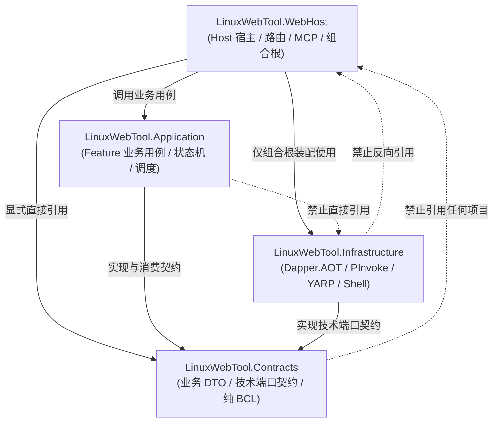
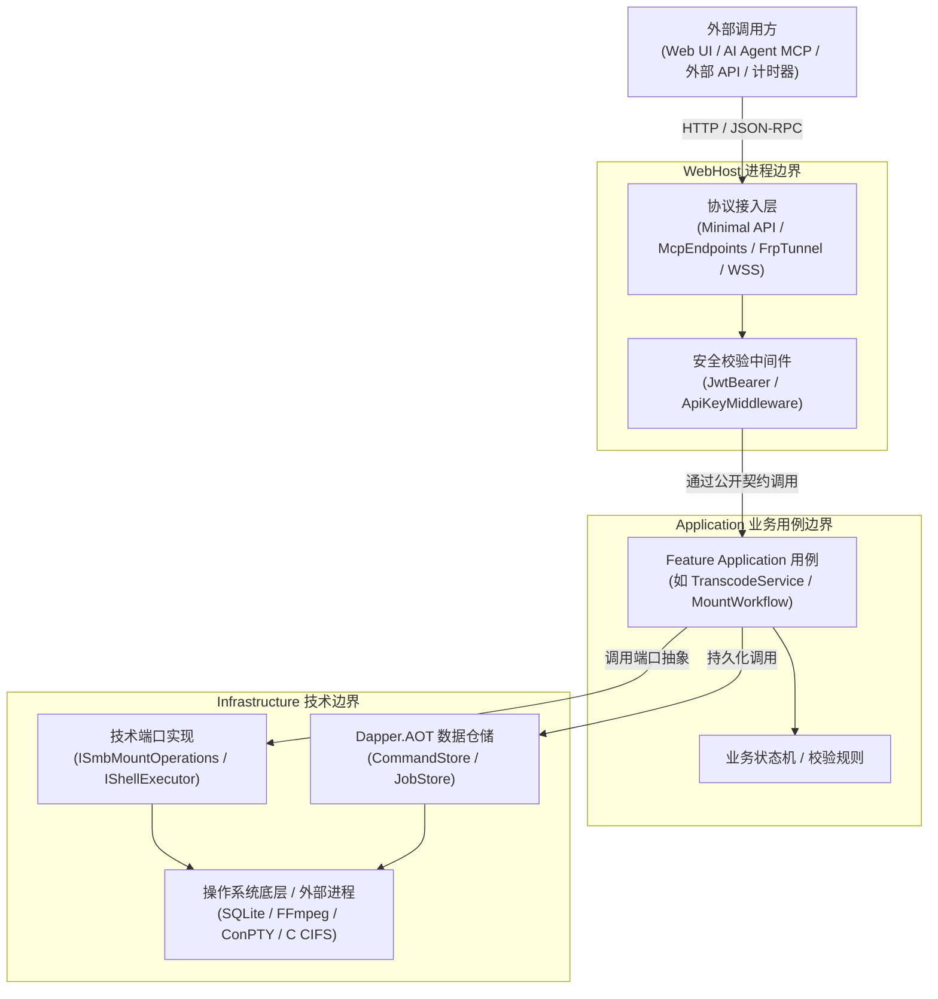
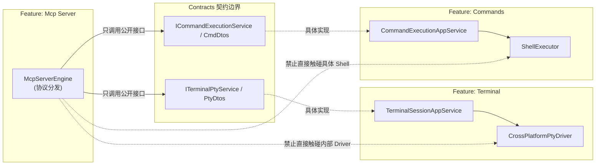
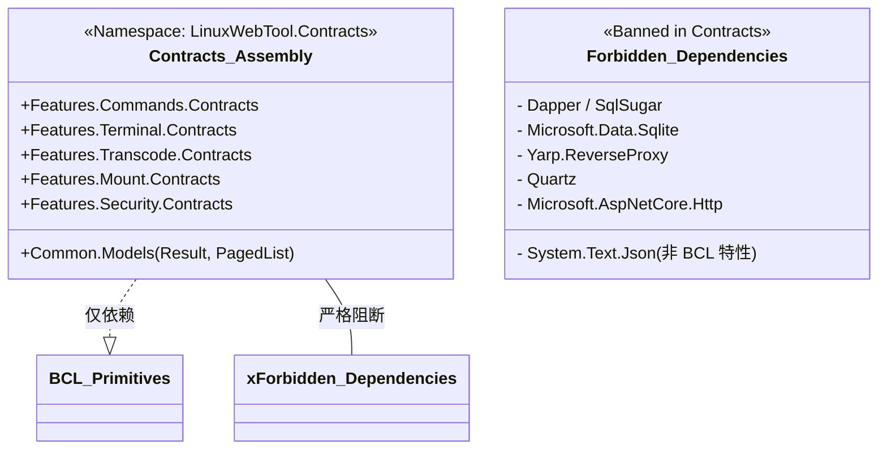
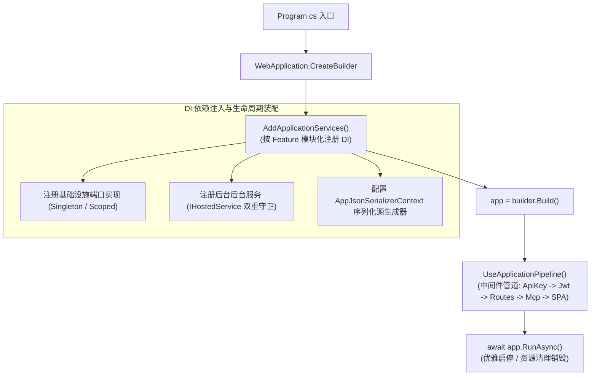

# LinuxWebTool 架构现状深度调研与架构优化方案

> **参考基准**：
> - 外部权威规范：`SoftwareArchitecture/backend` 通用轻量模块化核心规范（Core `1.2.0`）与 `governance/gates.md`（Governance `1.1.0`）。
> - 目标参考范式：`InfiniWeb`（Web API 模块化单体演进范式）与 `AITool`（面向跨端/插件/Native AOT 的轻量分层规范）。
> - 本项目物理特性：**LinuxWebTool**（基于 .NET 10 Native AOT 的跨平台 Linux/Windows 主机运维与智能管理平台，单文件单二进制交付，内置嵌入式 Vue 3 SPA 前端）。

---

## 1. 架构调研与现状事实诊断

### 1.1 现状物理拓扑与代码分布事实

经过对当前代码库 170 个 C# 生产源文件及 19 个测试源文件的全面扫描，当前物理拓扑由 `LinuxWebTool.slnx` 纳管，呈现典型的三层结构：

```text
LinuxWebTool.slnx
├── src/
│   ├── LinuxWebTool.Contracts       (17 个源文件，占比 10.0%)
│   ├── LinuxWebTool.Infrastructure  (115 个源文件，占比 67.6% - 绝对上帝程序集)
│   └── LinuxWebTool.WebHost         (38 个源文件，占比 22.4%)
└── tests/
    ├── LinuxWebTool.ArchitectureTests (10 个文件，120 项测试)
    └── LinuxWebTool.IntegrationTests  (9 个文件，57 项测试)
```

从代码量与职责分布看，当前架构存在极其严重的失衡与职责倒错。

### 1.2 六大核心架构痛点与违规审计

#### 痛点 1：`LinuxWebTool.Infrastructure` 膨胀为“上帝程序集（God Assembly）”
`Infrastructure` 聚集了 115 个源文件（占生产源码的 67.6%），它不仅承担数据库访问（Dapper.AOT、SQLite DDL）与底层操作系统适配（P/Invoke、Shell、PTY 驱动），更**吞噬了全部 13 个业务子域的核心业务用例与领域逻辑**：
- `SmbMountService`、`WebDavMountService`、`MountStateMachineService`（挂载状态机与健康恢复用例）；
- `TranscodeQueueService`、`WatchFolderService`（视频转码队列调度与文件夹监听规则引擎）；
- `EasyTierNodeManager`、`EasyTierHostSupervisor`（P2P 虚拟网卡节点状态生命周期编排）；
- `FrpTunnelManager`、`FrpTunnelEngine`（反向穿透会话协调与长连接协议重放）；
- `ApiKeyService`、`AdminCredentialService`（权限矩阵判定、哈希比对与安全审计）。

在经典架构与模块化 DDD 规范中，**业务用例与业务状态机必须属于 Feature.Application，基础设施层仅负责外部 I/O 驱动与技术端口实现**。当前结构导致技术适配代码与核心业务规则深度交织。

#### 痛点 2：`LinuxWebTool.WebHost` 控制器直接穿透，呈现“肥胖控制层（Fat Controllers）”
`WebHost` 的 `Routes/` 包含 15 个控制器（如 `TranscodeController` 630 行、`CommandsController` 280 行）。这些控制器：
- 未通过任何抽象业务用例层，而是**直接把 `*Store`（持久化仓储）与具体后台服务实例成批注入到控制器构造函数中**；
- 在 Action 内部充斥着大量复杂的业务验证、文件路径逻辑判断、实体构建、状态更新与批量任务拆分逻辑；
- 当新增协议入口（如第 2 节的 MCP 协议）时，无法复用控制器内的逻辑，导致重复开发或进一步向控制器反向借调。

#### 痛点 3：`LinuxWebTool.Contracts` 呈现“扁平大杂烩（Flat Bucket）”
`Contracts` 目前仅粗糙划分为 `Interfaces/` 与 `Models/`，所有 13 个子域的模型全混合在两个目录下：
- 缺乏垂直模块所有权边界（例如 `FrpTunnelModels.cs`、`ApiKeyModels.cs`、`TranscodeModels.cs`、`MountHealthModels.cs` 散落平铺）；
- 跨模块消费者无法按需依赖特定模块的契约，违背了“高内聚、契约按模块隔离”的原则。

#### 痛点 4：缺乏 Feature 间隔离屏障，模块间处于“裸奔调用”状态
当前 13 个功能子模块在 `Infrastructure` 内部处于同一程序集下，且未建立任何命名空间或访问权限拦截门禁：
- 例如 `Transcode` 可以任意直接调用 `Mount` 或 `Persistence` 的内部实现细节；
- 模块间协作没有通过明确的 `Feature.Contracts` 接口，形成了潜在的强耦合网状结构。

#### 痛点 5：隐式依赖传递，违背“直接引用显式化”原则
通过对 `src/LinuxWebTool.WebHost/LinuxWebTool.WebHost.csproj` 的审查发现：
```xml
<ItemGroup>
  <ProjectReference Include="..\LinuxWebTool.Infrastructure\LinuxWebTool.Infrastructure.csproj" />
</ItemGroup>
```
`WebHost` 消耗了 `Contracts` 中几乎所有的 DTO 与接口，但其项目文件**完全没有声明对 `LinuxWebTool.Contracts` 的直接引用**，而是完全依赖 `Infrastructure` 的隐式传递。这严重违背了架构治理基线中关于“生产项目禁止利用隐式依赖偷渡类型”的强制要求。

#### 痛点 6：门禁体系初级，缺乏语义分析与统一诊断
现有 18 项架构门禁（`LinuxArch001~018`）虽然在保障分层和 SQLite 大小写比对上起到积极作用，但存在明显缺陷：
- 检查逻辑多依赖手工粗粒度正则表达式（如 `Regex.IsMatch(file, @"\bSqlSugar\b")`，而项目早已全量切至 Dapper.AOT，旧规则未与时俱进）；
- 缺乏基于 Roslyn C# 语法树与语义模型的深度代码级防御；
- 缺少统一的诊断数据结构（Rule ID、级别、行号定位、违规符号、建议修复）；
- **缺少后端精确基线（Baseline）管理体系**：目前仅前端有 JSON 基线，后端一旦有既有违规只能就地修改测试断言或整体跳过，无法实现“锁定存量、阻断增量、逐步消除”的工程化治理。

---

## 2. 目标架构定位与物理架构方案选型

### 2.1 目标架构定位
**面向 Native AOT 单二进制交付的轻量模块化单体架构 (AOT-Friendly Lightweight Modular Monolith)**。
- 遵循通用轻量后端规范：严格分离 `Contracts`、`Shared`、`Features`、`Infrastructure`、`Hosts / Composition`；
- 保持极致 Native AOT 特性：零动态反射、单文件（Single File）Linux/Windows 二进制直接启动、内存轻量（<30MB）、启动毫秒级（<100ms）。

### 2.2 物理架构方案对比与权衡

为了解决当前的“上帝 Infrastructure”与“肥胖 WebHost”，在 .NET 10 Native AOT 约束下，我们评估了三种演进路径：

| 评估维度 | 方案 A：微单体多程序集方案 (Multi-Assembly) | 方案 B：纯单程序集目录隔离方案 (Single-Assembly + Roslyn) | 方案 C：轻量 4 层分层 + 垂直 Feature 切片 (推荐方案) |
|---|---|---|---|
| **物理结构** | 拆分为 15+ 个 `.csproj`（每个 Feature 独立拆分 Contracts/App/Infra） | 维持现有 3 个项目，仅在各项目内部推行 `Features/*` 目录 | 规范化为 **4 个核心生产项目**：Contracts, Application, Infrastructure, WebHost |
| **隔离强度** | 编译器物理隔离（最强） | 纯靠 Roslyn 静态测试门禁 | 物理层级单向依赖 + 模块内部 Roslyn 门禁双重守卫 |
| **Native AOT 友好度** | ⚠️ 较差：多程序集增加 AOT 依赖图遍历开销、修剪根分析复杂、编译速度明显变慢 | 极高：编译器整体优化容易，但源码组织仍易腐化 | **极高**：4 个程序集对 AOT 编译器极度友好，各层职责天然契合 trimming |
| **Native C 库与打包** | ⚠️ 复杂：liblinuxwebtool_pty.so 等编译目标跨项目搬运容易出错 | 简单，但代码混杂 | **优秀**：Native C 代码与 Bash 脚本完整收敛在 `Infrastructure` |
| **开发与维护心智** | 繁重：增加一个简单字段需跨 3-4 个项目引用和改动 | 较轻，但缺乏物理抓手 | **平衡适中**：用例逻辑集中在 Application，I/O 集中在 Infra，心智极佳 |

### 2.3 选定方案：方案 C（轻量 4 层分层 + 垂直 Feature 切片）

根据项目的实际规模（单机宿主运维工具）与极致发布性能目标，**方案 C 为最优架构演进路径**：

1. **`LinuxWebTool.Contracts`（纯净契约层）**：
   - 依赖：仅 .NET 基础类库（BCL），零第三方 NuGet 依赖；
   - 组织：按业务子域目录化拆解（`Features/<Feature>/...`）。
2. **`LinuxWebTool.Application`（核心业务用例层 - 新增独立程序集）**：
   - 依赖：引用 `Contracts`；纯业务逻辑与领域编排，禁止引用具体数据库驱动与 Web 框架；
   - 承载：转码队列调度逻辑、SMB 状态机、EasyTier 节点管理、APIKey 鉴权决断器、MCP 核心业务分发等。
3. **`LinuxWebTool.Infrastructure`（技术基础设施层 - 瘦身回归纯粹）**：
   - 依赖：引用 `Contracts`；承载纯技术适配；
   - 承载：Dapper.AOT Store 实现、SQLite 连接与 DDL、CrossPlatformPty 原生调用、C 共享库编译、YARP 配置提供器、文件流底层处理。
4. **`LinuxWebTool.WebHost`（Host 宿主与组合根 - 精简适配）**：
   - 依赖：显式引用 `Contracts`、`Application`、`Infrastructure`；
   - 承载：Program 入口、Minimal API 路由分发（`Routes/`）、MCP 协议端点（`Endpoints/`）、DI 依赖注入装配（`Composition/`）、`AppJsonSerializerContext` 序列化源生成上下文、嵌入式前端 SPA 资源。

---

## 3. 五大核心架构视图设计

参考 `SoftwareArchitecture/backend` 的规范化表达，定义本项目的 5 大完整架构视图：

### 3.1 视图 1：静态项目与编译引用视图 (Static Project Reference View)

该视图严格规范项目在编译时所允许建立的直接 `ProjectReference`，禁止隐式依赖，更严禁反向越界。



**直接引用矩阵规则**：
- `Contracts`：禁止引用任何项目，禁止引用除 BCL 之外的任何第三方包；
- `Application`：只能引用 `Contracts`，绝对禁止直接依赖 `Infrastructure` 和 `WebHost`；
- `Infrastructure`：只能引用 `Contracts`，绝对禁止引用 `Application` 和 `WebHost`；
- `WebHost`：直接显式引用 `Contracts`、`Application`、`Infrastructure`。

---

### 3.2 视图 2：运行时调用与时序视图 (Runtime Call View)

系统在运行时的实际请求流转与消息时序遵循标准的中介与分发模式：



**典型调用时序对比**：
- **旧模式**：Client → Controller → `TranscodeJobStore`（数据库）+ `Process.Start`（直接操作进程）。
- **优化后模式**：Client → Controller / McpEndpoint → `ITranscodeUseCase`（参数校验、状态流转）→ `ITranscodeQueuePort`（底层调度）→ `ITranscodeJobStore`（Dapper.AOT 持久化）。

---

### 3.3 视图 3：功能协作与实现隔离视图 (Feature Collaboration & Isolation View)

当一个业务功能需要与另一个业务功能协作时（例如：定时任务 `Schedule` 触发执行指令 `Commands`；或者 `Mcp` 触发终端 `Terminal`），**禁止跨模块直接穿透私有实现**，必须严格遵循契约协作：



---

### 3.4 视图 4：契约类型依赖视图 (Contract Type Dependency View)

契约层是全工程的稳定核心，其类型依赖闭包必须保证极度纯净：



**闭包纯净度规则**：
1. 契约中所有的参数模型、返回值模型只能包含 C# 原生基础类型（`string`, `int`, `Guid`, `DateTime`, `record`, `enum` 等）或契约内定义的纯 DTO；
2. 严禁暴露数据库模型（如包含表主键特性、映射关系的 Entity）；
3. 严禁暴露传输层特定上下文（如 `HttpContext`, `HttpRequest`）。

---

### 3.5 视图 5：组合根与装配生命周期视图 (Composition & Lifecycle View)

`LinuxWebTool.WebHost` 作为唯一的组合根（Composition Root），负责在程序启动与关闭生命周期内完成统一装配：



**关键装配纪律（沉淀自既往故障教训）**：
- **`IHostedService` 双重注册守卫**：后台服务如果同时被其他单例服务依赖（例如 `TranscodeQueueService`），必须显式 `AddSingleton<T>()` 再 `AddHostedService(sp => sp.GetRequiredService<T>())`，坚决杜绝只注册 `IHostedService` 导致的运行时解析崩溃；
- **SQLite 实例隔离**：配置 `IsAutoCloseConnection=false` 与写锁忙等超时（30s），保障并发后台采样与定时任务读写互不干扰；
- **源生成器完备注册**：所有在 Minimal API 或 MCP 中用到的 DTO 必须声明在 `AppJsonSerializerContext` 中，杜绝 Native AOT 运行时序列化抛出 `InvalidOperationException`。

---

## 4. 标准物理目录树与命名空间规范

为了消除“命名空间与物理路径不一致”的隐患，并在单工程内部建立清晰的职责边界，推行统一的 **Feature-First** 目录划分标准：

### 4.1 目录组织标准
在各程序集内部统一遵循：
```text
src/<ProjectName>/Features/<FeatureName>/<Responsibility>/<FileName>.cs
```

允许的标准职责子目录（`Responsibility`）清单：
| 职责目录 | 允许放置内容 | 典型示例 |
|---|---|---|
| `Contracts` | 模块公开对外接口、DTO 请求/响应模型、枚举 | `ITranscodeService.cs`, `TranscodeSubmitRequest.cs` |
| `Application` | 业务用例编排、状态机控制、工作流协调、业务领域事件 | `TranscodeWorkflowService.cs`, `MountStateMachine.cs` |
| `Persistence` | Dapper.AOT 仓储实现、SQL 语句定义、实体定义 | `TranscodeJobStore.cs`, `TranscodeJobEntity.cs` |
| `Platform` | 操作系统原生能力封装、P/Invoke、Shell/PTY 原生调用 | `WindowsConPty.cs`, `LinuxNativePty.cs` |
| `Integration` | 外部系统客户端、协议适配、第三方驱动 | `FfmpegProcessAdapter.cs`, `EasyTierNativeHost.cs` |
| `Routes` | Minimal API 路由处理逻辑、输入接收与结果包装 | `TranscodeRoutes.cs`, `MountRoutes.cs` |

### 4.2 命名空间规范
命名空间完全镜像物理路径：
```csharp
namespace <RootNamespace>.Features.<FeatureName>.<Responsibility>;
```
例如：
- `LinuxWebTool.Contracts.Features.Transcode.Contracts`
- `LinuxWebTool.Application.Features.Transcode.Application`
- `LinuxWebTool.Infrastructure.Features.Transcode.Persistence`
- `LinuxWebTool.WebHost.Features.Transcode.Routes`

---

## 5. 13 个业务子域的职责映射与重构清单

对系统现存的 13 个核心功能模块进行精确的分层归属划分：

| 模块名称 | 业务所有者 / 职责 | Contracts 职责 | Application 职责 | Infrastructure 职责 | WebHost 职责 |
|---|---|---|---|---|---|
| **Commands** | 命令管理与 Shell 执行 | 命令请求/响应 DTO、执行状态 | 命令执行用例、超时控制、历史记录维护 | Shell 进程包装器、`CommandStore` | `CommandsController`、Minimal API 路由 |
| **Schedule** | Quartz 定时任务调度 | 调度配置 DTO、Cron 校验接口 | 调度生命周期用例、作业触发器 | Quartz 调度引擎集成、`ScheduleStore` | `SchedulesController` 路由 |
| **SystemStatus** | 硬件/系统性能指标采集 | 状态指标 DTO、采样查询模型 | 状态采样工作流、阈值分析、缓存调度 | P/Invoke 驱动、`DiskStatusCache`、Store | `SystemStatusController` 路由 |
| **Files** | 本地文件浏览与操作 | 文件浏览/上传/下载模型 | 路径安全判定、文件批量处理业务 | `FileBrowserPath`、物理 IO 适配 | `FilesController` 路由 |
| **Terminal** | 跨平台终端 PTY | PTY 会话状态、输入输出 DTO | 终端会话生命周期管理、超时回收 | ConPTY / Linux forkpty 原生 C 驱动 | `TerminalEndpoints`、WebSocket 处理器 |
| **Transcode** | FFmpeg 媒体转码管道 | 转码预设/任务 DTO、硬件探针模型 | 转码队列调度器、文件夹监听规则用例 | FFmpeg 进程调度器、参数生成器、Store | `TranscodeController` 路由 |
| **Mount** | 存储挂载 (SMB/WebDav/Rclone) | 挂载状态 DTO、健康模型 | 挂载状态机服务、健康探测与重试协调 | CIFS mount 命令执行器、凭据持久化 | `SmbMountsController`、WebDav/Rclone 路由 |
| **Tunnel** | FRP WebSocket 反向穿透 | 隧道配置模型、帧 DTO | 穿透隧道会话生命周期、多线路选路 | WebSocket 帧编解码、长连接背压控制 | `FrpTunnelController` 路由 |
| **Gateway** | YARP 反向代理与端口转发 | 网关规则模型、端口转发 DTO | 网关规则动态编译用例、状态流转 | YARP 配置持久化、TCP/UDP 原始转发器 | `GatewayController`、Yarp 配置提供器 |
| **EasyTier** | P2P 虚拟组网管理器 | 节点状态/配置 DTO | 节点配置生命周期管理、热更新用例 | EasyTier 独立内核进程管理、Store | `EasyTierController` 路由 |
| **Security** | JWT 凭据与 APIKey 权限矩阵 | APIKey 凭据模型、权限矩阵定义 | 权限决断器用例、凭据校验工作流 | 密钥哈希驱动、SQLite 凭据持久化 | `ApiKeyMiddleware`、`ApiKeysController` |
| **Mcp** | Model Context Protocol 服务 | MCP JSON-RPC 协议模型、工具元数据 | 工具动态投影过滤、安全沙箱权限裁决 | 宿主技术反射排除适配 | `McpEndpoints` (/mcp/sse, /mcp/message) |
| **Logging** | 操作日志与文件日志归档 | 日志查询 DTO、分页模型 | 日志写入排队、生命周期归档策略 | 文件日志滚动适配器、`OperationLogStore` | `LogsController` 路由 |

---

## 6. 架构优化预期成效

1. **彻底终结“上帝程序集”**：`Infrastructure` 代码行数预计缩减 55%~60%，纯技术适配代码与核心用例代码完全解耦；
2. **控制器极简透明**：`Routes/` 控制器平均代码行数下降 70%，仅保留协议转换与输入校验，彻底杜绝数据库仓储直接注入；
3. **支持协议复用**：`Application` 中的业务用例（如指令执行、转码提交、文件列表查询）既可服务于 Web RESTful API，也可零成本服务于 MCP 协议和 CLI 入口；
4. **编译与发布保持极致轻量**：保持对 Native AOT 的 100% 兼容，单文件二进制发布体积、启动耗时与内存开销保持零劣变。
