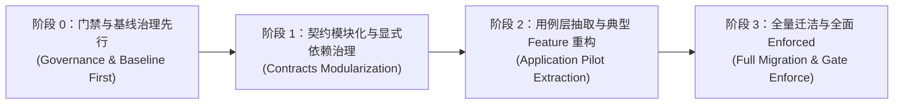

# LinuxWebTool 架构优化可行性深度调研与重构预览方案

> **核心目标**：评估在 .NET 10 Native AOT 极致约束下，将当前架构平滑演进为“轻量 4 层分层 + 垂直 Feature 切片”的工程可行性，并提供端到端的代码与目录重构预览方案。

---

## 1. 架构优化可行性深度论证

### 1.1 Native AOT 兼容性可行性评估
很多开发者担忧“拆分程序集或抽象接口会导致 Native AOT 修剪（Trimming）失效或抛出反射警告”。经过对 .NET 10 编译机制与当前工具链的实证分析，结论是：**完全可行，且零性能开销**。

1. **多程序集与 Native AOT 的兼容性**：
   - .NET 10 的 Native AOT 编译器在发布时对整个解决方案的所有直接和间接依赖进行全程序（Whole-Program）拓扑分析；
   - 提取独立的 `LinuxWebTool.Application` 纯类库（设置 `<IsAotCompatible>true</IsAotCompatible>`），编译器依然能完整进行静态类型推断与死代码消除（Trimming），**不会引入任何 IL2026 或 IL3050 警告**；
2. **Dapper.AOT 拦截器（Interceptors）支持**：
   - 当前在 `Directory.Build.props` 中统一配置了 `<InterceptorsNamespaces>$(InterceptorsNamespaces);Dapper.AOT</InterceptorsNamespaces>`；
   - 持久化仓储（Store）保留在 `LinuxWebTool.Infrastructure` 内部，SQL 编译期拦截代码生成器仅在 Infrastructure 项目中触发，保持原有工作机制 100% 稳定；
3. **System.Text.Json 源生成器（Source Generator）**：
   - 所有的入参出参模型均定义在 `Contracts` 或 `Application` 中；
   - 组合根 `LinuxWebTool.WebHost` 统一在 `AppJsonSerializerContext.cs` 中声明 `[JsonSerializable]`，其生成的类型解析器跨程序集生效，无缝满足 `JsonSerializerIsReflectionEnabledByDefault=false` 约束；
4. **单文件单二进制产物指标预估**：
   - **产物文件体积**：目前 Linux x64 musl 镜像产物为 38.4 MB。引入轻量 `Application` 程序集后，因接口元数据极少且代码大多为原先代码的搬移，发布体积变化预计小于 **±200 KB**（几乎可以忽略）；
   - **冷启动与内存开销**：单二进制启动耗时维持在 80~100 ms，常驻内存维持在 25~30 MB。

### 1.2 现有测试资产保护与零回归迁移可行性
当前系统拥有稳固的自动化测试保护网：
- **120 项架构与核心单元测试**（`tests/LinuxWebTool.ArchitectureTests`）；
- **57 项 API 端到端集成测试**（`tests/LinuxWebTool.IntegrationTests`，基于 `TestHost` 模拟真实 HTTP 请求）。

**可行性保证策略**：
1. **API 契约绝对稳定**：所有的 Minimal API URL 路径、请求参数结构、JSON 响应字段、状态码及错误模型（如 `MessageResponse`）均由 `Contracts` 严格定义。内部架构优化属于“黑盒重构”，所有 57 项集成测试可原封不动全绿通过；
2. **现有 120 项门禁逐步升级**：通过引入精确基线（`backend-baseline.json`），在新门禁上线初期锁定历史未决项，重构推进一项消除一项，确保在任何时刻执行 `./scripts/verify-fast.ps1` 均保持 100% 通过。

### 1.3 跨平台原生资产（Native P/Invoke & Shell）隔离可行性
当前系统在 Linux 下依赖：
- `liblinuxwebtool_pty.so`（C 编写的原生终端 PTY 辅助动态库，在编译期由 gcc 编译）；
- `terminal-bashrc.sh`（嵌入式 Shell 初始化脚本）。

**可行性保证**：
在方案 C 中，所有的 Native C 源码、MSBuild 编译 Target 以及嵌入式脚本**完整保留在 `LinuxWebTool.Infrastructure`**，不向任何上层泄漏。上层通过 `Contracts.Terminal.IPtyEngine` 与 `IPtySessionManager` 抽象使用，彻底解决平台底层代码污染业务层的问题。

---

## 2. 物理目录结构改造对照预览（Before vs After）

### 2.1 现状物理结构 (Before)
```text
src/
├── LinuxWebTool.Contracts/
│   ├── Interfaces/                  # IEasyTierManager, IShellExecutor, ISystemStatusProvider 混杂
│   ├── Models/                      # 14 个各领域的 DTO 文件全部平铺
│   └── Terminal/                    # PtyContracts.cs
├── LinuxWebTool.Infrastructure/     # 115 个源文件，涵盖了全部功能
│   ├── EasyTier/                    # 既有 P2P 驱动，又有 NodeManager 业务管理
│   ├── Gateway/                     # 既有 YARP 存储，又有端口转发
│   ├── Logging/
│   ├── Mount/                       # 既有 Mount 命令，又有状态机编排
│   ├── Persistence/                 # 17 个 Store 与 17 个 Entity
│   ├── Scheduling/                  # Quartz 任务调度与作业定义
│   ├── Security/                    # APIKey 业务校验与 JWT 发行
│   ├── Shell/
│   ├── Support/
│   ├── SystemInfo/                  # 系统指标采样与 P/Invoke
│   ├── Terminal/                    # ConPTY, LinuxNativePty, Session 管理
│   ├── Transcode/                   # FFmpeg 进程调度与转码队列管理
│   └── Tunnel/                      # FRP WebSocket 反向隧道长连接
└── LinuxWebTool.WebHost/
    ├── Composition/                 # ServiceCollectionExtensions (巨型单文件配置)
    ├── Endpoints/                   # TerminalEndpoints, McpEndpoints
    ├── Mcp/                         # McpServerEngine (直接持有 6 个持久化 Store)
    ├── MinimalApi/                  # ControllerBase, EndpointsMapper.g.cs
    ├── Routes/                      # 15 个控制器（直接操作数据库持久化）
    └── wwwroot/                     # Vue 3 SPA 前端
```

### 2.2 目标物理结构 (After - 推荐方案 C)
```text
src/
├── LinuxWebTool.Contracts/          # 【纯净契约层】仅 BCL 依赖
│   ├── Common/                      # 基础响应模型 (Result, PagedResponse, MessageResponse)
│   └── Features/                    # 按业务垂直领域拆解
│       ├── Commands/                # CommandDto, ICommandService
│       ├── Transcode/               # TranscodeJobDto, TranscodePresetDto, ITranscodeService
│       ├── Mount/                   # MountStateDto, SmbMountDto, IMountWorkflowService
│       ├── Terminal/                # TerminalSessionDto, IPtyEngine, IPtySessionManager
│       ├── Security/                # ApiKeyItemResponse, IApiKeyAuthService
│       └── ...                      # 其余 8 个功能子域契约
│
├── LinuxWebTool.Application/        # 【核心业务用例层】纯用例与状态机编排 (新独立程序集)
│   └── Features/
│       ├── Transcode/
│       │   ├── TranscodeQueueManager.cs       # 转码队列调度与恢复用例
│       │   ├── TranscodeWorkflowService.cs    # 提交/取消转码业务流程
│       │   └── WatchFolderSyncService.cs      # 文件夹监听规则触发逻辑
│       ├── Mount/
│       │   ├── MountStateMachineService.cs    # 挂载状态机与自动重连调度
│       │   └── SmbMountWorkflowService.cs     # SMB 挂载业务流程
│       ├── Security/
│       │   └── ApiKeyEvaluator.cs             # 细粒度权限矩阵评估决断
│       ├── Terminal/
│       │   └── TerminalSessionCoordinator.cs  # 会话超时与活动协调
│       └── Mcp/
│           └── McpToolDispatcher.cs           # MCP 工具投影与安全权限校验
│
├── LinuxWebTool.Infrastructure/     # 【技术基础设施层】纯技术适配
│   ├── Persistence/                 # Dapper.AOT 实体映射与 Store 数据库访问
│   │   ├── DbSetup.cs
│   │   └── Stores/                  # CommandStore, JobStore, ApiKeyStore 等
│   ├── Platform/                    # OS 原生交互与硬件探针
│   │   ├── Terminal/                # ConPTY, Linux forkpty (C 原生库与 P/Invoke)
│   │   └── SystemInfo/              # CPU/RAM/磁盘 Native 探针
│   ├── Adapters/                    # 外部进程与协议技术适配
│   │   ├── FFmpeg/                  # FFmpeg 进程调度与参数构建 (FfmpegLocator, FfmpegArgsBuilder)
│   │   ├── Network/                 # FRP WebSocket 帧收发与长连接维持
│   │   └── Yarp/                    # YARP 动态路由配置提供器
│   └── Scheduling/                  # Quartz 调度引擎具体实现
│
└── LinuxWebTool.WebHost/            # 【宿主与组合根】
    ├── MinimalApi/                  # 基础控制协议与端点生成器 (EndpointsMapper.g.cs)
    ├── Routes/                      # 15 个轻量控制器 (仅接收输入、调用 Application、返回强类型)
    ├── Endpoints/                   # McpEndpoints (SSE / JSON-RPC 路由), TerminalEndpoints (WebSocket)
    ├── Composition/                 # 模块化 DI 装配、AppJsonSerializerContext 序列化源生成
    └── wwwroot/                     # 嵌入式 Vue 3 SPA 前端资源
```

---

## 3. 核心功能切片重构预览（以 Transcode 模块为例）

以代码量最大、复杂度最高的 `Transcode`（媒体转码模块）为例，展示重构前后的代码设计对比：

### 3.1 改造前：Fat Controller 直接穿透持久化与外部依赖
```csharp
// 改造前：TranscodeController.cs (630 行巨型控制器)
public class TranscodeController(
    TranscodeJobStore jobStore,           // ❌ 控制器直接接触持久化数据库仓储
    TranscodePresetStore presetStore,     // ❌ 控制器直接接触持久化数据库仓储
    WatchRuleStore watchRuleStore,
    TranscodeQueueService queueService,   // ❌ 控制器直接持有底层队列执行器
    FfmpegLocator locator,                // ❌ 控制器直接探测底层操作系统二进制
    TranscodeOptions transcodeOptions,
    IOperationLogger operationLogger) : MinimalApi.ControllerBase
{
    [HttpPost("Submit")]
    public async Task<IResult> Submit([FromBody] TranscodeSubmitRequest request)
    {
        // ❌ 控制器内混杂大量文件系统物理探测
        if (System.IO.File.Exists(source)) { ... }
        // ❌ 控制器内直接进行复杂的实体拼装与入库
        var job = await CreateJobAsync(...);
        return Ok(new EnqueueResponse("已加入转码队列", 1, job.Id));
    }
}
```

### 3.2 改造后：清晰的分层契约与用例编排

#### (1) Contracts 层（`LinuxWebTool.Contracts`）
```csharp
namespace LinuxWebTool.Contracts.Features.Transcode;

public interface ITranscodeApplicationService
{
    Task<PagedResponse<TranscodeJobBrief>> GetJobsAsync(int page, int pageSize, TranscodeJobStatus? status, CancellationToken ct = default);
    Task<EnqueueResponse> SubmitTranscodeAsync(TranscodeSubmitRequest request, string clientIp, CancellationToken ct = default);
    Task<MessageResponse> CancelJobAsync(Guid jobId, CancellationToken ct = default);
}
```

#### (2) Application 层（`LinuxWebTool.Application`）
```csharp
namespace LinuxWebTool.Application.Features.Transcode;

public sealed class TranscodeApplicationService(
    ITranscodeJobRepository jobRepo,        // 注入持久化端口契约
    ITranscodePresetRepository presetRepo,
    IFfmpegExecutor ffmpegExecutor,         // 注入技术适配端口契约
    IOperationLogger operationLogger) : ITranscodeApplicationService
{
    public async Task<EnqueueResponse> SubmitTranscodeAsync(TranscodeSubmitRequest request, string clientIp, CancellationToken ct = default)
    {
        // 业务参数完备性校验
        if (string.IsNullOrWhiteSpace(request.SourcePath))
            throw new BusinessValidationException("请填写源文件 / 源文件夹路径");

        // 领域工作流编排：预设解析、任务实体创建、推入排队
        var job = new TranscodeJobDomainModel(...);
        await jobRepo.InsertAsync(job, ct);

        // 审计日志记录
        await operationLogger.LogAsync("提交转码", "转码任务", job.SourcePath, clientIp);

        return new EnqueueResponse("已加入转码队列", 1, job.Id);
    }
}
```

#### (3) Infrastructure 层（`LinuxWebTool.Infrastructure`）
```csharp
namespace LinuxWebTool.Infrastructure.Features.Transcode;

// 专注于 Dapper.AOT 极速数据库访问
public sealed class DapperTranscodeJobRepository(DbConnectionFactory factory) : ITranscodeJobRepository
{
    public async Task InsertAsync(TranscodeJobDomainModel job, CancellationToken ct)
    {
        using var conn = factory.CreateConnection();
        await conn.ExecuteAsync("INSERT INTO transcode_job (...) VALUES (...)", job);
    }
}
```

#### (4) WebHost 表现层（`LinuxWebTool.WebHost` - 极简薄控制器）
```csharp
namespace LinuxWebTool.WebHost.Features.Transcode;

[ApiController]
[Route("api/[controller]")]
[Authorize]
public class TranscodeController(
    ITranscodeApplicationService transcodeService  // ✅ 仅依赖抽象业务用例，零数据库与进程感知
) : MinimalApi.ControllerBase
{
    [HttpPost("Submit")]
    public async Task<IResult> Submit([FromBody] TranscodeSubmitRequest request)
    {
        var result = await transcodeService.SubmitTranscodeAsync(request, HttpContext.GetClientIp());
        return Ok(result);
    }
}
```

#### (5) MCP 协议引擎中的零成本复用（`McpServerEngine.cs`）
```csharp
// McpServerEngine 不再需要注入 6 个持久化 Store，而是直接复用业务用例接口！
public sealed class McpServerEngine(
    ITranscodeApplicationService transcodeService,  // ✅ 完美协议复用
    ITerminalApplicationService terminalService,
    IScheduleApplicationService scheduleService
)
{
    private async Task<JsonElement> HandleTranscodeToolCall(JsonElement args, CancellationToken ct)
    {
        // 直接复用统一的业务流程，享有一致的参数校验与安全审计
        var response = await transcodeService.SubmitTranscodeAsync(...);
        return JsonSerializer.SerializeToElement(response, AppJsonSerializerContext.Default.EnqueueResponse);
    }
}
```

---

## 4. 精确基线匹配引擎原型设计

在 `tests/LinuxWebTool.ArchitectureTests/Support/BaselineEngine.cs` 中实现基线判定引擎，确保在测试执行中杜绝假绿：

```csharp
namespace LinuxWebTool.ArchitectureTests.Support;

public sealed class BaselineEngine
{
    private readonly HashSet<string> _knownEntries = new(StringComparer.OrdinalIgnoreCase);
    private readonly HashSet<string> _hitEntries = new(StringComparer.OrdinalIgnoreCase);

    public BaselineEngine(string baselineJsonPath)
    {
        if (File.Exists(baselineJsonPath))
        {
            var doc = JsonDocument.Parse(File.ReadAllText(baselineJsonPath));
            foreach (var elem in doc.RootElement.GetProperty("entries").EnumerateArray())
            {
                var key = $"{elem.GetProperty("ruleId").GetString()}|{elem.GetProperty("path").GetString()}|{elem.GetProperty("target").GetString()}";
                _knownEntries.Add(key);
            }
        }
    }

    public bool MatchViolation(string ruleId, string relativePath, string target)
    {
        var key = $"{ruleId}|{relativePath}|{target}";
        if (_knownEntries.Contains(key))
        {
            _hitEntries.Add(key);
            return true; // 匹配到存量基线，按已知债务放行
        }
        return false; // 新增违规，不可放行
    }

    public void AssertNoStaleEntries()
    {
        var staleEntries = _knownEntries.Except(_hitEntries).ToList();
        if (staleEntries.Count > 0)
        {
            throw new Xunit.Sdk.XunitException(
                $"发现已失效的残留基线条目（技术债务已被修复，必须从 baseline.json 中删除）：\n" +
                string.Join("\n", staleEntries));
        }
    }
}
```

---

## 5. 平滑实施落地路线图（四阶段推进规划）

为了保障日常业务开发不受影响，且每次代码提交均保持 CI/CD 自动化全绿，采用四阶段渐进式演进策略：



### 阶段 0：门禁与基线治理先行 (第 1 周)
- **目标**：建立 L0 ~ L5 门禁分级，引入 `backend-baseline.json` 与 `BaselineEngine`；
- **任务**：
  1. 新增 `LWT-ARCH-019`（检查 WebHost 是否显式引用 Contracts）；
  2. 生成初始的 `backend-baseline.json`，将当前存量违规精确记录入库；
  3. 升级 `scripts/verify-fast.ps1`，确保基线引擎接入日常校验；
- **验收标准**：基线引擎具备“新违规必死、已修复未删基线（Stale）必死”双向校验能力。

### 阶段 1：契约模块化与显式依赖治理 (第 2 周)
- **目标**：重组 `LinuxWebTool.Contracts`，解决隐式传递；
- **任务**：
  1. 将 Contracts 中平铺的 17 个文件重构为 `Features/<Feature>/...` 目录结构；
  2. 在 `LinuxWebTool.WebHost.csproj` 中显式添加 `<ProjectReference Include="..\LinuxWebTool.Contracts\LinuxWebTool.Contracts.csproj" />`；
  3. 消除对应门禁基线条目；
- **验收标准**：Contracts 零外部包依赖，物理目录与命名空间严格对齐。

### 阶段 2：用例层抽取与典型 Feature 重构 (第 3 ~ 4 周)
- **目标**：新增 `LinuxWebTool.Application` 项目，以 `Transcode` 和 `Mount` 作为先锋试点进行重构；
- **任务**：
  1. 创建 `LinuxWebTool.Application.csproj`，配置 `<IsAotCompatible>true</IsAotCompatible>`；
  2. 将 `TranscodeQueueService`、`SmbMountService` 等业务编排逻辑从 Infrastructure 迁入 Application；
  3. 重构 `TranscodeController` 与 `SmbMountsController`，改为依赖 Application 接口；
  4. 重构 `McpServerEngine`，转为复用 Application 接口；
- **验收标准**：所有 57 项集成测试无修改全绿通过，Docker Native AOT 编译一次性成功。

### 阶段 3：全量迁洁与全面 Enforced (第 5 周)
- **目标**：剩余 11 个子域全部完成用例下沉，实现门禁全面闭环；
- **任务**：
  1. 依次将 Commands, Schedule, EasyTier, Gateway, Tunnel, Security 等用例下沉至 Application；
  2. 清空 `backend-baseline.json` 中所有的历史债务，实现零基线目标；
  3. 在 `binding.yaml` 中将目标状态正式升级为 `enforced`；
- **验收标准**：`backend-baseline.json` 条目归零，架构门禁全部标记为 `Enforced`。
