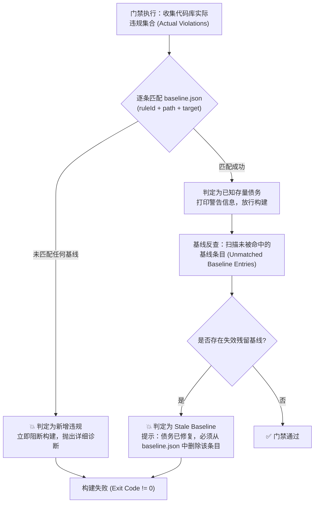

# LinuxWebTool 架构门禁体系与基线治理规范

> **治理基准**：对标 `SoftwareArchitecture/backend/governance/gates.md`（Governance Version `1.1.0`）。
> **核心原则**：检查从低成本的静态结构事实开始，逐级递进到运行时契约与 Native AOT 真实构建；规则必须可定位、可复现、有独立正反例，且杜绝假绿（False Green）。

---

## 1. 门禁分级体系（L0 ~ L5 矩阵）

项目将原有的 18 项单点手写测试，全面重组并升级为标准化的 L0 ~ L5 六级门禁矩阵：

| 门禁层级 | 核心检验对象 | 推荐证据类型 | 执行 Profile | 当前/目标状态 |
|---|---|---|---|---|
| **L0 物理所有权** | 项目目录结构、Feature 归属、生成物与测试范围隔离 | 文件系统扫描、目录结构单元测试 | local / pr | planned 升级 |
| **L1 项目依赖** | `.csproj` 项目清单、显式直接 ProjectReference、拓扑无环 | MSBuild 项目图解析、Assembly 边界测试 | local / pr | planned 升级 |
| **L2 源码边界** | C# 命名空间、跨 Feature 私有访问拦截、Controller 越权使用仓储 | Roslyn 语法与语义模型（Syntax/Semantic Model） | local / pr | planned 升级 |
| **L3 实现与 AOT** | AOT 序列化源生成覆盖、SQLite NOCASE 约束、代码复杂度 | Roslyn 语法检查、SourceGen 上下文反射对比 | pr | enforced 存量 |
| **L4 运行时契约** | Minimal API 路由映射、参数可空性、HTTP 错误码与集成验证 | WebApplicationFactory / TestHost 行为测试 | pr | enforced 存量 |
| **L5 构建与发布** | Native AOT 容器编译、符号修剪、跨平台单文件启动 Smoke | Docker Build、真实环境 Shell 执行探针 | release | enforced 存量 |

---

## 2. 统一诊断数据模型（Diagnostic Model）

所有的架构测试、Roslyn 分析器与门禁脚本，均必须输出符合以下统一规范的诊断信息：

```json
{
  "ruleId": "LWT-ARCH-007",
  "level": "Error",
  "location": "src/LinuxWebTool.Infrastructure/Persistence/CommandStore.cs:18",
  "target": "LinuxWebTool.Infrastructure.Persistence.CommandStore",
  "message": "命名空间与物理路径不一致：实际命名空间 'LinuxWebTool.Persistence' ≠ 期望 'LinuxWebTool.Infrastructure.Persistence'。"
}
```

### 诊断字段规范
1. **`ruleId`**：稳定且唯一的规则编号（如 `LWT-ARCH-001`）；
2. **`level`**：严重等级，分为 `Error`（阻断构建）、`Warning`（产生告警）、`Info`（提示信息）；
3. **`location`**：仓库相对路径及行号（格式 `path/to/file.cs:line`）；
4. **`target`**：被检验的违规目标（命名空间、类型名、方法签名、ProjectReference 或 DTO）；
5. **`message`**：清晰说明违反的具体边界，并给出合法的修改指导。

---

## 3. 门禁规则全集（现有 18 项升级 + 扩展规则）

### 3.1 既有规则映射与现代化升级

原有 18 项架构测试重新映射为标准编号并进行语义深化：

| 原规则编号 | 新统一编号 | 所属层级 | 规则含义 | 升级整改与实施要求 |
|---|---|---|---|---|
| `LinuxArch001` | `LWT-ARCH-001` | L1 | Contracts 零依赖且禁止第三方包 | 维持不变，确保其为纯 BCL 契约。 |
| `LinuxArch002` | `LWT-ARCH-002` | L1 | Infrastructure 禁止引用 WebHost | 维持不变。 |
| `LinuxArch003` | `LWT-ARCH-003` | L2 | Contracts 不得引用持久化与认证框架 | 升级为 Roslyn 符号扫描，拦截任何非纯净类型。 |
| `LinuxArch004` | `LWT-ARCH-004` | L1 | 下层禁止反向引用上层 | 升级为基于 `binding.yaml` 的双向拓扑图无环检测。 |
| `LinuxArch005` | `LWT-ARCH-005` | L2 | 控制器禁止直接接触持久化细节 | **重点升级**：由原 `SqlSugar` 正则替换为禁止 Controller 直接使用任何 `*Store` 或直接持有数据库连接，必须通过 Application 用例接口。 |
| `LinuxArch007` | `LWT-ARCH-007` | L2 | 命名空间必须与物理路径完全一致 | 扩展支持 `Features/<Feature>/<Responsibility>` 深度递归校验。 |
| `LinuxArch008` | `LWT-AOT-008` | L3 | AOT 响应类型必须为显式 DTO | 维持，拦截 `new { ... }` 动态对象投影。 |
| `LinuxArch009` | `LWT-API-009` | L4 | 控制器接口必须存在 Minimal API 映射 | 维持，确保 `EndpointsMapper.g.cs` 覆盖全部路由。 |
| `LinuxArch010` | `LWT-PUB-010` | L5 | 发布配置必须强制 Native AOT | 维持，锁定 csproj 与发布脚本的 AOT 配置。 |
| `LinuxArch011` | `LWT-API-011` | L4 | 文件删除必须使用 DELETE 动词 | 维持。 |
| `LinuxArch012` | `LWT-API-012` | L4 | 控制器特性与 Minimal API 映射一致性 | 维持双向差集对比（缺映射/缺控制器均阻断）。 |
| `LinuxArch013` | `LWT-SQL-013` | L3 | SQLite Store Guid 查询必须 COLLATE NOCASE | 维持，杜绝大小写匹配导致的 404。 |
| `LinuxArch014` | `LWT-SQL-014` | L3 | SQLite DDL 主键必须声明 COLLATE NOCASE | 维持。 |
| `LinuxArch015` | `LWT-API-015` | L4 | Minimal API GET 查询参数必须为可空/引用类型 | 维持，防止无参请求发生模型绑定 400 崩溃。 |
| `LinuxArch016` | `LWT-SQL-016` | L3/L4 | SQLite 混合大小写真实数据验证 | 维持 SQLite 动态集成测试。 |
| `LinuxArch017` | `LWT-API-017` | L4 | Minimal API 可空 Body 禁止直接声明参数 | 维持，强制使用 `ctx.Request.HasJsonContentType()`。 |
| `LinuxArch018` | `LWT-AOT-018` | L3 | Native AOT 禁止调用无源生成的 JSON 重载 | 维持，保障非反射序列化安全。 |

### 3.2 针对轻量模块化架构的新增扩展规则

为全面推进方案 C 的模块化落地，引入以下 6 项新增门禁：

| 新规则编号 | 所属层级 | 规则定义 | 实施方式与断言目标 |
|---|---|---|---|
| **`LWT-ARCH-019`** | L1 | **显式直接引用强制门禁** | WebHost 若使用 Contracts 中的类型，其 `.csproj` 必须显式声明 `<ProjectReference Include="...Contracts.csproj" />`，拦截隐式传递偷渡。 |
| **`LWT-ARCH-020`** | L2 | **跨 Feature 隔离门禁 (Feature Boundary)** | 源码中一个 Feature 禁止直接引用另一个 Feature 的非公开命名空间（如 `Features.X.Persistence`），只能通过 `Features.X.Contracts` 协作。 |
| **`LWT-ARCH-021`** | L0 | **标准职责目录白名单门禁** | `src/**` 生产代码中，Feature 下一级目录只能属于 `Contracts/Application/Persistence/Platform/Integration/Routes` 白名单，禁止自创新名词。 |
| **`LWT-AOT-022`** | L3 | **AppJsonSerializerContext 完备性门禁** | 扫描所有 Minimal API 出入参及 MCP Tool 参数类型，确保它们均在 `AppJsonSerializerContext` 显式标注 `[JsonSerializable]`，缺一不可。 |
| **`LWT-DI-023`** | L3 | **IHostedService 双重注册守卫门禁** | 扫描所有 `AddHostedService<T>()`，若 `T` 被其他服务构造函数所依赖，断言其必须同时执行 `AddSingleton<T>()`，杜绝启动时 NRE。 |
| **`LWT-COMP-024`** | L3 | **代码认知复杂度阈值门禁** | 使用 Roslyn 分析器对首方 C# 方法计算认知复杂度（Cognitive Complexity），单方法超 25 告警，超 40 阻断。 |

---

## 4. 精确基线（Baseline）治理规范

### 4.1 基线设计原则
1. **基线用于接管已知技术债务，绝非“永久特赦证”**；
2. **基线只降不增**：新代码触发门禁必须就地修复，严禁扩充基线；
3. **消除即清理（Stale Baseline 必死原则）**：当债务代码被重构修复后，若基线文件中仍然残留该条目，门禁测试必须判定为“失效基线错误（Stale Baseline Error）”并强制失败，直到人工清理基线条目；
4. **禁止通配符掩盖**：禁止使用目录级或项目级通配符（如 `src/**`），每一条基线必须精确到具体文件和符号。

### 4.2 精确基线数据格式
在 `tests/LinuxWebTool.ArchitectureTests/backend-baseline.json` 维护统一格式：

```json
{
  "version": "1.0.0",
  "project": "LinuxWebTool",
  "lastAudited": "2026-10-07",
  "entries": [
    {
      "ruleId": "LWT-ARCH-005",
      "path": "src/LinuxWebTool.WebHost/Routes/TranscodeController.cs",
      "target": "LinuxWebTool.Infrastructure.Persistence.TranscodeJobStore",
      "reason": "历史遗留直接在控制器注入了持久化仓储，待 Application 层提取后迁移",
      "owner": "BackendTeam",
      "cleanupCondition": "完成 TranscodeApplicationService 抽取并解耦路由",
      "expiry": "2026-12-31"
    }
  ]
}
```

### 4.3 判定算法流程图



### 4.4 防假绿（Anti-False-Green）纪律
为了防止门禁在配置错误时“静默全绿”：
1. **空扫描防御**：若某个门禁由于目录过滤导致扫描文件数为 0，门禁测试必须显式抛出异常（`Empty Scan Scope Error`），防止因拼写错误漏检；
2. **语法解析失败防御**：若 Roslyn 语法树解析出现错误，必须阻断，不得将解析失败视为 0 违规；
3. **正反例自检（Fixture Verification）**：每条核心门禁测试均附带一个标准正例与一个标准负例，确保门禁规则自身的判定准确性。

---

## 5. 执行 Profile 与 CI/CD 落地

| 执行环境 | 执行命令 | 触发时机 | 阻断策略 |
|---|---|---|---|
| **本地开发 (local)** | `dotnet test tests/LinuxWebTool.ArchitectureTests` | 开发者提交前 / IDE 内部 | L0 ~ L2 阻断 |
| **快速门禁 (PR)** | `./scripts/verify-fast.ps1` | GitHub PR / GitLab MR | L0 ~ L4 全部测试通过方可合并 |
| **发布流水线 (Release)** | `./scripts/verify-aot.ps1` 与 `./scripts/smoke-aot.ps1` | Release Tag / 镜像打包 | L5 容器编译与启动 Smoke 阻断 |
