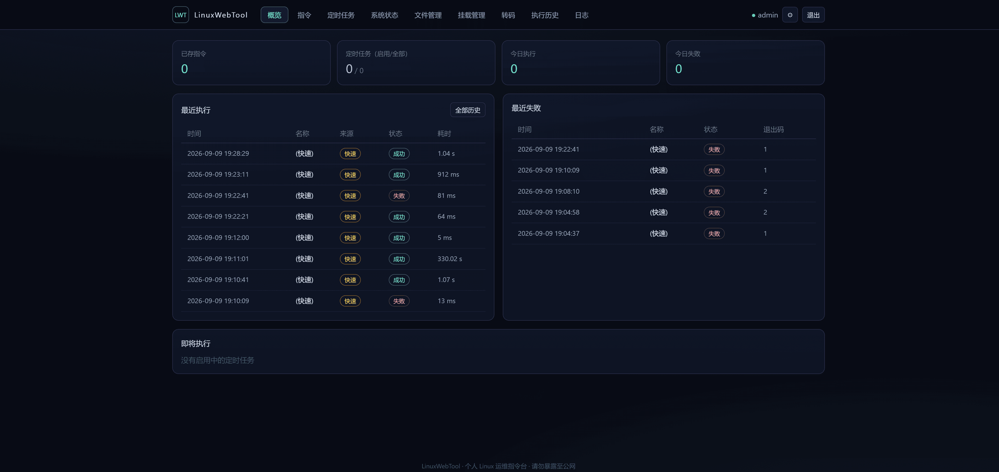
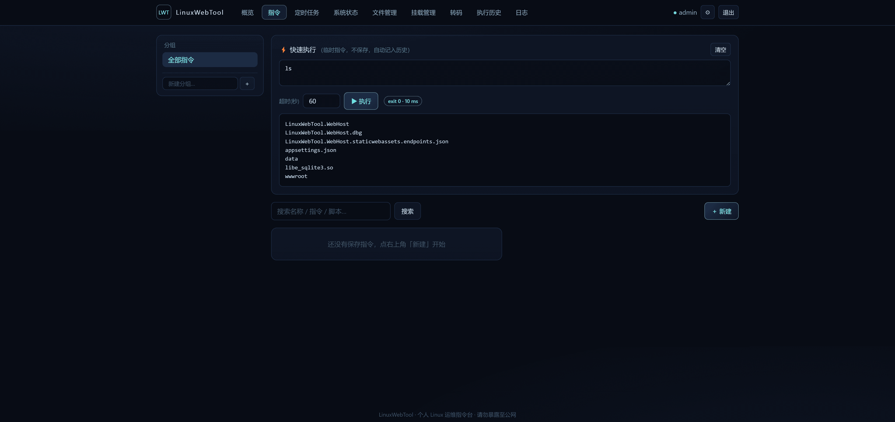
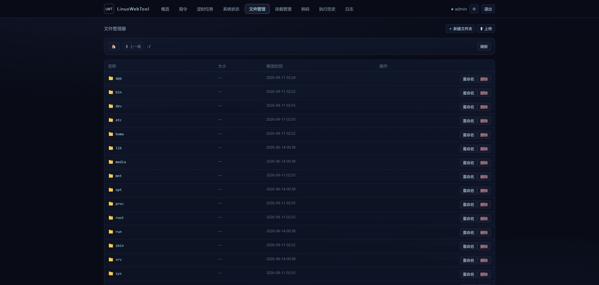
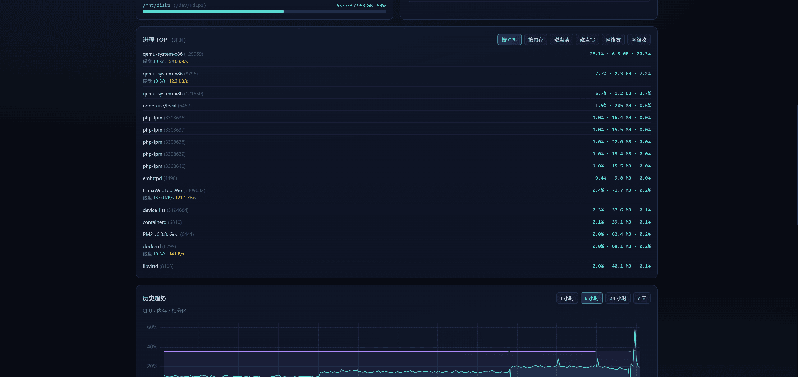
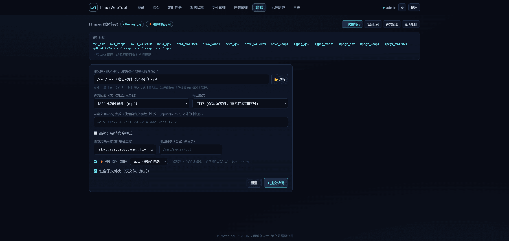

# LinuxWebTool：把常用 Linux 运维操作，变成简单直观的网页工具

管理 Linux 服务器时，我们经常需要重复执行一些操作：查看磁盘、执行命令、管理文件、配置定时任务、查看日志、进行媒体转码，或者管理 SMB 网络共享。

如果每次都登录 SSH、输入命令，不仅麻烦，也不利于统一管理。

LinuxWebTool 正是为此设计的一款轻量级 Linux 运维管理工具。它提供了一个直观的网页界面，把常用的服务器操作集中到一起，让日常管理更加方便、高效。

项目地址：[GitHub - csvkse/LWT](https://github.com/csvkse/LWT)

最新版本：[v0.1.7 Release](https://github.com/csvkse/LWT/releases/tag/v0.1.7)

## 效果预览

### 首页与指令管理





### 文件管理与系统状态





### 转码与 SMB 挂载




## 打开浏览器，就能管理 Linux 服务器

LinuxWebTool 启动后，通过浏览器访问管理页面即可使用，不需要频繁切换终端。

常用功能都按照页面分类展示：

- 仪表盘
- 指令管理
- 文件管理
- 定时任务
- 执行历史
- 系统状态
- 日志查看
- 媒体转码
- SMB 挂载管理

界面简洁清晰，即使不熟悉复杂命令，也可以快速找到需要的功能。

## 把常用命令保存下来，一键执行

经常使用的 Linux 命令，可以保存为可复用的功能。

支持自定义命令名称、命令分组、置顶常用命令、设置执行超时时间、查看实时输出、保存执行历史，以及执行多行 Bash 脚本。

例如，可以将以下操作保存为“查看 Docker 容器”：

```bash
docker ps --format "table {{.Names}}\t{{.Status}}\t{{.Ports}}"
```

以后只需要点击按钮，就能执行，不必再次手动输入。

## 文件管理更直观

LinuxWebTool 提供了网页文件管理功能，可以直接浏览服务器目录。

支持浏览目录、创建文件夹、上传文件、重命名文件和目录、删除文件和目录，以及查看和编辑常见文本文件。

对于配置文件、脚本文件、日志文件等内容，可以直接在浏览器中查看和编辑，减少频繁使用 FTP、SFTP 或命令行的需要。

文件删除、重命名和写入等操作都会受到保护目录限制，降低误操作风险。

## 定时任务自动执行

需要定期运行的操作，可以配置为定时任务，例如每天清理临时文件、定期备份数据库、检查磁盘空间、执行同步脚本或运行维护命令。

任务执行后，可以在执行历史中查看结果，了解任务是否成功、运行了多长时间以及产生了什么输出。

## 完整的执行记录和操作日志

LinuxWebTool 会记录命令执行历史和重要操作日志，帮助用户了解谁执行了什么命令、何时执行、是否成功以及产生了哪些输出。

文件修改、删除和定时任务等操作也可以通过日志辅助追踪，方便问题排查和日常管理。

## 系统状态一目了然

系统状态页面可以集中查看 CPU、内存、磁盘和挂载点、网络信息、系统进程、运行环境以及资源采样历史。

不需要再分别执行 `df`、`free`、`ps` 等命令，打开页面即可快速了解服务器状态。

## 支持媒体转码和硬件加速

LinuxWebTool 集成了 FFmpeg 媒体转码功能，支持转码参数配置、任务队列、任务取消、失败重试、转码历史、预设配置和文件夹监控。

在支持的 Linux 环境中，还可以使用 VA-API 等硬件加速能力，降低 CPU 使用率，提高转码效率。Docker 镜像提供不同 GPU 厂商的版本，可以根据实际硬件选择 Intel、AMD、NVIDIA 或全功能镜像。

## SMB 网络共享管理

在 Linux 服务器上使用 NAS 或 Windows 共享目录时，可以通过 LinuxWebTool 管理 SMB 挂载。

支持创建 SMB 挂载配置、挂载和卸载共享目录、查看挂载状态、启动时自动重新挂载，以及管理挂载凭据。

密码不会直接拼接到命令行中，而是保存到数据目录的凭据文件中，并使用受限权限保护。

SMB 挂载功能需要 Linux 权限支持；在 Docker 中通常需要额外配置特权参数。

## 三种部署方式

### 桌面端发布包

从 GitHub Releases 下载对应平台压缩包即可。当前桌面端提供 Linux x64、Linux ARM64 和 Windows x64 版本。

桌面端发布包采用 Native AOT 自包含单文件发布，目标设备无需额外安装 .NET 运行时，解压后即可运行。

### Docker 部署

适合服务器长期运行，也方便升级和迁移：

```bash
docker pull ghcr.io/csvkse/lwt:latest

docker run -d \
  --restart unless-stopped \
  -p 5270:5270 \
  -v linuxwebtool-data:/app/data \
  --name linuxwebtool \
  ghcr.io/csvkse/lwt:latest
```

数据统一保存到 `/app/data`，包括 SQLite 数据库、管理员配置、JWT 密钥、日志和 SMB 凭据。升级镜像时保留数据卷即可。

### Linux 自包含部署

也可以使用自包含发布包部署到 Linux，并通过 systemd 作为系统服务运行，适合希望使用传统 Linux 服务管理方式的用户。

## 安全提示

LinuxWebTool 具备管理员认证机制，首次启动时会生成管理员账号和随机密码，同时支持 JWT 登录认证、管理员密码修改、受保护的后台 API、文件操作限制、数据目录保护和操作日志记录。

需要注意的是，LinuxWebTool 具备执行 Shell 命令的能力，因此应当部署在可信网络或本机环境中，不建议直接暴露到公网。

建议不直接开放公网访问，使用防火墙限制访问来源，为管理员设置高强度密码，并定期备份 `data` 目录。Docker 部署时也应当仅授予必要的设备和权限。

## 适合哪些场景？

LinuxWebTool 适合个人家庭服务器、NAS 和媒体服务器、家庭实验室、小型 Linux 服务器、Docker 主机，以及需要网页化管理或不想频繁登录 SSH 的日常维护场景。

它不是大型企业级运维平台，而是一款专注于“常用操作简单化”的轻量工具。

## 项目特点

LinuxWebTool 的目标很简单：

> 让常用的 Linux 管理操作更容易找到、更容易执行，也更容易追踪。

它不要求复杂部署，不依赖外部数据库，支持 Docker 和自包含发布，并提供清晰的操作界面和完整的执行记录。

如果你希望用一个轻量、直观、可自托管的网页工具管理 Linux 服务器，LinuxWebTool 值得一试。

欢迎大家体验使用 LinuxWebTool，也欢迎提出宝贵意见和改进建议。每一条反馈，都会帮助这个项目变得更好。
