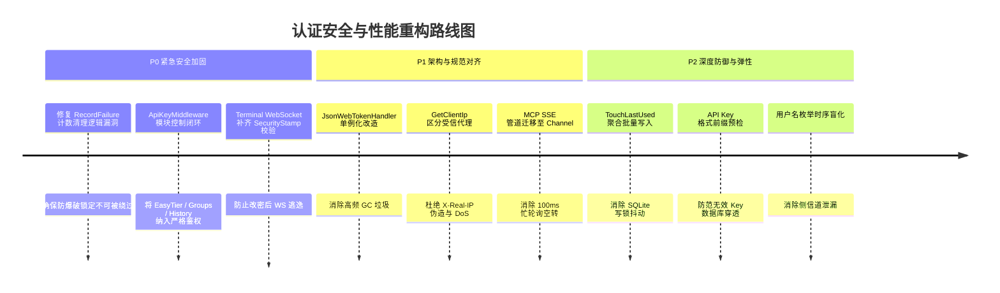

# 用户登录认证与权限控制全流程代码逻辑深度审计与性能调研报告

**文件版本**：v1.0  
**审计时间**：2026-10-09  
**审计对象**：`LinuxWebTool` 登录认证体系、JWT 会话生命周期、Security Stamp 安全戳记、API Key 细粒度权限矩阵、WebSocket/MCP 鉴权管道及相关基础设施

---

## 目录

- [1. 审计概述与风险矩阵](#1-审计概述与风险矩阵)
- [2. 全流程认证鉴权架构与执行链路](#2-全流程认证鉴权架构与执行链路)
- [3. 逻辑与安全问题深度剖析](#3-逻辑与安全问题深度剖析)
  - [3.1 [高危] RecordFailure 计数清理逻辑缺陷导致暴力破解锁定失效](#31-高危-recordfailure-计数清理逻辑缺陷导致暴力破解锁定失效)
  - [3.2 [高危] X-Real-IP 盲目信任引发 IP 伪造、锁定绕过与拒绝服务 (DoS)](#32-高危-x-real-ip-盲目信任引发-ip-伪造锁定绕过与拒绝服务-dos)
  - [3.3 [高危] ApiKeyMiddleware 模块权限“默认放行”造成越权管理 (EasyTier / Groups)](#33-高危-apikeymiddleware-模块权限默认放行造成越权管理-easytier--groups)
  - [3.4 [中危] WebSocket 终端直连握手绕过 SecurityStamp 安全校验](#34-中危-websocket-终端直连握手绕过-securitystamp-安全校验)
  - [3.5 [中危] 用户名比对非恒定时间导致的枚举时序侧信道泄露](#35-中危-用户名比对非恒定时间导致的用户枚举时序侧信道泄露)
  - [3.6 [低危] AdminAccount 凭据并发修改与非原子读写竞态](#36-低危-adminaccount-凭据并发修改与非原子读写竞态)
  - [3.7 [低危] URL Query 传参 API Key 引发的日志凭据泄露风险](#37-低危-url-query-传参-api-key-引发的日志凭据泄露风险)
- [4. 性能瓶颈与高并发优化调研](#4-性能瓶颈与高并发优化调研)
  - [4.1 MCP SSE 下行通道 Task.Delay(100) 忙轮询 CPU 空转](#41-mcp-sse-下行通道-taskdelay100-忙轮询-cpu-空转)
  - [4.2 JsonWebTokenHandler 重复实例化与 GC 分配开销](#42-jsonwebtokenhandler-重复实例化与-gc-分配开销)
  - [4.3 API Key 无效 Key 查库导致的缓存穿透与 SQLite IO 消耗](#43-api-key-无效-key-查库导致的缓存穿透与-sqlite-io-消耗)
  - [4.4 TouchLastUsed 异步写对 SQLite 单写锁的高频争用](#44-touchlastused-异步写对-sqlite-单写锁的高频争用)
- [5. 系统化整改建议与落地路线图](#5-系统化整改建议与落地路线图)

---

## 1. 审计概述与风险矩阵

本次审计针对 `LinuxWebTool` 当前版本的双轨认证鉴权模型（**单管理员 JWT 会话 + 多通道 API Key 权限矩阵**）展开了全方位静态分析与动态推演。

总体而言，系统采用了严格的 Native AOT 源生成兼容架构，在密码哈希验证、滑动窗口续签、基于 GUID 的安全随机戳记（Security Stamp）防指纹泄露等方面表现出色。但在**边界防护、权限矩阵闭环度、反向代理受信判定以及高并发长连接资源调度**上存在若干逻辑缺陷与优化空间。

### 风险与瓶颈汇总矩阵

| 编号 | 类别 | 问题描述 | 严重级别 | 潜在影响 |
|---|---|---|---|---|
| **SEC-01** | 安全逻辑 | `RecordFailure` 计数清理条件错误 | **高危** | 多 IP 扫描或并发暴力破解时锁定计数被意外抹除，防爆破失效 |
| **SEC-02** | 安全逻辑 | `GetClientIp` 盲目采信 `X-Real-IP` 请求头 | **高危** | 攻击者伪造源 IP 绕过防爆破锁定；或恶意使真实管理员 IP 触发 DoS |
| **SEC-03** | 权限控制 | `ApiKeyMiddleware` 模块控制白名单存在缺口 | **高危** | 仅开通 `AllowApi` 的 Key 越权操控 `EasyTier` 虚拟网、增删指令分组 `Groups` |
| **SEC-04** | 安全逻辑 | WebSocket 终端连接用 Token 握手未校验 `SecurityStamp` | **中危** | 管理员改密后，历史 Token 仍可通过 WS Query 直连 PTY 终端会话 |
| **SEC-05** | 安全风险 | 登录接口未做恒定时间比对，存在用户名时序侧信道 | **中危** | 攻击者可通过纳秒/微秒级响应耗时判断用户名是否存在 |
| **SEC-06** | 逻辑并发 | `AdminCredentialService` 凭据更新缺乏写锁 | **低危** | 多请求并发修改凭据时可能导致文件写入竞态或属性撕裂读 |
| **SEC-07** | 安全规范 | API Key 支持 URL Query 传参 | **低危** | 代理访问日志、浏览器历史明文留存 API 密钥 |
| **PERF-01**| 性能瓶颈 | MCP SSE 连接每 100ms 忙轮询出队 | **中等** | 存在持续长连接时产生无意义 CPU 上下文切换与能耗 |
| **PERF-02**| 性能瓶颈 | `JsonWebTokenHandler` 每次调用均 `new` 实例 | **轻微** | 在高频滑动续约与认证时造成无意义小对象堆分配 |
| **PERF-03**| 性能瓶颈 | 无效 API Key 绕过缓存直接穿透 SQLite | **轻微** | 恶意枚举 Key 时对 SQLite 造成磁盘读取放大 |
| **PERF-04**| 性能瓶颈 | `TouchLastUsed` 线程池任务争用 SQLite 单一写事务锁 | **轻微** | 并发调用时可能引发短暂的数据库忙锁重试 |

---

## 2. 全流程认证鉴权架构与执行链路

```mermaid
flowchart TD
    Req([HTTP / WS 请求进入]) --> HealthCheck{是否为 /health, /app/* 或静态资源?}
    HealthCheck -- 是 --> DirectPass[静态文件/健康检查直接响应]
    HealthCheck -- 否 --> AuthMW[UseAuthentication: 解析 Bearer JWT]
    
    AuthMW --> JwtValid{JWT 签名与时间有效?}
    JwtValid -- 是 --> StampCheck{JwtBearerEvents: 核验 sub 与 SecurityStamp}
    StampCheck -- 匹配 --> AdminCtx[标记为管理员会话 context.User]
    StampCheck -- 不匹配/改密后 --> AuthFail[context.Fail: 标记未认证 401]
    JwtValid -- 否/无Token --> AnonCtx[保持未认证身份]

    AdminCtx --> ApiKeyMW[ApiKeyMiddleware]
    AuthFail --> ApiKeyMW
    AnonCtx --> ApiKeyMW

    ApiKeyMW --> CheckIsAdmin{是否已为管理员 JWT 会话?}
    CheckIsAdmin -- 是 --> BypassKey[跳过 API Key，保留管理员全权]
    CheckIsAdmin -- 否 --> ExtractKey[提取 X-Api-Key / Bearer lwt_ / Query]

    ExtractKey --> HasKey{是否存在 API Key?}
    HasKey -- 否 (API 路由) --> NextAuth[传递给 ASP.NET Core 授权管道]
    HasKey -- 否 (MCP 路由) --> Mcp401[401: MCP 通道强制要求鉴权]
    HasKey -- 是 --> ValidateKey[ApiKeyService.Validate: 查缓存/查库]

    ValidateKey --> KeyValid{Key 存在、启用且未过期?}
    KeyValid -- 否 --> Key401[401: 无效或已过期的 API Key]
    KeyValid -- 是 --> ChannelCheck{检查通道权限 AllowApi / AllowMcp}
    ChannelCheck -- 不允许 --> Chan403[403: 拒绝通道访问]
    ChannelCheck -- 允许 --> ModuleCheck{CheckModulePermission: 检查模块授权}
    ModuleCheck -- 越权 --> Mod403[403: 拒绝访问业务模块]
    ModuleCheck -- 允许 --> InjectKeyUser[注入 ApiKey ClaimsPrincipal]

    BypassKey --> AuthZ[UseAuthorization 路由鉴权]
    NextAuth --> AuthZ
    InjectKeyUser --> AuthZ

    AuthZ --> EndpointCheck{端点是否要求 [Authorize]?}
    EndpointCheck -- 需鉴权且未通过 --> Resp401[返回 401 Unauthorized]
    EndpointCheck -- 通过/允许匿名 --> RenewMW[JwtRenewalMiddleware: 检查剩余寿命]
    RenewMW --> BusinessHandler[执行具体 Controller / Endpoint 业务逻辑]
```

---

## 3. 逻辑与安全问题深度剖析

### 3.1 [高危] RecordFailure 计数清理逻辑缺陷导致暴力破解锁定失效

#### 源码定位
[`AuthController.cs`](file:///e:/WorkProject/CSharp/PrivateProject/Web/WebToolForLinux/src/LinuxWebTool.WebHost/Features/Auth/Routes/AuthController.cs#L110-L128)：
```csharp
private static void RecordFailure(string ip)
{
    if (Failures.Count > 100)
    {
        var now = DateTime.Now;
        foreach (var kvp in Failures)
        {
            if (kvp.Value.LockUntil <= now) // <-- 缺陷所在
            {
                Failures.TryRemove(kvp.Key, out _);
            }
        }
    }

    Failures.AddOrUpdate(
        ip,
        _ => (1, DateTime.MinValue), // <-- 初始 LockUntil 为 MinValue
        (_, s) => s.Count + 1 >= MaxFailures ? (0, DateTime.Now.Add(LockDuration)) : (s.Count + 1, s.LockUntil));
}
```

#### 逻辑漏洞成因
1. 当某个 IP 发生 1~9 次密码错误时，其存储状态为 `(Count: 1~9, LockUntil: DateTime.MinValue)`。
2. 当容器内累计的记录数达到 100（`Failures.Count > 100`）触发内存清理时，清理条件是 `kvp.Value.LockUntil <= now`。
3. 由于未锁定的记录其 `LockUntil` 始终是 `DateTime.MinValue`，恒小于当前时间 `now`！
4. **后果**：所有当前正在被跟踪、尚未达到 10 次的 IP 失败计数会被**全量清零**。攻击者只要利用脚本在每轮猜测中混入 100 个不同的 IP 头部，或者正常并发请求使字典膨胀，目标 IP 的失败计数便永远无法累加到 10 次，**IP 失败锁定形同虚设**。

#### 整改方案
- 引入真正的“最后失败时间”（`LastFailedAt`）或仅清理**已锁定且锁定已过期**（`LockUntil > DateTime.MinValue && LockUntil <= now`）或**超过防爆破时间窗口（如 10 分钟内无后续失败）**的条目；
- 限制字典最大容量，采用定长滑动淘汰（如 LRU 或清除超期项）。

---

### 3.2 [高危] X-Real-IP 盲目信任引发 IP 伪造、锁定绕过与拒绝服务 (DoS)

#### 源码定位
[`HttpContextExtensions.cs`](file:///e:/WorkProject/CSharp/PrivateProject/Web/WebToolForLinux/src/LinuxWebTool.WebHost/Shared/Extensions/HttpContextExtensions.cs#L6-L14)：
```csharp
public static string GetClientIp(this HttpContext context)
{
    var forwarded = context.Request.Headers["X-Real-IP"].FirstOrDefault();
    if (!string.IsNullOrEmpty(forwarded))
    {
        return forwarded;
    }
    return context.Connection.RemoteIpAddress?.ToString() ?? string.Empty;
}
```

#### 逻辑漏洞成因
1. `GetClientIp` 无条件取客户端发来的 `X-Real-IP` 请求头，没有校验底层连接来源（`RemoteIpAddress`）是否属于配置的受信任反向代理（如 `127.0.0.1`、Docker 私网网段等）。
2. 在容器直连端口暴露（如 `-p 5000:5000`）或没有配置 Nginx/Traefik 强行剔除伪造头的场景下：
   - **绕过锁定**：黑客攻击登录接口时，每次请求随机传入不同的 `X-Real-IP: 1.1.x.x`，即可使服务端的 IP 防爆破机制彻底失效；
   - **拒绝服务 (DoS)**：黑客可传入管理员真实的公网 IP（通过抓包或域名解析得知），故意连续发送 10 次错误密码，导致真正管理员的 IP 被封禁 5 分钟无法登录后台；
   - **日志投毒**：系统审计日志中的 `ClientIp` 全部被伪造，追溯审计失真。

#### 整改方案
- 使用 ASP.NET Core 标准的 `UseForwardedHeaders` 配合 `ForwardedHeadersOptions`，显式配置 `KnownNetworks` 与 `KnownProxies`；
- 若未配置受信反代，默认仅采信 `context.Connection.RemoteIpAddress`。

---

### 3.3 [高危] ApiKeyMiddleware 模块权限“默认放行”造成越权管理 (EasyTier / Groups)

#### 源码定位
[`ApiKeyMiddleware.cs`](file:///e:/WorkProject/CSharp/PrivateProject/Web/WebToolForLinux/src/LinuxWebTool.WebHost/Shared/Middleware/ApiKeyMiddleware.cs#L126-L168)：
```csharp
private static bool CheckModulePermission(string path, ApiKeyEntity entity)
{
    if (path.StartsWith("/api/Auth/ChangeCredential", ...) ||
        path.StartsWith("/api/ApiKeys", ...) ||
        path.StartsWith("/api/FrpTunnel", ...))
    {
        return false;
    }
    if (path.StartsWith("/api/Commands", ...) || path.StartsWith("/api/Terminal", ...))
        return entity.AllowTerminal;
    if (path.StartsWith("/api/Schedules", ...))
        return entity.AllowSchedules;
    if (path.StartsWith("/api/Files", ...) || ...)
        return entity.AllowFiles;
    if (path.StartsWith("/api/Transcode", ...))
        return entity.AllowTranscode;
    if (path.StartsWith("/api/Gateway", ...))
        return entity.AllowGateway;

    // 默认如 Overview、SystemStatus、History、Logs 等查询接口只要拥有 Api 权限即可
    return true; // <-- 严重漏斗
}
```

#### 逻辑漏洞成因
`CheckModulePermission` 采用了**黑名单排除 + 部分白名单匹配 + 默认 return true**的设计，导致后来新增的业务模块或未显式匹配的模块全部默认对 API Key 开放：
1. **EasyTier 组网失控**：`/api/EasyTier` 属于系统级核心组网功能（启动/停止虚拟网卡、加入节点、生成配置）。由于未在该方法中拦截，任何开通了 `AllowApi: true`（哪怕关闭了所有其他权限）的 API Key，均可肆意调用 EasyTier 控制器全部接口！
2. **指令分组被非法修改**：`/api/Groups` 是指令分组管理（创建/更新/删除）。`CheckModulePermission` 只检查了 `/api/Commands`，却遗漏了 `/api/Groups`。没有终端执行权限的 Key 可以随意删除或修改系统的指令分组。
3. **指令历史清空与日志越权**：`/api/History` 支持 `DELETE`（全量抹除执行历史），只读 API Key 能够擦除管理员的执行历史痕迹；且能直接读取全量系统操作审计日志（`/api/Logs`）。

#### 整改方案
- 严格遵循**默认拒绝（Default Deny）**原则；
- 将 `/api/EasyTier` 与 `/api/FrpTunnel` 同等对待（划入管理员专享或单独提供 `AllowNetwork` 标识）；
- 将 `/api/Groups` 明确归入 `entity.AllowTerminal` 保护；
- 限制 `/api/History` 与 `/api/Logs` 的写操作仅管理员可用。

---

### 3.4 [中危] WebSocket 终端直连握手绕过 SecurityStamp 安全校验

#### 源码定位
[`TerminalEndpoints.cs`](file:///e:/WorkProject/CSharp/PrivateProject/Web/WebToolForLinux/src/LinuxWebTool.WebHost/Features/Terminal/Endpoints/TerminalEndpoints.cs#L24-L40)：
```csharp
if (!isAuthenticated && string.IsNullOrEmpty(ticket))
{
    var tokenQuery = context.Request.Query["token"].ToString();
    if (!string.IsNullOrWhiteSpace(tokenQuery))
    {
        try
        {
            var handler = new JsonWebTokenHandler();
            var result = await handler.ValidateTokenAsync(tokenQuery, jwtIssuer.BuildValidationParameters()).ConfigureAwait(false);
            isAuthenticated = result.IsValid; // <-- 漏洞：仅校验了签名与时间，未核验 SecurityStamp
        }
        catch { isAuthenticated = false; }
    }
}
```

#### 逻辑漏洞成因
1. 浏览器与客户端连接 `/api/terminal/ws/{sessionId}` 时支持通过 Query 参数 `?token=...` 进行握手认证。
2. 此处直接调用 `handler.ValidateTokenAsync(tokenQuery, jwtIssuer.BuildValidationParameters())`，**该参数只校验了签名有效性和有效期，完全没有触发 `JwtBearerEvents.OnTokenValidated` 中对 `SecurityStamp` 的比对**！
3. **后果**：管理员在后台修改密码后，旧 Token 已经无法访问任何 REST API，但若攻击者手握旧 Token，直接向 WebSocket 发起握手，依然会被判定为合法，直接接入终端 PTY 会话！

#### 整改方案
- 在 `ValidateTokenAsync` 成功后，显式提取 `result.ClaimsIdentity?.FindFirst("stamp")?.Value` 与 `adminCredential.Account.SecurityStamp` 进行比对，不匹配立即拒绝握手。

---

### 3.5 [中危] 用户名比对非恒定时间导致的枚举时序侧信道泄露

#### 源码定位
[`AdminCredentialService.cs`](file:///e:/WorkProject/CSharp/PrivateProject/Web/WebToolForLinux/src/LinuxWebTool.Infrastructure/Features/Security/Adapters/AdminCredentialService.cs#L32-L36)：
```csharp
public bool Validate(string userName, string password)
{
    return string.Equals(userName, Account.UserName, StringComparison.Ordinal)
        && PasswordHasher.Verify(password, Account.PasswordHash);
}
```

#### 逻辑漏洞成因
1. `string.Equals(userName, Account.UserName)` 采用非恒定时间比对，且使用了 `&&` 短路逻辑。
2. 若传入的 `userName` 不匹配，方法在约几十纳秒内即刻返回 `false`；若 `userName` 匹配成功，后续会执行 `PasswordHasher.Verify`（包含完整的 SHA256 哈希计算，耗时约几百微秒至毫秒级）。
3. 攻击者通过网络请求的高精度耗时统计，可以无差别探知系统的管理员用户名是否为 `admin` 或其他自定义名称。

#### 整改方案
- 即使用户名不匹配，也虚拟执行一次固定开销的 `PasswordHasher.Hash("dummy")` 运算，消除微秒级响应耗时差。

---

### 3.6 [低危] AdminAccount 凭据并发修改与非原子读写竞态

#### 源码定位
[`AdminCredentialService.cs`](file:///e:/WorkProject/CSharp/PrivateProject/Web/WebToolForLinux/src/LinuxWebTool.Infrastructure/Features/Security/Adapters/AdminCredentialService.cs#L49-L55)：
```csharp
public void UpdateCredential(string? newUserName, string? newPassword)
{
    // ...
    Persist(generatedPassword: null);
}
```

#### 逻辑漏洞成因
- `Account` 对象为一个包含可变属性的引用对象；`Persist` 直接使用 `File.WriteAllText(_filePath, ...)`。
- 全程没有使用 `lock` 互斥保护。若在极端并发场景下同时触发改名/改密，或者其他线程正在读取 `Account.SecurityStamp`，存在引用不一致或文件写锁冲突的隐患。

#### 整改方案
- 将 `AdminAccount` 设为不可变 `record`，使用原子替换（`Interlocked.Exchange` 或 `lock`），并在写文件时使用临时文件+原子替换策略（`File.Replace`）。

---

### 3.7 [低危] URL Query 传参 API Key 引发的日志凭据泄露风险

#### 源码定位
[`ApiKeyMiddleware.cs`](file:///e:/WorkProject/CSharp/PrivateProject/Web/WebToolForLinux/src/LinuxWebTool.WebHost/Shared/Middleware/ApiKeyMiddleware.cs#L190-L202)：
```csharp
if (context.Request.Query.TryGetValue("apiKey", out var queryKey) ||
    context.Request.Query.TryGetValue("key", out var fallbackQueryKey))
```

#### 逻辑风险成因
- 虽然 Query 传参为前端某些不能方便设置 Header 的场景（如 `` 或直链下载）提供了便利，但 URL 中的 Query 字符串会被绝大多数反向代理（Nginx、Apache、云网关）以及浏览器历史记录以明文形式完整记录在 Access Log 中。
- 运维人员日志审查或第三方日志采集服务（ELK、Loki）可能导致高权限 API Key 无意识泄露。

#### 整改方案
- 严格限制 Query Key 仅允许用于必须的无头端点（如特定下载或文件直链），并在文档中明确告警；建议主干交互强制使用 `X-Api-Key` 请求头。

---

## 4. 性能瓶颈与高并发优化调研

### 4.1 MCP SSE 下行通道 Task.Delay(100) 忙轮询 CPU 空转

#### 源码定位
[`McpEndpoints.cs`](file:///e:/WorkProject/CSharp/PrivateProject/Web/WebToolForLinux/src/LinuxWebTool.WebHost/Features/Mcp/Endpoints/McpEndpoints.cs#L35-L46)：
```csharp
while (!context.RequestAborted.IsCancellationRequested)
{
    if (session.OutgoingMessages.TryDequeue(out var msgJson))
    {
        await context.Response.WriteAsync($"event: message\r\ndata: {msgJson}\r\n\r\n", context.RequestAborted);
        await context.Response.Body.FlushAsync(context.RequestAborted);
    }
    else
    {
        await Task.Delay(100, context.RequestAborted); // <-- 性能隐患
    }
}
```

#### 性能损耗分析
- 每个保持连接的 SSE 客户端都会在服务端分配一个异步状态机，每 100 毫秒醒来执行一次 `TryDequeue`。
- 若有 10 个 Agent 或客户端接入保持长连接，每秒将发生 **100 次无意义的线程池调度与上下文切换**，不仅浪费 CPU 周期，也延长了消息出队的实际响应时延（平均延迟 50ms）。

#### 优化方案
将 `ConcurrentQueue<string>` 替换为 .NET 高性能无锁通道：
```csharp
private readonly Channel<string> _channel = Channel.CreateUnbounded<string>(new UnboundedChannelOptions { SingleReader = true });

// 消费端彻底转为事件等待驱动，零 CPU 占用，且微秒级即时响应：
await foreach (var msg in session.Channel.Reader.ReadAllAsync(context.RequestAborted))
{
    await context.Response.WriteAsync($"event: message\r\ndata: {msg}\r\n\r\n", context.RequestAborted);
    await context.Response.Body.FlushAsync(context.RequestAborted);
}
```

---

### 4.2 JsonWebTokenHandler 重复实例化与 GC 分配开销

#### 源码定位
- `JwtIssuer.cs` 的 `Issue()` 与 `ShouldRenew()`；
- `TerminalEndpoints.cs` 的 WebSocket 握手。

每次调用均执行 `var handler = new JsonWebTokenHandler();`。

#### 性能损耗分析
- 微软官方文档明确指出：`JsonWebTokenHandler` 是无状态且**完全线程安全（Thread-Safe）**的类型，推荐作为单例（Singleton）或 `static readonly` 字段重用。
- 在用户开启了 7 天滑动会话的情况下，几乎每一个有效 API 请求都在通过 `JwtRenewalMiddleware` 执行 `ShouldRenew`，重复 `new JsonWebTokenHandler()` 会在高并发请求下制造大量短寿命 GC 垃圾分配。

#### 优化方案
在 `JwtIssuer` 中将其提升为静态只读单例：
```csharp
private static readonly JsonWebTokenHandler TokenHandler = new();
```

---

### 4.3 API Key 无效 Key 查库导致的缓存穿透与 SQLite IO 消耗

#### 源码定位
[`ApiKeyService.cs`](file:///e:/WorkProject/CSharp/PrivateProject/Web/WebToolForLinux/src/LinuxWebTool.Infrastructure/Features/Security/Adapters/ApiKeyService.cs#L56-L63)：
```csharp
if (!_cache.TryGetValue(keyHash, out var entity))
{
    entity = await store.GetByHashAsync(keyHash);
    if (entity != null)
    {
        _cache[keyHash] = entity;
    }
}
```

#### 性能损耗分析
- 系统仅对存在的有效 Key 做内存缓存；如果外部攻击者拿着随机伪造的 Key 持续向接口发送请求，每次请求都会穿透缓存，直接向底层 SQLite 发起 SQL 查询（`SELECT * FROM api_key WHERE KeyHash = @KeyHash`）。
- 虽有索引加速，但仍会触发磁盘与连接池开销。

#### 优化方案
- 引入**前缀快速格式预检**：所有系统生成的合法 Key 均以 `lwt_live_` 开头且为 41 位定长，格式不符直接内存拒绝，不触发 SHA256 哈希与 SQL 探测；
- 对不存在的 Key 进行短期负向缓存（Negative Caching）或限制查询频次。

---

### 4.4 TouchLastUsed 异步写对 SQLite 单写锁的高频争用

#### 源码定位
[`ApiKeyService.cs`](file:///e:/WorkProject/CSharp/PrivateProject/Web/WebToolForLinux/src/LinuxWebTool.Infrastructure/Features/Security/Adapters/ApiKeyService.cs#L89-L110)：
```csharp
_ = Task.Run(async () =>
{
    try { await store.TouchLastUsedAsync(id); }
    catch (Exception ex) { logger.LogDebug(ex, "更新 API Key 最后使用时间失败"); }
});
```

#### 性能损耗分析
- 虽然有 1 分钟内存防抖限制，但使用 `_ = Task.Run(...)` 脱离管线异步写库，若多张 Key 在短时间内并发到达防抖阈值，会并发发起多个写事务。
- SQLite 数据库在写入时采用库级独占排他锁，并发写会导致连接抛出 `database is locked` 异常（虽然捕获了日志，但仍带来无效的锁等待与上下文切换）。

#### 优化方案
- 建议使用内存字典维护 `LastUsedAt`，由后台定时任务（如每 5 分钟或服务退出时）批量合并执行单次批量更新。

---

## 5. 系统化整改建议与落地路线图

为确保系统达到工业级稳健性与安全性，建议分三个阶段实施整改：



### 推荐整改代码示例速览

#### 1. 修复 `RecordFailure`（[`AuthController.cs`](file:///e:/WorkProject/CSharp/PrivateProject/Web/WebToolForLinux/src/LinuxWebTool.WebHost/Features/Auth/Routes/AuthController.cs)）
```csharp
private static void RecordFailure(string ip)
{
    var now = DateTime.Now;
    if (Failures.Count > 100)
    {
        foreach (var (key, state) in Failures)
        {
            // 仅清理已锁定且已解冻的记录，或者 10 分钟内未再失败的陈旧计数
            if ((state.LockUntil > DateTime.MinValue && state.LockUntil <= now) ||
                (state.LockUntil == DateTime.MinValue && now - state.LastAttemptAt > TimeSpan.FromMinutes(10)))
            {
                Failures.TryRemove(key, out _);
            }
        }
    }

    Failures.AddOrUpdate(
        ip,
        _ => (1, DateTime.MinValue, now),
        (_, s) => s.Count + 1 >= MaxFailures 
            ? (0, now.Add(LockDuration), now) 
            : (s.Count + 1, s.LockUntil, now));
}
```

#### 2. 闭环 `ApiKeyMiddleware` 权限矩阵（[`ApiKeyMiddleware.cs`](file:///e:/WorkProject/CSharp/PrivateProject/Web/WebToolForLinux/src/LinuxWebTool.WebHost/Shared/Middleware/ApiKeyMiddleware.cs)）
```csharp
private static bool CheckModulePermission(string path, ApiKeyEntity entity)
{
    // 系统管理类专属接口：严禁普通 API Key 访问
    if (path.StartsWith("/api/Auth", StringComparison.OrdinalIgnoreCase) ||
        path.StartsWith("/api/ApiKeys", StringComparison.OrdinalIgnoreCase) ||
        path.StartsWith("/api/FrpTunnel", StringComparison.OrdinalIgnoreCase) ||
        path.StartsWith("/api/EasyTier", StringComparison.OrdinalIgnoreCase)) // 保护 EasyTier 虚拟组网
    {
        return false;
    }

    // 指令与终端
    if (path.StartsWith("/api/Commands", StringComparison.OrdinalIgnoreCase) ||
        path.StartsWith("/api/Groups", StringComparison.OrdinalIgnoreCase) ||   // 保护指令分组
        path.StartsWith("/api/Terminal", StringComparison.OrdinalIgnoreCase))
    {
        return entity.AllowTerminal;
    }

    // 定时任务
    if (path.StartsWith("/api/Schedules", StringComparison.OrdinalIgnoreCase))
    {
        return entity.AllowSchedules;
    }

    // 文件与挂载
    if (path.StartsWith("/api/Files", StringComparison.OrdinalIgnoreCase) ||
        path.StartsWith("/api/SmbMounts", StringComparison.OrdinalIgnoreCase) ||
        path.StartsWith("/api/WebDavMounts", StringComparison.OrdinalIgnoreCase) ||
        path.StartsWith("/api/RcloneMounts", StringComparison.OrdinalIgnoreCase) ||
        path.StartsWith("/api/MountTasks", StringComparison.OrdinalIgnoreCase))
    {
        return entity.AllowFiles;
    }

    // 媒体转码
    if (path.StartsWith("/api/Transcode", StringComparison.OrdinalIgnoreCase))
    {
        return entity.AllowTranscode;
    }

    // 智能网关
    if (path.StartsWith("/api/Gateway", StringComparison.OrdinalIgnoreCase))
    {
        return entity.AllowGateway;
    }

    // 基础监控（Overview / SystemStatus）允许读取；审计删除接口禁止
    if (path.StartsWith("/api/History", StringComparison.OrdinalIgnoreCase) && 
        context.Request.Method == "DELETE")
    {
        return false;
    }

    return true;
}
```

#### 3. 修复 WebSocket `SecurityStamp` 校验（[`TerminalEndpoints.cs`](file:///e:/WorkProject/CSharp/PrivateProject/Web/WebToolForLinux/src/LinuxWebTool.WebHost/Features/Terminal/Endpoints/TerminalEndpoints.cs)）
```csharp
var tokenQuery = context.Request.Query["token"].ToString();
if (!string.IsNullOrWhiteSpace(tokenQuery))
{
    try
    {
        var result = await TokenHandler.ValidateTokenAsync(tokenQuery, jwtIssuer.BuildValidationParameters()).ConfigureAwait(false);
        if (result.IsValid)
        {
            var adminCred = context.RequestServices.GetRequiredService<AdminCredentialService>();
            var stamp = result.ClaimsIdentity?.FindFirst("stamp")?.Value;
            var sub = result.ClaimsIdentity?.FindFirst("sub")?.Value;
            isAuthenticated = string.Equals(sub, adminCred.Account.UserName, StringComparison.Ordinal)
                && adminCred.ValidateSecurityStamp(stamp);
        }
    }
    catch { isAuthenticated = false; }
}
```

#### 4. 重构 MCP SSE 管道为 Channel（[`McpEndpoints.cs`](file:///e:/WorkProject/CSharp/PrivateProject/Web/WebToolForLinux/src/LinuxWebTool.WebHost/Features/Mcp/Endpoints/McpEndpoints.cs)）
```csharp
// 零轮询、零空转，完全由 Reader.ReadAllAsync 驱动
await foreach (var msg in session.MessageChannel.Reader.ReadAllAsync(context.RequestAborted))
{
    await context.Response.WriteAsync($"event: message\r\ndata: {msg}\r\n\r\n", context.RequestAborted);
    await context.Response.Body.FlushAsync(context.RequestAborted);
}
```
