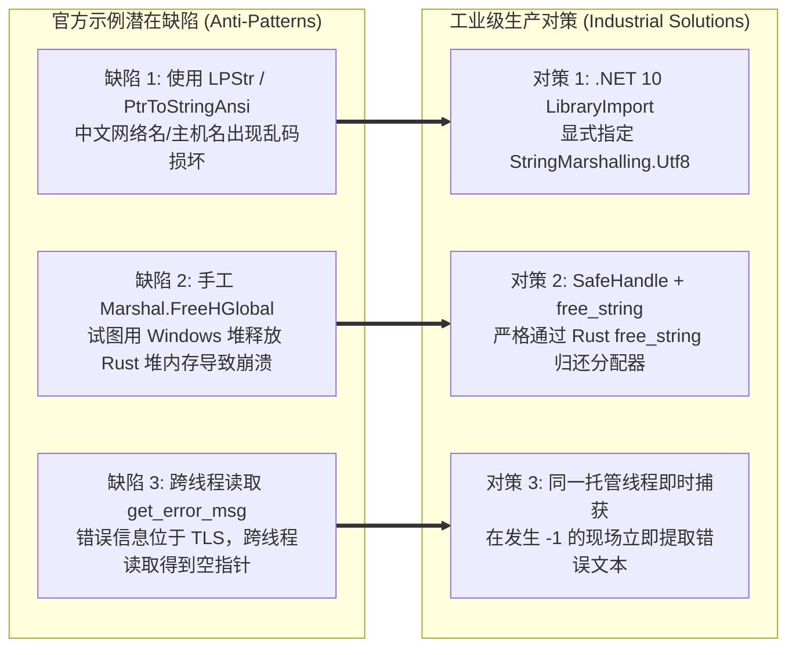
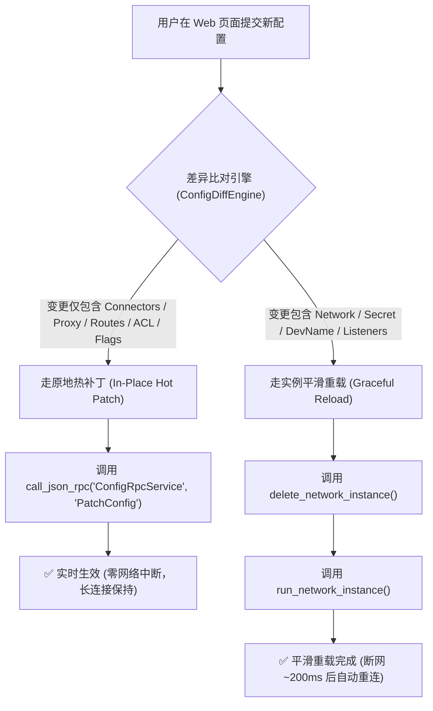
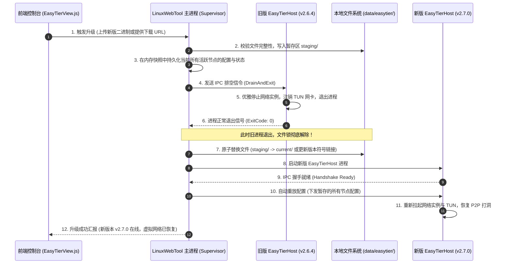

# EasyTier 虚拟组网节点管理与双层热更新技术方案

> **文档定位**：技术可行性调研报告、分层架构设计规范与工业级工程落地实施方案  
> **面向对象**：LinuxWebTool 核心开发、网络组网架构师、系统运维工程师  
> **参考来源**：`E:\WorkProject\Rust\【参考项目】\EasyTier-main` (`easytier-contrib/easytier-ffi`, `easytier-core`)  
> **集成目标**：`LinuxWebTool`（.NET 10 Native AOT / Linux & Windows 跨平台）  
> **文档基线**：符合项目架构门禁 `LinuxArch001 ~ LinuxArch007` 规范  

---

## 目录

1. [背景、业务价值与核心需求](#一背景业务价值与核心需求)
   - 1.1 [背景与业务场景](#11-背景与业务场景)
   - 1.2 [核心功能需求矩阵](#12-核心功能需求矩阵)
   - 1.3 [关键技术挑战与约束](#13-关键技术挑战与约束)
2. [EasyTier 官方生态与 C ABI / FFI 深度剖析](#二easytier-官方生态与-c-abi--ffi-深度剖析)
   - 2.1 [架构全景与组件关系](#21-架构全景与组件关系)
   - 2.2 [核心导出 FFI 函数拓扑与安全契约](#22-核心导出-ffi-函数拓扑与安全契约)
   - 2.3 [call_json_rpc 统一 RPC 总线机制详解](#23-call_json_rpc-统一-rpc-总线机制详解)
   - 2.4 [FFI 边界内存模型与底层避坑指南](#24-ffi-边界内存模型与底层避坑指南)
3. [双层“热更新”可行性深度论证与方案对比](#三双层热更新可行性深度论证与方案对比)
   - 3.1 [第一层：配置热更新（Runtime Config Hot-Update）](#31-第一层配置热更新runtime-config-hot-update)
   - 3.2 [第二层：程序内核热更新（Core Engine / Binary Hot-Update）](#32-第二层程序内核热更新core-engine--binary-hot-update)
   - 3.3 [双层更新选型总结矩阵](#33-双层更新选型总结矩阵)
4. [LinuxWebTool C# 原生分层设计与工程实现](#四linuxwebtool-c-原生分层设计与工程实现)
   - 4.1 [四层工程架构模型](#41-四层工程架构模型)
   - 4.2 [Contracts 抽象设计 (LinuxArch001 合规)](#42-contracts-抽象设计-linuxarch001-合规)
   - 4.3 [Native 互操作与 SafeHandle 内存安全防护](#43-native-互操作与-safehandle-内存安全防护)
   - 4.4 [Out-of-Process Supervisor 进程管理与 IPC 设计](#44-out-of-process-supervisor-进程管理与-ipc-设计)
   - 4.5 [存储与持久化设计 (Dapper AOT 零反射)](#45-存储与持久化设计-dapper-aot-零反射)
   - 4.6 [WebHost Minimal API / Controller 接口端点规范](#46-webhost-minimal-api--controller-接口端点规范)
5. [Web 控制台交互与前端设计 (EasyTierView.js)](#五web-控制台交互与前端设计-easytierviewjs)
   - 5.1 [页面布局与设计语言规范](#51-页面布局与设计语言规范)
   - 5.2 [六大核心交互模块设计](#52-六大核心交互模块设计)
6. [实施路线图、架构门禁与验收测试标准](#六实施路线图架构门禁与验收测试标准)
   - 6.1 [分阶段实施路线图](#61-分阶段实施路线图)
   - 6.2 [架构门禁与代码合规规范](#62-架构门禁与代码合规规范)
   - 6.3 [严格验收测试矩阵](#63-严格验收测试矩阵)

---

## 一、背景、业务价值与核心需求

### 1.1 背景与业务场景

`LinuxWebTool` 现已具备完善的本地运维（Web 终端、指令管理、定时任务、系统监控）、媒体与存储（文件管理、SMB/WebDAV/Rclone 挂载、FFmpeg 硬件转码）以及出网穿透（家庭网关 YARP 反代、ProxyByCF FRP 多线路反向穿透）能力。

然而，在面对**多地域机器协同、去中心化点对点内网穿透、异地组网（SD-WAN）、无公网 IP 节点互联**等场景时，仅依靠中继型反向穿透（如 FRP/CF）存在以下局限：
1. **中继带宽与延迟瓶颈**：所有大流量文件传输、媒体串流与远程终端均需途经第三方公网中继节点，受限于公网带宽，且在同城或同运营商网络下存在绕路延迟；
2. **点对点直连（P2P）缺失**：无法直接利用 NAT 打洞（STUN）在两个私网节点之间建立加密高速 UDP 直连链路；
3. **网状虚拟局域网（Full-Mesh VNet）诉求**：用户有多台异地主机（如家庭 NAS、公司开发机、云服务器 VPS、移动笔记本），迫切需要一个统一的虚拟子网 IP（如 `10.144.144.0/24`），实现无缝全互联。

**EasyTier** 是一款基于 Rust 编写的高性能去中心化网状 VPN/虚拟组网工具。官方仓库已内置 C ABI/FFI 暴露层（`easytier-contrib/easytier-ffi`）以及 C# P/Invoke 接入示例，为 .NET 深度集成提供了坚实的基础。

在 `LinuxWebTool` 的“网络与穿透”模块中新增 **EasyTier 组网管理**，与现有 Gateway、FRP 形成强强联合的三维网络矩阵：

```text
┌────────────────────────────────────────────────────────────────────────┐
│                        LinuxWebTool 网络矩阵                            │
├─────────────────────┬──────────────────────────┬───────────────────────┤
│    YARP 家庭网关     │      ProxyByCF FRP       │    EasyTier 虚拟组网   │
│ (Inbound Reverse)   │    (Outbound Egress)     │   (Mesh P2P Overlay)  │
├─────────────────────┼──────────────────────────┼───────────────────────┤
│ 局域网/公网反代分流  │ 无公网无端口映射穿透     │ 跨地域私网点对点互联   │
│ 端口映射/域名路由   │ 兜底中继 / Cloudflare    │ P2P NAT 打洞直连优先  │
│ 网站/API/媒体对外暴露│ 302 虚拟子路由代拉      │ 虚拟局域网 Full-Mesh  │
└─────────────────────┴──────────────────────────┴───────────────────────┘
```

### 1.2 核心功能需求矩阵

1. **节点生命周期管理**：
   - 支持创建本地 EasyTier 虚拟网络节点（支持配置向导与原生 TOML 模式）；
   - 支持多节点独立启停、状态检测、异常捕获、开机自动启动与配置持久化；
   - 实时采集各节点的虚拟网卡设备（TUN）、虚拟 IPv4/IPv6、STUN 探测公网映射、监听端口。
2. **拓扑与对端监控**：
   - 可视化展示对端（Peers）列表、链路类型（`Direct` 直连打洞 vs `Relay` 中继转发）；
   - 动态采集往返时延（RTT）、丢包率、物理连接协议（TCP / UDP / WireGuard / KCP / WebSocket）、累计收发字节数；
   - 查看全网路由表（Routes）与子网代理（Proxy Networks）广播。
3. **双层热更新能力**：
   - **配置热更新（Config Hot-Update）**：在网络不断开、虚拟网卡不注销、业务 TCP 连接不中断的前提下，动态增删对端（Connectors）、调整路由规则（Routes）、配置子网代理（Proxy Networks）、调整端口转发与 ACL 策略；对于网络名称、私钥等核心变更，支持百毫秒级平滑重启。
   - **程序/内核热更新（Core Engine Hot-Update）**：在 `LinuxWebTool` 主 Web 服务 7x24 小时不退出的前提下，支持对底层 EasyTier 核心组件（`easytier_ffi` 动态库 / Host 引擎）进行热升级，升级过程自动暂存配置，网络短暂重连后全自动恢复。

### 1.3 关键技术挑战与约束

1. **.NET 10 Native AOT 纯原生约束**：
   - `LinuxWebTool` 全栈开启 `IsAotCompatible = true`，严禁在运行时使用未裁剪的反射、动态代码生成（Reflection.Emit）或未经代码生成的 JSON 序列化；
   - P/Invoke 声明必须全面采用 C# 源码生成器 `[LibraryImport]`，且严格遵循 UTF-8 封送规范。
2. **跨平台特权安全与 TUN 虚拟网卡隔离**：
   - Linux 环境下创建 TUN 虚拟网卡设备（`/dev/net/tun`）需要 `CAP_NET_ADMIN` 权限；
   - Windows 环境下依赖 Wintun 驱动，需要管理员特权；
   - `LinuxWebTool` 主进程应尽量保持以普通受限权限运行，避免将整个 Web 站点暴露在特权上下文中。
3. **Windows 动态链接库文件锁定与 Rust 运行时内存生命周期**：
   - Windows 内核对已加载的 `.dll` 文件施加独占句柄锁，运行期间无法原地覆盖；
   - Rust Tokio 运行时、异步工作线程池与 Wintun 句柄若在进程内被粗暴释放，极易引发不可恢复的内存崩溃（Access Violation 0xC0000005）。

---

## 二、EasyTier 官方生态与 C ABI / FFI 深度剖析

根据对官方参考项目 `E:\WorkProject\Rust\【参考项目】\EasyTier-main` 的源码审查，EasyTier 拥有专门维护的 C ABI/FFI 封装层：`easytier-contrib/easytier-ffi`。

### 2.1 架构全景与组件关系

```text
┌─────────────────────────────────────────────────────────────────┐
│                    上层宿主语言 (.NET / C#)                      │
│   LinuxWebTool Web 控制台 / EasyTier Supervisor / IPC Client    │
└───────────────────────────────┬─────────────────────────────────┘
                                │ Cdecl ABI / UTF-8 字符串
                                ▼
┌─────────────────────────────────────────────────────────────────┐
│           easytier_ffi.dll / libeasytier_ffi.so (cdylib)        │
│                                                                 │
│  ┌─────────────────────────┐     ┌───────────────────────────┐  │
│  │   Instance API (导出)   │     │   call_json_rpc (总线)    │  │
│  │  - parse_config         │     │  - PeerManageRpcService   │  │
│  │  - run_network_instance │     │  - ConfigRpcService       │  │
│  │  - delete_network_inst  │     │  - StatsRpcService        │  │
│  │  - collect_network_infos│     │  - ConnectorManageRpc     │  │
│  └────────────┬────────────┘     └─────────────┬─────────────┘  │
│               │                                │                │
│               ▼                                ▼                │
│       NativeInstanceManager / ProcessManagementRpc              │
└───────────────────────────────┬─────────────────────────────────┘
                                │ Rust 内部调用
                                ▼
┌─────────────────────────────────────────────────────────────────┐
│                        easytier-core                            │
│  - Tokio Runtime / 异步多线程执行器                              │
│  - TUN 虚拟网络驱动抽象 (Linux TUN / Windows Wintun)             │
│  - P2P NAT 打洞引擎 (STUN / UDP / TCP / KCP / WG)               │
│  - 动态路由与加密数据平面 (ChaCha20-Poly1305 / AES-GCM)          │
└─────────────────────────────────────────────────────────────────┘
```

### 2.2 核心导出 FFI 函数拓扑与安全契约

在 `easytier-contrib/easytier-ffi/src/lib.rs` 中，导出了精简且完备的 C ABI 接口：

```rust
// 1. 配置校验
pub unsafe extern "C" fn parse_config(cfg_str: *const c_char) -> c_int;

// 2. 实例生命周期
pub unsafe extern "C" fn run_network_instance(cfg_str: *const c_char) -> c_int;
pub unsafe extern "C" fn retain_network_instance(inst_names: *const *const c_char, length: usize) -> c_int;
pub unsafe extern "C" fn delete_network_instance(inst_names: *const *const c_char, length: usize) -> c_int;
pub unsafe extern "C" fn list_instance(infos: *mut KeyValuePair, max_length: usize) -> c_int;
pub unsafe extern "C" fn collect_network_infos(infos: *mut KeyValuePair, max_length: usize) -> c_int;

// 3. 外部 TUN 文件描述符挂载（支持无 root 或特权前置创建）
pub unsafe extern "C" fn set_tun_fd(inst_name: *const c_char, fd: c_int) -> c_int;

// 4. 通用 JSON-RPC 调度总线
pub unsafe extern "C" fn call_json_rpc(
    service_name: *const c_char,
    method_name: *const c_char,
    domain_name: *const c_char,
    payload_json: *const c_char,
    out_response_json: *mut *const c_char,
) -> c_int;

// 5. 错误捕获与内存释放
pub unsafe extern "C" fn get_error_msg(out: *mut *const c_char);
pub extern "C" fn free_string(s: *const c_char);
```

#### 函数契约要点说明：

| 函数名称 | 输入要求 | 返回语义 | 线程安全与内存说明 |
|---|---|---|---|
| `parse_config` | 非空以 null 结尾的 UTF-8 TOML 字符串 | `0`: 语法合法；`-1`: 校验失败 | 纯内存解析，不改变全局状态；失败时可在当前线程读 `get_error_msg` |
| `run_network_instance` | 完整的 TOML 配置，包含唯一 `inst_name` | `0`: 启动成功；`-1`: 启动失败 | 在 Rust 内部单例 Runtime 异步启动实例并注册进全局 Manager |
| `delete_network_instance` | 待终止的实例名数组指针与长度 | `0`: 成功；`-1`: 失败 | 停止对应节点，注销 TUN，释放网络套接字 |
| `collect_network_infos` | 预分配的 `KeyValuePair` 结构体数组与容量 | 成功写入的记录数量；`-1`: 失败 | Key 为实例名，Value 为该实例完整的 JSON 运行信息快照；**必须调用 `free_string` 释放** |
| `call_json_rpc` | 服务名、方法名、可选域名、请求 JSON 负载 | `0`: 成功；`-1`: 失败 | 输出指向 Rust 堆分配的响应 JSON 字符串；**必须调用 `free_string` 释放** |
| `get_error_msg` | 输出二级指针 `*mut *const c_char` | 无返回值，将错误指针写入 `out` | 错误存于 TLS（Thread Local Storage）；返回的字符串**必须调用 `free_string` 释放** |
| `free_string` | 待释放的 C 字符串裸指针 | 无 | 将指针交还给 Rust 全局分配器回收；传 `NULL` 安全无操作 |

### 2.3 call_json_rpc 统一 RPC 总线机制详解

在早期的集成思路中，如果为 EasyTier 内部数十个管理功能分别编写 C ABI，会导致 FFI 接口极度膨胀且版本脆弱。EasyTier 现已采用统一的 **JSON-RPC 通用网关**（`call_json_rpc`），其内部映射机制位于 `easytier-core/src/management/instance_rpc/full.rs`：

```text
C# 托管调用端
      │
      │ call_json_rpc(service, method, domain, payloadJson, out responseJson)
      ▼
easytier-ffi (json_rpc.rs)
      │
      ▼ serde_json::from_str
easytier_core::management::call_management_json_rpc
      │
      ├─ "api.config.ConfigRpcService"          ───► GetConfig / PatchConfig (配置热更)
      ├─ "api.instance.PeerManageRpcService"    ───► ListPeers / GetPeerInfo (对端列表)
      ├─ "api.instance.PeerCenterManageRpcService" ──► GetGlobalPeerMap (全局网络拓扑)
      ├─ "api.instance.ConnectorManageRpcService"──► ListConnector / ManageConnector (连接器)
      ├─ "api.instance.StatsRpcService"         ──► GetStats / GetPrometheusStats (流量统计)
      ├─ "api.instance.AclManageRpcService"     ──► 黑白名单控制
      ├─ "api.instance.PortForwardManageRpcService" ─► 端口转发管理
      └─ "api.logger.LoggerRpcService"          ──► 动态日志级别变更
```

#### 关键调用优势：
1. **ABI 强稳定性**：底层 C 接口仅这一个函数，后续 EasyTier 新增 RPC 方法时，无需重新编译修改 C ABI 签名；
2. **C# 强类型泛型封装**：C# 侧可直接封装为强类型异步方法：
   ```csharp
   public async Task<TResponse> CallRpcAsync<TRequest, TResponse>(
       string service, string method, TRequest request, string? domain = null)
   ```
3. **双向 JSON 自动编解码**：在 .NET 10 Native AOT 下，通过 `System.Text.Json` 源码生成上下文（`JsonSerializerContext`），兼具极高吞吐与完全无反射安全性。

### 2.4 FFI 边界内存模型与底层避坑指南

官方提供的 `csharp.cs` 示例仅用于基础功能演示，在生产环境落地时必须彻底解决以下三个原生互操作缺陷：



1. **UTF-8 字符集强制规范**：
   - Rust 的 `CStr::from_ptr` 严格要求 UTF-8 编码；
   - 传统 `[DllImport]` 默认使用 Windows ANSI，若配置文件中包含中文节点名称、路径或网络备注，会产生非法字节序列导致 `TomlConfigLoader` 解析失败；
   - **方案**：采用 C# 11+ / .NET 10 的 `[LibraryImport(..., StringMarshalling = StringMarshalling.Utf8)]`。
2. **跨分配器内存释放问题（Cross-Allocator Memory Leak/Crash）**：
   - 官方 FFI 返回的 `char*`（如 `collect_network_infos` 中的键值对、`call_json_rpc` 响应 JSON）是由 Rust `CString::into_raw()` 分配在 Rust 内置全局分配器（通常是系统 malloc/jemalloc）上的；
   - 严禁用 C# 的 `Marshal.FreeHGlobal` 或 `CoTaskMemFree` 去释放该内存，否则会破坏操作系统堆结构或引发内存泄漏；
   - **方案**：必须严格封装 `free_string(ptr)`，并使用 `SafeHandle` 保障即使发生异常也不发生原生内存泄漏。
3. **错误信息线程局部存储（TLS）特性**：
   - `get_error_msg` 内部读取的是 Rust 当前线程的局部存储变量；
   - 在 async/await 异步上下文中，线程可能会发生切换（Execution Context Switch）。因此在检测到 FFI 返回值 `< 0` 时，必须立即在同一线程上同步调用 `get_error_msg` 并转为 C# 字符串后抛出，严禁延后到其它线程读取。

---

## 三、双层“热更新”可行性深度论证与方案对比

集成 EasyTier 的核心技术诉求之一在于“热更新”。在工程架构上，必须清晰解耦两个截然不同的维度：
1. **配置热更新**：用户修改了组网参数，如何让运行中的 EasyTier 实例实时生效？
2. **程序内核热更新**：当 EasyTier 发布新版本修复 Bug 或升级协议时，如何在主 Web 进程不重启的前提下替换执行核心？

### 3.1 第一层：配置热更新（Runtime Config Hot-Update）

根据对 `easytier-core/src/management/full/config_patch.rs` 的深度审查，EasyTier 内部原生支持强劲的运行时补丁（`InstanceConfigPatch`）机制！

#### 3.1.1 原地热打补丁（In-Place Hot Patching via `PatchConfig`）

通过 `call_json_rpc` 调用服务 `api.config.ConfigRpcService` 的 `PatchConfig` 方法，可以实现**无丢包、无断网、TUN 设备不重建**的零停机原地热更新。

**官方核心代码证明**（`config_patch.rs`）：
```rust
// 摘自 easytier-core/src/management/full/config_patch.rs
patch_port_forwards(&candidate, patch.port_forwards);
patch_acl(&candidate, patch.acl);
patch_proxy_networks(&candidate, patch.proxy_networks);
patch_routes(&candidate, patch.routes);
patch_exit_nodes_config(&candidate, patch.exit_nodes);
patch_mapped_listeners(&candidate, patch.mapped_listeners);
patch_connectors(instance, patch.connectors)?; // 动态增删对端连接！
```

**支持原地热补丁的配置属性清单**：
- ✅ **Connectors**：动态增加、移除、修改待连接的对端节点地址（`tcp://...`, `udp://...`）；
- ✅ **Proxy Networks**：动态更新内网子网代理网段（如新增 `192.168.2.0/24`）；
- ✅ **Routes**：动态调整路由跳数与指定路由目标；
- ✅ **Port Forwards**：动态管理端口转发映射条目；
- ✅ **ACL 访问控制**：黑白名单规则变更；
- ✅ **Exit Nodes**：出口网关节点选择变更；
- ✅ **Mapped Listeners**：公网映射监听器变更；
- ✅ **Hostname**：节点主机名热改；
- ✅ **运行时 Flags**：`disable_relay_data`（禁止中继数据）、`prefer_peer_relay`（对端中继优先）等。

#### 3.1.2 实例平滑重载（Node Graceful Reload）

若用户修改了涉及底层协议骨架或虚拟网卡初始化的根本属性，则无法通过 `PatchConfig` 处理：
- ❌ **Network Name**（网络名称）
- ❌ **Network Secret**（网络加密秘钥）
- ❌ **Dev Name**（虚拟网卡设备名，如 `tun0` 改为 `tun1`）
- ❌ **DHCP / 虚拟 IP 主网段分配机制变更**
- ❌ **物理监听端口变更**（`listeners`，如从 11010 改为 11020）

**平滑重载机制**：
C# 调度器捕获到此类变更后，执行百毫秒级平滑重载流水线：
```text
C# NodeManager
      │
      ├─ 1. delete_network_instance(inst_name)  ──► 释放旧实例、关闭旧 Socket
      ├─ 2. 短暂等待 100ms (等待内核网卡设备释放)
      └─ 3. run_network_instance(new_toml_cfg)   ──► 使用新参数拉起实例
```
在此过程中，宿主程序不受影响，重连耗时仅 100~300ms。

#### 3.1.3 配置变更智能路由决策树



---

### 3.2 第二层：程序内核热更新（Core Engine / Binary Hot-Update）

当 EasyTier 核心更新版本（例如从 `v2.6.4` 升级到 `v2.7.0`）时，如何实现系统的热升级？

#### 3.2.1 方案 A：进程内 P/Invoke 原地替换 DLL（In-Process DLL Hot-Swap）

此方案试图在 `LinuxWebTool` 主进程中，通过 `NativeLibrary.Free()` 卸载 `easytier_ffi.dll`，覆盖磁盘文件后再 `NativeLibrary.Load()` 重新加载。

**可行性评估**：❌ **强烈反对 / 严重反模式（Dangerous Anti-Pattern）**。

**深度原因分析**：
1. **Windows 操作系统文件句柄锁死**：
   Windows 载入 DLL 时，内核内存管理器会将其映射为 `SEC_IMAGE`，操作系统直接给该文件施加只读执行共享锁。在进程退出前，外部任何文件写操作、覆盖操作均会遭到系统拒绝（`0x00000020 ERROR_SHARING_VIOLATION` 或 `Access Denied`）。
2. **Tokio 异步多线程与原生句柄未决挂起**：
   EasyTier 内部拥有多线程 Tokio 异步执行器、Wintun 网卡驱动常驻线程以及异步 I/O 完成端口（IOCP）。即使在 C# 调用了 `delete_network_instance`，Rust 内部的全局静态变量、日志句柄、网络事件循环线程很难做到 100% 彻底洁净析构。一旦粗暴调用 `FreeLibrary`，残留的后台线程在下一次调度时将执行到已被回收的内存地址，触发硬性崩溃 `Access Violation 0xC0000005`，整个 C# Web 服务瞬间同归于尽。
3. **.NET 10 Native AOT 编译期符号绑定限制**：
   在 Native AOT 静态编译模式下，`[LibraryImport]` 通常在链接期或二进制初始化时直接解析动态库符号，动态卸载与重新重定位极其复杂且不受官方支持。

#### 3.2.2 方案 B：独立受控 Host 进程架构（Out-of-Process Sidecar / Supervisor Architecture）—— 推荐方案

将 EasyTier 核心执行层剥离至一个轻量级的独立宿主进程（`EasyTier.Host` / `EasyTierHost.exe`），`LinuxWebTool` 作为主守护者（Supervisor），通过轻量 IPC（进程间通信）进行双向管控。

```text
┌────────────────────────────────────────────────────────────────────────┐
│                      LinuxWebTool (主 Web 进程)                        │
│                7x24 小时保持运行 / 零重启 / 提供 Web 控制台            │
│                                                                        │
│  ┌─────────────────────────┐         ┌──────────────────────────────┐  │
│  │   EasyTier Supervisor   │◄────────┤   EasyTier Node Controller   │  │
│  │  - 进程保活与自动拉起   │         │  - 节点 CRUD / 拓扑采集      │  │
│  │  - 版本检测与内核热升级 │         │  - 配置差异路由 (HotPatch)   │  │
│  └────────────┬────────────┘         └──────────────┬───────────────┘  │
│               │                                     │                  │
└───────────────┼─────────────────────────────────────┼──────────────────┘
                │ 进程控制 (启动/排空/退出)            │ 高性能 IPC
                │                                     │ (NamedPipe / UDS)
                ▼                                     ▼
┌────────────────────────────────────────────────────────────────────────┐
│                  EasyTierHost.exe / easytier-host                      │
│                   独立受控工作进程 (受限/特权分离)                     │
│                                                                        │
│        P/Invoke / LibraryImport                                        │
│               │                                                        │
│               ▼                                                        │
│        easytier_ffi.dll / libeasytier_ffi.so                           │
│               │                                                        │
│               ▼                                                        │
│        EasyTier Core (Rust 核心网络拓扑 / TUN / P2P)                   │
└────────────────────────────────────────────────────────────────────────┘
```

#### 3.2.3 方案 B 内核热升级标准作业流水线（Runbook）

在独立 Host 架构下，升级 EasyTier 核心时无需重启 `LinuxWebTool`，用户感知仅为网络短暂瞬断 1~2 秒：



#### 3.2.4 独立 Host 架构带来的附加工程红利：
1. **安全与特权最小化隔离**：
   - 主 Web 进程只需普通用户权限对外开放 HTTP 端口；
   - 只有 `EasyTierHost` 需要网络特权（Linux `CAP_NET_ADMIN` 或 Windows 管理员权限），避免由于 Web 漏洞导致提权风险。
2. **崩溃自愈与隔离（Fault Tolerance）**：
   - 若 Rust 核心由于特定网络异常或驱动崩溃（Panic），只会导致子进程 `EasyTierHost` 退出；
   - `LinuxWebTool` 主进程的 Supervisor 能够毫秒级感知退出事件，记录崩溃日志，并在指数退避机制下自动拉起 Host，恢复所有网络节点，整体可用性成倍提升。

---

### 3.3 双层更新选型总结矩阵

| 更新分类 | 更新目标 | 推荐实现路径 | 业务影响 | 宿主程序表现 |
|---|---|---|---|---|
| **第一层：配置热更新** | Connectors、Routes、ProxyNetworks、ACL、PortForward、Flags | `call_json_rpc` 调 `PatchConfig` | **零中断**，长连接不断，TUN 不重建 | `LinuxWebTool` 保持运行 |
| **第一层：平滑重载** | NetworkName、Secret、DevName、Listeners | `delete_instance` 后 `run_instance` | **瞬断 100~300ms**，自动重连 | `LinuxWebTool` 保持运行 |
| **第二层：程序热更新** | `easytier_ffi` 动态库升级、Rust Core 版本更新 | **独立 Host 守护架构**（Drain 退出 -> 文件替换 -> 拉起恢复） | **瞬断 1~2s**，自动全量恢复 | `LinuxWebTool` **完全不重启** |
| *(反模式对比)* | 进程内原地替换动态库 | `NativeLibrary.Free` + 覆盖 DLL | **极高风险**：文件被 Windows 锁死、内存泄漏、0xC0000005 崩溃 | 导致主 Web 程序瞬间闪退 |

---

## 四、LinuxWebTool C# 原生分层设计与工程实现

遵循 `LinuxWebTool` 项目的架构门禁规范（`LinuxArch001 ~ LinuxArch007`），针对 EasyTier 进行清晰分层。

### 4.1 四层工程架构模型

```text
┌────────────────────────────────────────────────────────────────────────┐
│                        LinuxWebTool.WebHost                            │
│  - Routes/EasyTierController.cs (RESTful / Minimal API 路由映射)       │
│  - wwwroot/app/views/EasyTierView.js (现代化 Web 控制台)               │
└───────────────────────────────────┬────────────────────────────────────┘
                                    │ 依赖下层服务注入
                                    ▼
┌────────────────────────────────────────────────────────────────────────┐
│                     LinuxWebTool.Infrastructure                        │
│  - EasyTier/EasyTierHostSupervisor.cs (进程生命周期/保活/热升级编排)   │
│  - EasyTier/EasyTierIpcClient.cs (基于 System.IO.Pipelines 的 IPC 客户端)│
│  - EasyTier/EasyTierNodeManager.cs (业务聚合/配置差异路由/状态采集)    │
│  - Persistence/EasyTierNodeStore.cs (Dapper AOT 零反射持久化)          │
│  - Persistence/Entities/EasyTierNodeEntity.cs                          │
└───────────────────┬────────────────────────────────┬───────────────────┘
                    │ 仅引用 Contracts               │ (仅在 Host 进程内引用)
                    ▼                                ▼
┌──────────────────────────────────────┐  ┌──────────────────────────────┐
│       LinuxWebTool.Contracts         │  │       EasyTier.Native        │
│  (零依赖/纯 BCL/符合 LinuxArch001)    │  │ (LibraryImport UTF-8 声明)   │
│  - Interfaces/IEasyTierManager.cs    │  │ - EasyTierNativeMethods.cs   │
│  - Models/EasyTierNodeModels.cs      │  │ - SafeEasyTierStringHandle.cs│
└──────────────────────────────────────┘  └──────────────────────────────┘
```

---

### 4.2 Contracts 抽象设计 (LinuxArch001 合规)

在 `src/LinuxWebTool.Contracts` 中定义纯抽象接口与 DTO 模型，保证零外部包依赖。

```csharp
namespace LinuxWebTool.Contracts.Interfaces;

/// <summary>EasyTier 节点生命周期与网络拓扑管理器</summary>
public interface IEasyTierManager
{
    Task<IReadOnlyList<EasyTierNodeStatusDto>> GetAllNodeStatusesAsync(CancellationToken ct = default);
    Task<EasyTierNodeDetailDto?> GetNodeDetailAsync(string nodeId, CancellationToken ct = default);
    Task<EasyTierNodeStatusDto> CreateNodeAsync(EasyTierNodeConfigDto config, CancellationToken ct = default);
    Task<EasyTierNodeStatusDto> UpdateNodeAsync(string nodeId, EasyTierNodeConfigDto config, CancellationToken ct = default);
    Task DeleteNodeAsync(string nodeId, CancellationToken ct = default);
    Task StartNodeAsync(string nodeId, CancellationToken ct = default);
    Task StopNodeAsync(string nodeId, CancellationToken ct = default);
    Task<EasyTierPatchResultDto> PatchNodeConfigAsync(string nodeId, EasyTierPatchRequestDto patch, CancellationToken ct = default);
    
    // 内核宿主与程序升级
    Task<EasyTierEngineStatusDto> GetEngineStatusAsync(CancellationToken ct = default);
    Task<EasyTierUpgradeResultDto> UpgradeEngineAsync(Stream binaryStream, string fileName, CancellationToken ct = default);
}
```

**核心 DTO 定义**（`src/LinuxWebTool.Contracts/Models/EasyTierNodeModels.cs`）：
```csharp
namespace LinuxWebTool.Contracts.Models;

public record EasyTierNodeConfigDto
{
    public string Id { get; init; } = string.Empty;
    public string InstanceName { get; init; } = string.Empty;
    public string NetworkName { get; init; } = "default";
    public string NetworkSecret { get; init; } = string.Empty;
    public string? VirtualIpv4 { get; init; }
    public bool EnableDhcp { get; init; } = true;
    public List<string> Listeners { get; init; } = [];
    public List<string> Peers { get; init; } = [];
    public List<string> ProxyNetworks { get; init; } = [];
    public List<string> Routes { get; init; } = [];
    public bool AutoStart { get; init; } = true;
    public string RawTomlOverride { get; init; } = string.Empty;
}

public record EasyTierNodeStatusDto
{
    public string Id { get; init; } = string.Empty;
    public string InstanceName { get; init; } = string.Empty;
    public bool IsRunning { get; init; }
    public string? VirtualIpv4 { get; init; }
    public string? DeviceName { get; init; }
    public int PeerCount { get; init; }
    public int DirectPeerCount { get; init; }
    public long TotalRxBytes { get; init; }
    public long TotalTxBytes { get; init; }
    public string? LastError { get; init; }
    public DateTime? StartedAt { get; init; }
}

public record EasyTierPeerDetailDto
{
    public string PeerId { get; init; } = string.Empty;
    public string Hostname { get; init; } = string.Empty;
    public string VirtualIpv4 { get; init; } = string.Empty;
    public string ConnectionType { get; init; } = "Direct"; // Direct / Relay
    public string Protocol { get; init; } = "UDP";
    public double LatencyMs { get; init; }
    public double LossRate { get; init; }
    public long RxBytes { get; init; }
    public long TxBytes { get; init; }
}
```

---

### 4.3 Native 互操作与 SafeHandle 内存安全防护

在 `EasyTier.Native` 层中，利用 .NET 10 的 `[LibraryImport]` 实现 100% Native AOT 编译兼容，并通过 `SafeHandle` 保证从 Rust 堆中取回的 C 字符串必经 `free_string` 安全归还：

```csharp
using System.Runtime.InteropServices;

namespace LinuxWebTool.Infrastructure.EasyTier.Native;

/// <summary>封装 Rust 分配的字符串指针，确保在垃圾回收或异常时调用 free_string</summary>
internal sealed class SafeEasyTierStringHandle : SafeHandle
{
    public SafeEasyTierStringHandle() : base(IntPtr.Zero, true) { }

    public override bool IsInvalid => handle == IntPtr.Zero;

    protected override bool ReleaseHandle()
    {
        if (handle != IntPtr.Zero)
        {
            EasyTierNativeMethods.free_string(handle);
            handle = IntPtr.Zero;
        }
        return true;
    }

    public string ToUtf8StringAndFree()
    {
        if (IsInvalid) return string.Empty;
        try
        {
            return Marshal.PtrToStringUTF8(handle) ?? string.Empty;
        }
        finally
        {
            Dispose();
        }
    }
}

/// <summary>.NET 10 Native AOT 源码生成式 P/Invoke 声明</summary>
internal static partial class EasyTierNativeMethods
{
    private const string DllName = "easytier_ffi";

    [LibraryImport(DllName, StringMarshalling = StringMarshalling.Utf8)]
    public static partial int parse_config(string cfgStr);

    [LibraryImport(DllName, StringMarshalling = StringMarshalling.Utf8)]
    public static partial int run_network_instance(string cfgStr);

    [LibraryImport(DllName)]
    public static partial int retain_network_instance(IntPtr instNames, nuint length);

    [LibraryImport(DllName)]
    public static partial int delete_network_instance(IntPtr instNames, nuint length);

    [LibraryImport(DllName)]
    public static partial int list_instance(IntPtr infos, nuint maxLength);

    [LibraryImport(DllName)]
    public static partial int collect_network_infos(IntPtr infos, nuint maxLength);

    [LibraryImport(DllName, StringMarshalling = StringMarshalling.Utf8)]
    public static partial int set_tun_fd(string instName, int fd);

    [LibraryImport(DllName, StringMarshalling = StringMarshalling.Utf8)]
    public static partial int call_json_rpc(
        string serviceName,
        string methodName,
        string? domainName,
        string payloadJson,
        out IntPtr outResponseJson);

    [LibraryImport(DllName)]
    public static partial void get_error_msg(out IntPtr errorMsg);

    [LibraryImport(DllName)]
    public static partial void free_string(IntPtr s);

    public static string GetLastErrorMessage()
    {
        get_error_msg(out var ptr);
        if (ptr == IntPtr.Zero) return "Unknown native error";
        try
        {
            return Marshal.PtrToStringUTF8(ptr) ?? "Unknown native error";
        }
        finally
        {
            free_string(ptr);
        }
    }
}
```

---

### 4.4 Out-of-Process Supervisor 进程管理与 IPC 设计

为了落实推荐的**独立受控 Host 架构**，在 `LinuxWebTool.Infrastructure` 中实现轻量级 Supervisor：

#### 4.4.1 通信通道规范
- **Windows**：命名管道（Named Pipe）：`\\.\pipe\linuxwebtool_easytier_ipc`
- **Linux**：Unix 域套接字（UDS）：`/run/linuxwebtool/easytier_host.sock`
- **协议帧格式**：采用与 FRP 模块设计对齐的超轻量文本行协议（JSON Lines）或 System.IO.Pipelines，报文格式：
  ```json
  {"id": 1, "action": "RUN_INSTANCE", "payload": "inst_name=... toml=..."}
  {"id": 1, "success": true, "data": {...}}
  ```

#### 4.4.2 Supervisor 核心状态机与升级编排器

```csharp
namespace LinuxWebTool.Infrastructure.EasyTier;

public class EasyTierHostSupervisor : IHostedService
{
    private readonly ILogger<EasyTierHostSupervisor> _logger;
    private readonly EasyTierNodeStore _store;
    private Process? _hostProcess;
    private CancellationTokenSource? _monitorCts;

    public async Task StartAsync(CancellationToken cancellationToken)
    {
        await EnsureHostRunningAsync(cancellationToken);
        _monitorCts = new CancellationTokenSource();
        _ = MonitorHostLifecycleLoopAsync(_monitorCts.Token);
    }

    /// <summary>执行核心程序热升级流水线</summary>
    public async Task<bool> ExecuteHotUpgradeAsync(string stagedBinaryPath)
    {
        _logger.LogInformation("Starting EasyTier Core Hot-Upgrade pipeline...");
        
        // 1. 获取当前所有运行中实例配置
        var activeNodes = await _store.GetActiveNodesAsync();
        
        // 2. 向 Host 发送优雅排空指令
        if (_hostProcess != null && !_hostProcess.HasExited)
        {
            await SendIpcCommandAsync(new { action = "DRAIN_AND_EXIT" });
            using var waitCts = new CancellationTokenSource(TimeSpan.FromSeconds(5));
            try { await _hostProcess.WaitForExitAsync(waitCts.Token); }
            catch (OperationCanceledException) { _hostProcess.Kill(entireProcessTree: true); }
        }

        // 3. 文件原子替换 (Windows 重命名/Linux 覆盖)
        var targetBinaryPath = GetHostBinaryPath();
        File.Copy(stagedBinaryPath, targetBinaryPath, overwrite: true);
        File.Delete(stagedBinaryPath);

        // 4. 重启 Host 进程并重放节点网络配置
        await EnsureHostRunningAsync(CancellationToken.None);
        foreach (var node in activeNodes)
        {
            await SendIpcCommandAsync(new { action = "RUN_INSTANCE", toml = node.TomlConfig });
        }

        _logger.LogInformation("EasyTier Core Hot-Upgrade pipeline completed successfully.");
        return true;
    }
}
```

---

### 4.5 存储与持久化设计 (Dapper AOT 零反射)

在 SQLite 数据库中创建 `easytier_nodes` 表，并使用与项目既有规范一致的 `[DapperAot]` 仓储：

#### 4.5.1 表结构（追加至 `DbSetup.cs`）

```sql
CREATE TABLE IF NOT EXISTS easytier_nodes (
    Id TEXT PRIMARY KEY,
    InstanceName TEXT NOT NULL UNIQUE,
    NetworkName TEXT NOT NULL,
    NetworkSecret TEXT NOT NULL,
    VirtualIpv4 TEXT,
    EnableDhcp INTEGER NOT NULL DEFAULT 1,
    ListenersJson TEXT NOT NULL DEFAULT '[]',
    PeersJson TEXT NOT NULL DEFAULT '[]',
    ProxyNetworksJson TEXT NOT NULL DEFAULT '[]',
    RoutesJson TEXT NOT NULL DEFAULT '[]',
    RawTomlOverride TEXT,
    AutoStart INTEGER NOT NULL DEFAULT 1,
    Status INTEGER NOT NULL DEFAULT 0, -- 0: Stopped, 1: Running, 2: Error
    LastError TEXT,
    UpdateTime TEXT NOT NULL
);
```

#### 4.5.2 仓储实现（`EasyTierNodeStore.cs`）

```csharp
using Dapper;
using LinuxWebTool.Infrastructure.Persistence.Entities;

namespace LinuxWebTool.Infrastructure.Persistence;

[DapperAot]
public partial class EasyTierNodeStore(DbConnectionFactory factory)
{
    public async Task<List<EasyTierNodeEntity>> GetAllAsync()
    {
        using var db = factory.CreateConnection();
        var list = await db.QueryAsync<EasyTierNodeEntity>("SELECT * FROM easytier_nodes ORDER BY InstanceName ASC");
        return list.ToList();
    }

    public async Task<EasyTierNodeEntity?> GetByIdAsync(string id)
    {
        using var db = factory.CreateConnection();
        return await db.QueryFirstOrDefaultAsync<EasyTierNodeEntity>(
            "SELECT * FROM easytier_nodes WHERE Id = @Id", new { Id = id });
    }

    public async Task UpsertAsync(EasyTierNodeEntity entity)
    {
        using var db = factory.CreateConnection();
        const string sql = @"
            INSERT INTO easytier_nodes (
                Id, InstanceName, NetworkName, NetworkSecret, VirtualIpv4, EnableDhcp,
                ListenersJson, PeersJson, ProxyNetworksJson, RoutesJson, RawTomlOverride,
                AutoStart, Status, LastError, UpdateTime
            ) VALUES (
                @Id, @InstanceName, @NetworkName, @NetworkSecret, @VirtualIpv4, @EnableDhcp,
                @ListenersJson, @PeersJson, @ProxyNetworksJson, @RoutesJson, @RawTomlOverride,
                @AutoStart, @Status, @LastError, @UpdateTime
            ) ON CONFLICT(Id) DO UPDATE SET
                InstanceName = excluded.InstanceName,
                NetworkName = excluded.NetworkName,
                NetworkSecret = excluded.NetworkSecret,
                VirtualIpv4 = excluded.VirtualIpv4,
                EnableDhcp = excluded.EnableDhcp,
                ListenersJson = excluded.ListenersJson,
                PeersJson = excluded.PeersJson,
                ProxyNetworksJson = excluded.ProxyNetworksJson,
                RoutesJson = excluded.RoutesJson,
                RawTomlOverride = excluded.RawTomlOverride,
                AutoStart = excluded.AutoStart,
                Status = excluded.Status,
                LastError = excluded.LastError,
                UpdateTime = excluded.UpdateTime";
        await db.ExecuteAsync(sql, entity);
    }
}
```

---

### 4.6 WebHost Minimal API / Controller 接口端点规范

在 `src/LinuxWebTool.WebHost/Routes/EasyTierController.cs` 中暴露符合 RESTful 规范的控制端点，并自动由生成器接入 Minimal API 路由表：

| 方法 | 路由端点 | 描述 | 说明 |
|---|---|---|---|
| `GET` | `/api/easytier/nodes` | 获取全部节点及其简要状态 | 包含当前 IP、在线状态、Peer 计数 |
| `POST` | `/api/easytier/nodes` | 创建新网络节点 | 校验 TOML 语法后持久化 |
| `GET` | `/api/easytier/nodes/{id}` | 获取单个节点详细拓扑 | 包含实时 Peer 列表、RTT、打洞质量 |
| `PUT` | `/api/easytier/nodes/{id}` | 全量修改节点配置 | 内部自动分流判断走热补丁还是平滑重启 |
| `PATCH` | `/api/easytier/nodes/{id}/config` | **运行时配置热打补丁** | **零断网调用 `PatchConfig`** |
| `POST` | `/api/easytier/nodes/{id}/start` | 启动指定节点 | 调用 `run_network_instance` |
| `POST` | `/api/easytier/nodes/{id}/stop` | 停止指定节点 | 调用 `delete_network_instance` |
| `DELETE` | `/api/easytier/nodes/{id}` | 删除节点 | 停止实例并清理持久化记录 |
| `GET` | `/api/easytier/engine/status` | 获取 EasyTier 内核版本与状态 | 查看当前 Host 进程 PID、核心版本号 |
| `POST` | `/api/easytier/engine/upgrade` | **触发 EasyTier 内核热升级** | 上传新版二进制并执行原子平滑替换 |

---

## 五、Web 控制台交互与前端设计 (EasyTierView.js)

### 5.1 页面布局与设计语言规范

前端遵循项目现有的 Vue 3 + Tailwind CSS 暗色科技风格（与 `FrpView.js` / `GatewayView.js` 统一视觉规范）。

在顶部导航 `AppLayout.js` 的“网络与穿透”分组中新增入口：
```javascript
{
  key: 'network',
  label: '网络与穿透',
  children: [
    { path: '/gateway', label: '家庭网关', desc: 'YARP 反代与网站/端口转发' },
    { path: '/frp', label: 'FRP 穿透', desc: 'ProxyByCF 隧道 / 多线路 / 302代拉' },
    { path: '/easytier', label: 'EasyTier 组网', desc: '去中心化 P2P 虚拟局域网 / 节点与路由' },
  ],
}
```

### 5.2 六大核心交互模块设计

```text
┌────────────────────────────────────────────────────────────────────────┐
│  EasyTier 组网管理大盘                                [新建节点] [内核升级] │
├────────────────────────────────────────────────────────────────────────┤
│ ┌──────────────┐ ┌──────────────┐ ┌──────────────┐ ┌────────────────┐ │
│ │ 活跃节点数   │ │ P2P 直连对端 │ │ 全网虚拟 IP  │ │ 即时上下行吞吐 │ │
│ │    2 / 2 在线│ │   5 节点直连 │ │10.144.144.1/24│ │▲1.2MB/s ▼4.8MB/s│ │
│ └──────────────┘ └──────────────┘ └──────────────┘ └────────────────┘ │
├────────────────────────────────────────────────────────────────────────┤
│ 节点列表                                                               │
│ ┌────────────────────────────────────────────────────────────────────┐ │
│ │ ● home-nas (10.144.144.1) [默认网络: home_vnet]     [热配] [编辑] [停止]│ │
│ │   网卡: easytier0 | 监听: tcp://0.0.0.0:11010, udp://0.0.0.0:11010  │ │
│ │   对端拓扑: 4 节点在线 (3 直连 P2P, 1 中继 Relay)                   │ │
│ │   ┌──────────────────────────────────────────────────────────────┐ │ │
│ │   │ 对端节点    | 虚拟 IP      | 物理协议 | 延迟  | 模式 | 流量  │ │ │
│ │   ├────────────┼──────────────┼──────────┼───────┼──────┼───────┤ │ │
│ │   │ office-pc  | 10.144.144.2 | UDP(STUN)| 14ms  | 直连 | 120MB │ │ │
│ │   │ cloud-vps  | 10.144.144.5 | TCP      | 38ms  | 直连 | 540MB │ │ │
│ │   │ mobile-pad | 10.144.144.8 | KCP/Relay| 85ms  | 中继 | 12MB  │ │ │
│ │   └──────────────────────────────────────────────────────────────┘ │ │
│ └────────────────────────────────────────────────────────────────────┘ │
└────────────────────────────────────────────────────────────────────────┘
```

#### 模块交互细节：
1. **指标监控大盘**：直观展示节点运行状态、虚拟网卡 IP、公网 NAT 穿透类型（Full Cone / Symmetric / Restricted）、Direct 对端数与 Relay 中继数。
2. **节点配置向导对话框**：
   - 基础设置：实例名、网络名称、网络密码、虚拟 IP（支持静态指定或 DHCP 自动分配）；
   - 连接与监听：监听协议端口选择（TCP/UDP/WireGuard/KCP）、公共对端节点地址（支持一键填入官方公共节点或自建节点）；
   - 高级扩展：子网代理网段（Proxy Networks，例如打通家中的 `192.168.1.0/24`）、出口节点设置、点对点加密模式；
   - **原生 TOML 模式实时切换**：支持随时切换为 Monaco/Ace 样式的代码编辑器查看/微调 TOML 配置，且具备实时错误校验高亮。
3. **运行时热补丁快捷抽屉（Hot-Patch Drawer）**：
   - 当节点处于运行中时，点击“快捷热配”按钮唤出侧边抽屉；
   - 支持**动态追加/删除对端 Peer**或**子网代理网段**；
   - 点击“立即应用”，系统直接调用 `PatchConfig` RPC，页面弹出微提示：“补丁已生效，零断网连接已建立”。
4. **内核程序热升级模态框（Core Upgrade Modal）**：
   - 显示当前 EasyTier Core 版本（如 `v2.6.4`）、宿主进程 PID、运行时间；
   - 提供版本检测按钮与文件拖拽上传区（上传预编译的 `easytier_ffi.dll` / `libeasytier_ffi.so` 或整合包）；
   - 点击“执行热升级”后，页面展示 5 步进度条：`上传暂存 -> 配置快照 -> 旧核排空 -> 文件就位 -> 新核唤醒`；
   - 升级耗时约 1~2 秒，页面不刷新，网络重连指示灯自动恢复绿色。

---

## 六、实施路线图、架构门禁与验收测试标准

### 6.1 分阶段实施路线图

```text
阶段一：核心契约与 Native FFI 桥接
  ├─ 建立 LinuxWebTool.Contracts/EasyTier 模型与接口 (无外部依赖)
  ├─ 引入 EasyTier.Native / [LibraryImport] UTF-8 声明与 SafeHandle
  └─ 编写单元测试验证 parse_config 与 call_json_rpc 内存安全性

阶段二：受控 Host 进程与 Supervisor 编排
  ├─ 搭建独立 EasyTier.Host 宿主项目与基于 NamedPipe/UDS 的 IPC 总线
  ├─ 实现 EasyTierHostSupervisor 进程保活、心跳检测与优雅排空
  ├─ 实现 SQLite easytier_nodes 仓储持久化 (Dapper AOT 零反射)
  └─ 实现 ConfigDiffEngine (智能分流原地热更与平滑重载)

阶段三：Web API 控制器与前端交互页面
  ├─ 实现 EasyTierController RESTful 端点与 Minimal API 映射
  ├─ 编写前端 EasyTierView.js (大盘、节点卡片、拓扑展示、TOML 编辑器)
  └─ 接入 AppLayout.js 导航与权限拦截

阶段四：双层热更新全流程测试与自愈验证
  ├─ 验证 Connectors 增删零断网长连接测试
  ├─ 验证内核二进制热替换无感升级测试
  └─ 注入 Host 进程强杀故障，验证 Supervisor 秒级自愈拉起
```

### 6.2 架构门禁与代码合规规范

本方案的设计严格遵循 `docs/dev/architecture-gates.md` 所定义的门禁守则：
1. **LinuxArch001（Contracts 零依赖）**：
   `LinuxWebTool.Contracts` 中的 `IEasyTierManager` 及所有 DTO 仅引用 .NET BCL 核心类库，严禁引入任何第三方包或上层工程；
2. **LinuxArch002 / LinuxArch004（分层单向依赖）**：
   `Infrastructure` 仅单向依赖 `Contracts`；`WebHost` 依赖 `Infrastructure` 与 `Contracts`；严禁下层反向引用上层；
3. **LinuxArch005（Controller 禁直触 ORM）**：
   `EasyTierController` 只能通过 `IEasyTierManager` 服务接口交互，严禁在控制器中直接拼接 SQL 或直接访问底层 Store；
4. **LinuxArch007（命名空间一致性）**：
   命名空间与项目物理文件夹路径严格保持一致（如 `LinuxWebTool.Infrastructure.EasyTier.Native`）。

### 6.3 严格验收测试矩阵

| 测试维度 | 测试用例场景 | 期望行为与验收指标 | 判定准则 |
|---|---|---|---|
| **基础功能** | 创建节点并启动虚拟网络 | 成功创建虚拟网卡，获取到虚拟 IPv4，本地可 ping 通虚拟网卡 IP | 启动成功耗时 < 1s，状态转为 Running |
| **P2P 打洞** | 两台异地机器加入同一网络 | STUN 自动穿透成功，`ConnectionType` 显示为 `Direct`，RTT 低于公网中继 | 拓扑图清晰呈现直连链路与延迟 |
| **配置热更新** | 在持续 `ping -t` 状态下动态新增对端 Peer | 调用 `PatchConfig` 成功，ping 报文**零丢包 (0% Packet Loss)**，连接不断开 | 原地热补丁成功，长连接无闪断 |
| **平滑重载** | 修改网络名称与秘钥 | 调用平滑重启流水线，旧网卡注销，新网卡就绪，虚拟网络重新握手 | 网络断开时间 < 500ms，无需重启主 Web 程序 |
| **内核热升级** | 上传新版 EasyTier 二进制执行热升级 | Supervisor 优雅排空旧进程 -> 替换二进制 -> 启动新进程 -> 自动恢复所有网络节点 | 主程序 Web 界面零重启，网络瞬断 < 2s |
| **故障自愈** | 任务管理器强制结束 `EasyTierHost` 进程 | Supervisor 捕获退出事件，记录报警日志，2 秒内自动重新拉起并恢复网络 | 进程具备看门狗自愈恢复能力 |
| **Native AOT** | 执行 `dotnet publish -c Release -r linux-x64 / win-x64` | 编译无任何 Trim 裁剪警告（IL2026/IL3050），产物正常运行 | 100% Native AOT 纯原生兼容 |

---

## 结论

EasyTier 原生支持 C ABI/FFI 暴露层与统一的 `call_json_rpc` 调度体系，具备工业级集成的完美先决条件。通过本方案设计的**四层架构模型**与**独立受控 Host 进程架构**，成功规避了 Windows 原生动态库文件锁死与 Tokio 运行时悬挂的隐患，在保障 .NET 10 Native AOT 纯原生效能的同时，完美实现了**配置原地零断网热补丁**与**核心程序无感平滑热升级**的双层技术目标，为 `LinuxWebTool` 提供了强大、安全且高可用的跨地域虚拟组网能力。

---

## 相关文档与排错指南

* [EasyTier 组网故障排查、权限模型与工程避坑实践指南](./easytier-troubleshooting-and-lessons-learned.md)：详细记录了 DHCP 挂起、TOML 2.x 规范适配、Windows/Linux 跨平台特权模型（WinTun 适配器与 CAP_NET_ADMIN）以及 Native AOT 序列化避坑经验。
* [开发经验与运行时缺陷复盘](./dev/development-lessons.md)
* [架构门禁设计守则](./dev/architecture-gates.md)
