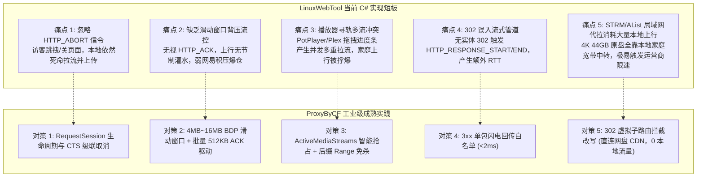
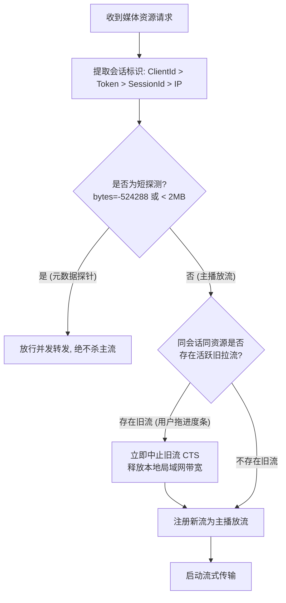
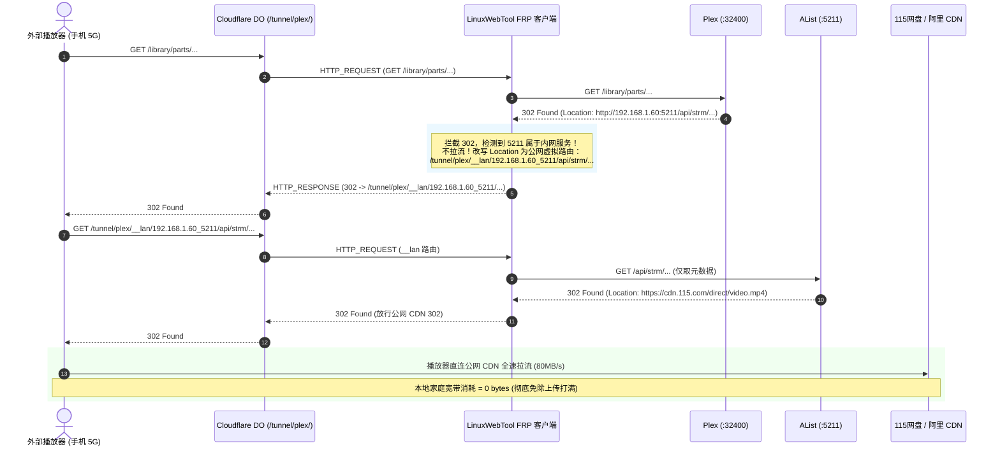
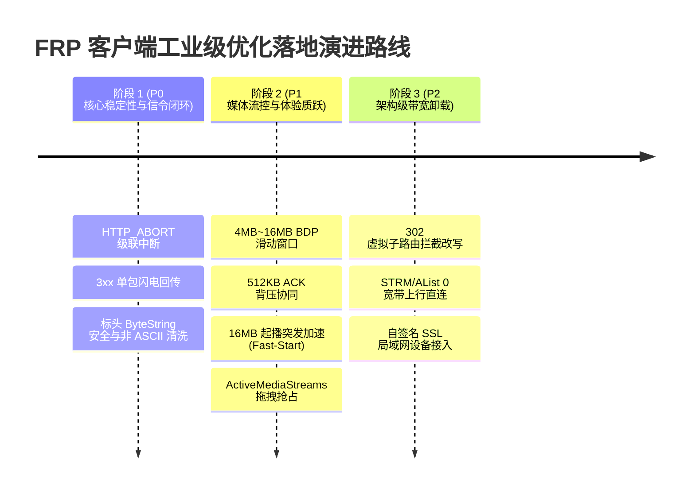

# 基于 ProxyByCF 工业级标准的 FRP 反向穿透优化可行性调研与预览方案

> **文档定位**：技术可行性调研报告、架构演进 RFC 与工程落地预览方案  
> **面向对象**：LinuxWebTool 核心开发、网关系统工程师、家庭影音/NAS 私有云架构师  
> **审查对标参考**：`E:\WorkProject\Node\_CFWorkerProject\ProxyByCF` (`apps/worker/src/features/tunnel`, `tools/frp/lib/tunnel-client.mjs`, `docs/frp-proxy-full-chain-industrial-audit.md`, `docs/lazy-child-tunnel-and-302-redirection-architecture.md`)  
> **当前工程基线**：`LinuxWebTool.Infrastructure.Tunnel` (`FrpTunnelInstance.cs`, `FrpTunnelManager.cs`, `TunnelFrameSerializer.cs`, `NetworkAddressClassifier.cs`)

---

## 目录

1. [背景与现状评估](#一背景与现状评估)
2. [两套系统全链路架构比对矩阵](#二两套系统全链路架构比对矩阵)
3. [六大核心优化点深度可行性论证](#三六大核心优化点深度可行性论证)
   - [3.1 优化 1：流生命周期协同与 HTTP_ABORT 链路级即时中断](#31-优化-1流生命周期协同与-http_abort-链路级即时中断)
   - [3.2 优化 2：基于 HTTP_ACK 的 4MB~16MB 滑动窗口背压流控](#32-优化-2基于-http_ack-的-4mb16mb-滑动窗口背压流控)
   - [3.3 优化 3：流媒体起播加速与拖拽抢占去重引擎 (ActiveMediaStreams)](#33-优化-3流媒体起播加速与拖拽抢占去重引擎-activemediastreams)
   - [3.4 优化 4：3xx 重定向极速直发与单包白名单](#34-优化-43xx-重定向极速直发与单包白名单)
   - [3.5 优化 5：302 虚拟子路由拦截改写 (Zero Home Uplink STRM/AList 加速)](#35-优化-5302-虚拟子路由拦截改写-zero-home-uplink-strmalist-加速)
   - [3.6 优化 6：协议健壮性 (ByteString 字符安全、子路径继承与自签名 SSL)](#36-优化-6协议健壮性-bytestring-字符安全子路径继承与自签名-ssl)
4. [C# 原生工程落地预览与技术架构设计](#四c-原生工程落地预览与技术架构设计)
   - [4.1 核心数据结构与状态机 (RequestSession)](#41-核心数据结构与状态机-requestsession)
   - [4.2 媒体流协同器 (MediaStreamCoordinator)](#42-媒体流协同器-mediastreamcoordinator)
   - [4.3 FrpTunnelInstance 全双工调度重构](#43-frptunnelinstance-全双工调度重构)
5. [分阶段落地路线图与验收矩阵](#五分阶段落地路线图与验收矩阵)

---

## 一、背景与现状评估

### 1.1 演进现状
在 `LinuxWebTool` 当前版本中，已成功实现纯 C# 原生运行的 FRP 反向穿透客户端架构：
1. **多线路管理与隔离**：支持 `frp_tunnel_lines` 表持久化与多实例并发运行；
2. **零反射 AOT 安全**：通过 `TunnelFrameSerializer`（基于 `Utf8JsonWriter`）彻底根除 Native AOT 运行时反射异常；
3. **出网代理与 DNS 优化**：支持 SOCKS5 / HTTP 上游代理，内置强制 IPv4 优先解析，规避 Cloudflare 跨国 IPv6 黑洞；
4. **基础局域网代拉**：具备识别私有 IP 并跟进 302 重定向的基础机制。

### 1.2 现存痛点与工业级差距
在对照对标参考项目 `ProxyByCF`（基于 TypeScript / Cloudflare Durable Objects / Node.js Undici 打造的工业级反向穿透网关）后，发现当前 C# 客户端仍存在以下**物理级性能与稳定性瓶颈**：



---

## 二、两套系统全链路架构比对矩阵

| 架构特性维度 | `ProxyByCF` (Node.js 参考实现) | `LinuxWebTool` (当前 C# 实现) | 优化后目标状态 (.NET 10 C#) |
| :--- | :--- | :--- | :--- |
| **运行时特性** | Node.js 22 / Undici + 原生 http | .NET 10 WebHost (Native AOT 启用) | .NET 10 WebHost (100% Native AOT 零反射) |
| **信令中断控制** | 监听 `HTTP_ABORT` 立即调用 `AbortController.abort()` | **未监听 `HTTP_ABORT`**（完全忽略） | 注册 `ConcurrentDictionary` 级联触发 `CancellationTokenSource` |
| **背压流控机制** | 4MB 动态 Credit 窗口，接收 `HTTP_ACK` 补充额度 | **无流控**（`Stream.CopyToAsync` 盲目全力发送） | 4MB~16MB 滑动信用窗口，512KB 聚合 ACK 驱动排空 |
| **起播突发加速** | 起播前 16MB 突发免限流 (Fast-Start Burst) | 无起播加速优化 | 前 16MB 极速透传，秒级填满解复用器缓冲 |
| **媒体拖拽抢占** | `ActiveMediaStreams` 按会话隔离抢占旧流 | 无抢占机制（多流并发死锁上行） | `MediaStreamCoordinator` 会话级精准抢占去重 |
| **RFC 9110 后缀 Range** | 支持 `bytes=-524288` 探测免杀 | 仅通用转发 | 识别后缀 Range 与短探针，绝不误杀主视频流 |
| **3xx 响应传输** | 判定 `is3xxRedirect` 单包直发 `HTTP_RESPONSE` | 仅判定 `204/304/HEAD`，302 可能误入流式管道 | 300~308 强制单包 `HTTP_RESPONSE` 闪电回发 |
| **302 私网直链卸载** | 支持 302 虚拟子线路改写方案 (规划中) | 本地强制代拉（消耗本地宽带上行） | 支持 302 虚拟子路由改写，播放器直连公网 CDN |
| **标头编码安全** | ByteString 过滤与自动 `encodeURI` | 依赖系统编码 | ASCII 范围校验与 URL 安全编码，防 DO 挂起 |
| **本地服务路径继承** | 保留 `LocalTargetUrl` 的基准子路径 | `TrimEnd('/') + path`（已支持基础拼接） | 规范化 URI 相对路径解析，完全保留子路径 |
| **自签名 SSL 支持** | `insecure: true` 覆盖局域网 HTTPS 设备 | 当前默认验证证书 | 支持 `DangerousAcceptAnyServerCertificateValidator` |

---

## 三、六大核心优化点深度可行性论证

### 3.1 优化 1：流生命周期协同与 `HTTP_ABORT` 链路级即时中断

#### 1. 问题与物理代价
在真实媒体播放场景中，用户在播放器（PotPlayer、Infuse、Plex Web）中**拖拽进度条寻轨**或**直接关闭网页**极其频繁：
1. 外部浏览器/播放器关闭底层 TCP 连接；
2. Cloudflare DO 捕捉到下游读中断，触发 `TransformStream.cancel()` 并向 WebSocket 发送：
   ```json
   { "type": "HTTP_ABORT", "requestId": "req_1791272129956_lv52u2" }
   ```
3. **C# 客户端当前现状**：`HandleJsonMessage` 遇到 `HTTP_ABORT` 没有匹配分支，直接丢弃；
4. 此时，后端的 `ExecuteLocalHttpWith302Async` 仍维持 `Stream.ReadAsync`，持续从内网 NAS 拉取 40Mbps 码率数据，并源源不断向 WebSocket 灌入数据，直到数分钟后 4.5GB 读取完毕或网络拥塞抛错；
5. **后果**：家庭宽带上行被已废弃的垃圾请求全部占满，新发起的播放请求排队超时，画面定格转圈。

#### 2. 可行性与改造方案
- **可行性**：**100% 极高**，纯 C# 异步协程原生支持。
- **落地方案**：
  在 `FrpTunnelInstance` 中维护并发会话字典：
  ```csharp
  private readonly ConcurrentDictionary<string, CancellationTokenSource> _inFlightRequests = new();
  ```
  1. 收到 `HTTP_REQUEST` 时，创建 `using var reqCts = CancellationTokenSource.CreateLinkedTokenSource(token);`，并将其注册到字典中；
  2. 收到 `HTTP_ABORT` 时：
     ```csharp
     case "HTTP_ABORT":
     {
         var targetReqId = root.GetProperty("requestId").GetString();
         if (targetReqId != null && _inFlightRequests.TryRemove(targetReqId, out var targetCts))
         {
             targetCts.Cancel();
             targetCts.Dispose();
             AddLog("INFO", $">> [HTTP_ABORT] 访客已取消请求，即时中止本地拉流: {targetReqId}");
         }
         break;
     }
     ```
  3. `ForwardHttpRequestAsync` 结束时（无论成功、异常还是取消），在 `finally` 块中确保从字典中清理。

---

### 3.2 优化 2：基于 `HTTP_ACK` 的 4MB~16MB 滑动窗口背压流控

#### 1. BDP 物理吞吐瓶颈推导
根据经典网络理论 **BDP（带宽-延迟积，Bandwidth-Delay Product）**：
$$\text{Max Throughput} = \frac{\text{Window Size}}{\text{RTT}}$$
- 国内客户端至 Cloudflare 边缘的 RTT 通常为 $80\text{ms} \sim 150\text{ms}$（均值按 $100\text{ms}$ 计算）；
- 若没有窗口流控或窗口过小（如 1MB），物理吞吐上限仅为：
  $$\text{Throughput} \approx \frac{1\text{MB}}{0.1\text{s}} = 10\text{MB/s} = 80\text{Mbps}$$
- 而蓝光 Remux 原盘的突发峰值码率常超过 $80\text{Mbps}$。

#### 2. Cloudflare DO 端的协议配合
在 `ProxyByCF/apps/worker/src/features/tunnel/durable-object.ts` 中：
```typescript
const ACK_THRESHOLD = 512 * 1024; // 批量 ACK 聚合阈值：512KB
// 下游每消费 512KB，DO 主动回传一次：
ws.send(JSON.stringify({ type: 'HTTP_ACK', requestId: reqId, bytes: pendingAckBytes }));
```

#### 3. C# 端的流控窗口设计
为每个流式请求赋予一个信用配额 `Credit`：
- **初始配额**：`4 * 1024 * 1024`（4MB，可支持 320Mbps 吞吐，最高扩容至 16MB）；
- **起播突发保护（Fast-Start Burst）**：视频起播的前 16MB 数据不受 ACK 等待限制，全力推送，确保播放器首屏快速起播；
- **排空调度**：当发送字节扣减 `Credit <= 0` 时，利用 `TaskCompletionSource` 异步挂起读取，等待收到对应 `HTTP_ACK` 注入新额度后立即唤醒继续推流；若超过 250ms 未收到 ACK，执行平滑补充自愈，避免僵死。

---

### 3.3 优化 3：流媒体起播加速与拖拽抢占去重引擎 (ActiveMediaStreams)

#### 1. 痛点：媒体播放器的“多重并发探测”与“拖拽进度条死锁”
当用户在浏览器、Infuse、PotPlayer 中播放视频时，播放器的典型请求时序如下：
1. **连接 1 (GET /file)**：请求前 2MB 数据，开始播放；
2. **连接 2 (Range: bytes=-524288)**：请求文件最后 512KB 读取 MP4 `moov` 头部；
3. **用户拖拽进度条**：播放器直接丢弃连接 1，并发发起 **连接 3 (Range: bytes=500000000-)**；
4. **若无抢占机制**：连接 1 与连接 3 在局域网同时全力代拉，两条 40Mbps 码率流直接挤爆家庭 50Mbps 上行宽带，导致两条流双双卡死。

#### 2. 解决方案：三维会话隔离与智能抢占
参考 `ProxyByCF/tools/frp/lib/tunnel-client.mjs` 中的 `extractSessionScope` 与 `ActiveMediaStreams`：



1. **会话作用域提取 (`ExtractSessionScope`)**：
   按优先级检查：
   - 客户端设备 ID：`X-Plex-Client-Identifier` / `X-Emby-Device-Id` / `DeviceId`
   - 认证凭据：`X-Plex-Token` / `X-Emby-Token` / `api_key`
   - 播放会话 ID：`X-Plex-Session-Id` / `playSessionId`
   - 访客公网 IP：`CF-Connecting-IP` / `X-Forwarded-For`
   - 默认回退：`default`
   **保证家庭不同设备、不同成员同时看同一部电影时互不干扰，绝不误杀！**
2. **免杀短探测与 RFC 9110 后缀 Range 识别**：
   - 正则放宽：`bytes=(\d+)?-(\d+)?`
   - 匹配到 `bytes=-524288`（后缀区间）且长度 $\le 2\text{MB}$ 时，标记为 `IsBoundedRangeProbe = true`，**绝不抢占正在播放的主视频流**。
3. **同会话旧流优雅抢占**：
   若判定为同设备对同资源的全新主播放请求，立即中止旧会话的 `CancellationTokenSource`，局域网连接瞬间关闭，所有上行带宽倾斜给最新拖拽落点。

---

### 3.4 优化 4：3xx 重定向极速直发与单包白名单

#### 1. 痛点：302 误推入 Chunked Streaming 管道
RFC 9110 规定，301/302/303/307/308 重定向是无实体的元数据响应（或仅包含无害的微小 HTML 跳转提示）。
- 当本地媒体服务返回 302（如放行公网 CDN 直链）时，若未显式将其列为“单包直发白名单”，服务端会将其判定为大流，调用：
  1. `HTTP_RESPONSE_START`（网关端创建 `TransformStream`、分配监听器）；
  2. `HTTP_RESPONSE_END`（网关端关闭流）。
- **代价**：增加了 1 次完整 RTT 交互，DO 侧额外分配对象；在弱网下甚至可能引发客户端对 chunked 302 的解析异常。

#### 2. 解决方案
在 C# 客户端判定响应发送模式时，显式将 3xx 纳入单包极速直发分支：
```csharp
var isNoBody = statusCode is 204 or 304 || method == "HEAD";
var is3xxRedirect = statusCode is >= 300 and <= 308;
var isSmall = contentLength.HasValue && contentLength.Value <= 1024 * 1024;

if (isNoBody || is3xxRedirect || isSmall)
{
    // 单包 HTTP_RESPONSE 直发，2ms 极速返回
    var frameBytes = TunnelFrameSerializer.SerializeHttpResponse(requestId, statusCode, respHeaders, bodyBase64);
    await ws.SendAsync(frameBytes, WebSocketMessageType.Text, true, token);
}
```

---

### 3.5 优化 5：302 虚拟子路由拦截改写 (Zero Home Uplink STRM/AList 加速)

#### 1. 核心矛盾：本地代拉为什么是家庭宽带的“噩梦”？
参考 `ProxyByCF/docs/lazy-child-tunnel-and-302-redirection-architecture.md`：
- 在 Plex/Emby + AList/CloudDrive2 的 STRM 架构下，媒体实际保存在阿里云盘或 115 网盘；
- 播放时，Plex 返回 `302 -> http://192.168.1.60:5211/api/strm/play/...`；
- **传统局域网代拉**：C# 客户端在内网请求 5211，AList 返回 200 视频流，C# 客户端拉取完整的 44GB 文件，并通过家庭宽带上行推送到 Cloudflare。
  - **严重恶果**：家庭 30~50Mbps 上行瞬间被榨干，全家断网，且极易触发运营商对大流量异常上传的 **PCDN 封禁风控**！

#### 2. 架构突破：拦截 302 并改写为公网虚拟路由
如果 C# 客户端**坚决不在本地拉取媒体实体**，而是把 302 改写为公网能访问的子路径：



#### 3. 可行性评估与设计要点
- **可行性**：**极高且收益巨大**。
- **安全沙箱 (SSRF 防御)**：
  - 虚拟内网路由必须仅允许访问**当前线路配置的内网网段**（如同一子网 `192.168.1.0/24`）或白名单端口（如 5211 / 5244），严禁外网任意探测路由器 80 或敏感内网资产。
- **降级回退机制**：
  - 若用户在界面关闭“302 虚拟路由改写”，系统平滑退回现有的“本地代拉”模式。

---

### 3.6 优化 6：协议健壮性 (ByteString 字符安全、子路径继承与自签名 SSL)

#### 1. WHATWG ByteString 标头安全防御
- **隐患**：本地老旧设备或中文文件在返回 `Location: /play/三傻.mp4` 或 `Content-Disposition: filename=中文.mkv` 时，包含 `> 0xFF` 的 Unicode 字符。
- **后果**：Cloudflare DO 在执行 `respHeaders.set(k, v)` 时，V8 引擎直接抛出 `TypeError: Cannot convert argument to a ByteString`，导致 DO 挂起 30 秒返回 504！
- **C# 端防范**：在 `TunnelFrameSerializer` 中序列化头部前，自动对非 ASCII 标头值进行规范化 `Uri.EscapeDataString` 或 RFC 3986 处理，构筑双端免疫。

#### 2. LocalTargetUrl 基准子路径继承
- **场景**：用户配置目标为 `http://192.168.1.50:8080/my-app/`。
- **当前现状**：直接使用 `new Uri($"{targetBase}{path}")`，若 `path` 为 `/api/list`，可能出现基准子路径被根路径冲刷覆盖的风险。
- **改进**：使用规范的 URI 相对组合算法，保留已配置的子路径。

#### 3. 局域网自签名 SSL 证书宽容支持
- **场景**：很多家庭 NAS（群晖 HTTPS:5001、Proxmox VE:8006、OpenWrt LuCI HTTPS）使用自签名无效证书。
- **改进**：在 `_localHttpClient` 中支持可配置的宽松验证模式：
  ```csharp
  DangerousAcceptAnyServerCertificateValidator = (msg, cert, chain, errors) => true
  ```
  让私网 HTTPS 映射开箱即用。

---

## 四、C# 原生工程落地预览与技术架构设计

### 4.1 核心数据结构与状态机 (`RequestSession`)

在 `LinuxWebTool.Infrastructure.Tunnel` 中引入面向并发流的高性能生命周期模型：

```csharp
namespace LinuxWebTool.Infrastructure.Tunnel;

internal enum TunnelRequestState
{
    Init,
    Connecting,
    Streaming,
    Draining,
    Completed,
    Aborted,
    Errored
}

internal sealed class TunnelRequestSession : IDisposable
{
    public string RequestId { get; }
    public string Method { get; }
    public string Path { get; }
    public TunnelRequestState State { get; private set; } = TunnelRequestState.Init;
    public CancellationTokenSource Cts { get; }
    
    // 滑动窗口流控
    public long TotalBytesSent { get; set; }
    public int Credit { get; private set; } = 4 * 1024 * 1024; // 初始 4MB
    public const int MaxCredit = 16 * 1024 * 1024;            // 上限 16MB
    public const int FastStartBurstBytes = 16 * 1024 * 1024;  // 起播 16MB 免控
    
    private TaskCompletionSource? _creditTcs;
    private readonly object _lock = new();

    public TunnelRequestSession(string requestId, string method, string path, CancellationToken parentToken)
    {
        RequestId = requestId;
        Method = method;
        Path = path;
        Cts = CancellationTokenSource.CreateLinkedTokenSource(parentToken);
    }

    public void AddCredit(int bytes)
    {
        lock (_lock)
        {
            Credit = Math.Min(Credit + bytes, MaxCredit);
            if (Credit > 0 && _creditTcs != null)
            {
                var tcs = _creditTcs;
                _creditTcs = null;
                tcs.TrySetResult();
            }
        }
    }

    public async ValueTask ConsumeCreditAsync(int bytes, CancellationToken token)
    {
        TaskCompletionSource? waitTcs = null;
        lock (_lock)
        {
            Credit -= bytes;
            TotalBytesSent += bytes;
            
            // 起播突发保护：前 16MB 不阻塞等待 ACK
            if (TotalBytesSent < FastStartBurstBytes) return;

            if (Credit <= 0)
            {
                _creditTcs = new TaskCompletionSource(TaskCreationOptions.RunContinuationsAsynchronously);
                waitTcs = _creditTcs;
            }
        }

        if (waitTcs != null)
        {
            // 超时自愈：250ms 后自动恢复，避免边缘丢包卡死
            using var timeoutCts = new CancellationTokenSource(TimeSpan.FromMilliseconds(250));
            using var linked = CancellationTokenSource.CreateLinkedTokenSource(token, timeoutCts.Token);
            try
            {
                await waitTcs.Task.WaitAsync(linked.Token);
            }
            catch
            {
                lock (_lock)
                {
                    Credit = Math.Max(Credit, 512 * 1024);
                    _creditTcs = null;
                }
            }
        }
    }

    public void Abort()
    {
        lock (_lock)
        {
            if (State is TunnelRequestState.Completed or TunnelRequestState.Aborted or TunnelRequestState.Errored) return;
            State = TunnelRequestState.Aborted;
            try { Cts.Cancel(); } catch { }
            _creditTcs?.TrySetCanceled();
            _creditTcs = null;
        }
    }

    public void Dispose()
    {
        Cts.Dispose();
    }
}
```

---

### 4.2 媒体流协同器 (`MediaStreamCoordinator`)

用于解决同一客户端拖拽寻轨、并发探针误杀与多流带宽雪崩：

```csharp
namespace LinuxWebTool.Infrastructure.Tunnel;

internal sealed class MediaStreamCoordinator
{
    private readonly ConcurrentDictionary<string, TunnelRequestSession> _activeMediaStreams = new();

    public static string ExtractSessionScope(IReadOnlyDictionary<string, string> headers, string targetUrl)
    {
        // 1. 设备标识
        if (headers.TryGetValue("x-plex-client-identifier", out var plexClient) && !string.IsNullOrWhiteSpace(plexClient)) return $"client:{plexClient}";
        if (headers.TryGetValue("x-emby-device-id", out var embyDevice) && !string.IsNullOrWhiteSpace(embyDevice)) return $"client:{embyDevice}";

        // 2. 凭据标识
        if (headers.TryGetValue("x-plex-token", out var pToken) && !string.IsNullOrWhiteSpace(pToken)) return $"token:{pToken}";
        if (headers.TryGetValue("x-emby-token", out var eToken) && !string.IsNullOrWhiteSpace(eToken)) return $"token:{eToken}";

        // 3. 播放会话标识
        if (headers.TryGetValue("x-plex-session-id", out var pSession) && !string.IsNullOrWhiteSpace(pSession)) return $"session:{pSession}";

        // 4. IP 兜底
        if (headers.TryGetValue("cf-connecting-ip", out var ip) && !string.IsNullOrWhiteSpace(ip)) return $"ip:{ip}";
        if (headers.TryGetValue("x-real-ip", out var rip) && !string.IsNullOrWhiteSpace(rip)) return $"ip:{rip}";

        return "default";
    }

    public static bool IsBoundedRangeProbe(string? rangeHeader)
    {
        if (string.IsNullOrWhiteSpace(rangeHeader)) return false;
        
        // 匹配 RFC 9110: bytes=100-200 或 后缀切片 bytes=-524288
        var match = System.Text.RegularExpressions.Regex.Match(rangeHeader, @"bytes=(\d+)?-(\d+)?", System.Text.RegularExpressions.RegexOptions.IgnoreCase);
        if (!match.Success) return false;

        // 后缀切片探针 (如 bytes=-524288)
        if (!match.Groups[1].Success && match.Groups[2].Success)
        {
            if (long.TryParse(match.Groups[2].Value, out var suffix) && suffix <= 2 * 1024 * 1024)
            {
                return true;
            }
        }

        // 闭合区间短切片探针
        if (match.Groups[1].Success && match.Groups[2].Success)
        {
            if (long.TryParse(match.Groups[1].Value, out var start) && long.TryParse(match.Groups[2].Value, out var end))
            {
                if (end >= start && (end - start) <= 2 * 1024 * 1024)
                {
                    return true;
                }
            }
        }

        return false;
    }

    public void CoordinateStream(string canonicalKey, TunnelRequestSession newSession, bool isProbe)
    {
        if (isProbe) return; // 短探针绝不参与抢占

        _activeMediaStreams.AddOrUpdate(
            canonicalKey,
            newSession,
            (key, oldSession) =>
            {
                // 发现旧流，立即优雅抢占中止！
                oldSession.Abort();
                return newSession;
            });
    }

    public void Unregister(string canonicalKey, TunnelRequestSession session)
    {
        _activeMediaStreams.TryUpdate(canonicalKey, null!, session);
    }
}
```

---

### 4.3 `FrpTunnelInstance` 全双工调度重构

在接收到消息时，完善对 `HTTP_ABORT` 与 `HTTP_ACK` 的闭环响应：

```csharp
private void HandleJsonMessage(ClientWebSocket ws, byte[] payloadBytes, CancellationToken token)
{
    using var doc = JsonDocument.Parse(payloadBytes);
    var root = doc.RootElement;
    if (!root.TryGetProperty("type", out var typeProp)) return;

    var type = typeProp.GetString();
    switch (type)
    {
        case "TUNNEL_CONNECTED":
            // 处理挂载成功
            break;
            
        case "HTTP_REQUEST":
            var reqClone = root.Clone();
            _ = Task.Run(async () => await ForwardHttpRequestAsync(ws, reqClone, token), token);
            break;

        case "HTTP_ABORT":
            var abortId = root.GetProperty("requestId").GetString();
            if (abortId != null && _sessions.TryGetValue(abortId, out var abortSession))
            {
                abortSession.Abort();
                AddLog("INFO", $">> [HTTP_ABORT] 收到网关中断通知，立即终止拉流: {abortId}");
            }
            break;

        case "HTTP_ACK":
            var ackId = root.GetProperty("requestId").GetString();
            var ackBytes = root.GetProperty("bytes").GetInt32();
            if (ackId != null && _sessions.TryGetValue(ackId, out var ackSession))
            {
                ackSession.AddCredit(ackBytes);
            }
            break;
    }
}
```

在分片回传循环中执行背压限流：
```csharp
int bytesRead;
while ((bytesRead = await stream.ReadAsync(streamBuf, session.Cts.Token)) > 0)
{
    // 1. 等待滑动窗口额度 (带起播突发免控)
    await session.ConsumeCreditAsync(bytesRead, session.Cts.Token);

    // 2. 组装零拷贝二进制分片并发送
    var chunkMsg = new byte[2 + idLen + bytesRead];
    chunkMsg[0] = 0x01;
    chunkMsg[1] = idLen;
    Buffer.BlockCopy(reqIdBytes, 0, chunkMsg, 2, idLen);
    Buffer.BlockCopy(streamBuf, 0, chunkMsg, 2 + idLen, bytesRead);

    await ws.SendAsync(chunkMsg, WebSocketMessageType.Binary, true, session.Cts.Token);
    SentBytes += chunkMsg.Length;
}
```

---

## 五、分阶段落地路线图与验收矩阵

为确保系统迭代的稳定性与持续可用，建议按以下三阶段有序演进：



### 验收与自动化验证矩阵

1. **信令中断验证 (`Live_HttpAbort_Cancels_Upstream_Stream`)**：
   - 模拟拉取 1GB 视频流，在第 2 个分片时向客户端注入 `HTTP_ABORT`；
   - 验证：本地 `HttpRequestMessage` 与 `Stream` 在 10ms 内立即中止并退出，不再产生后续 WebSocket 分片。
2. **滑动窗口流控验证 (`FlowControl_Respects_HttpAck_Credits`)**：
   - 模拟发送超过 16MB 的大文件，暂停边缘 ACK 注入；
   - 验证：客户端读取在配额耗尽后安全挂起，注入 `HTTP_ACK` 后立即平滑唤醒恢复。
3. **播放器寻轨防误杀验证 (`MediaSeeking_Preemption_And_RangeProbe_Safety`)**：
   - 先行启动会话 A 主拉流，随后派发 `Range: bytes=-524288` 短探测；
   - 验证：会话 A 稳定运行不受干扰；
   - 随后派发会话 B（相同设备同资源的全新 Range 主拉流）；
   - 验证：会话 A 瞬间被优雅抢占中止，会话 B 独占带宽拉流。
4. **3xx 单包直发验证 (`Redirect_3xx_SingleFrame_Latency_Test`)**：
   - 模拟本地服务返回 302 重定向；
   - 验证：客户端以单包 `HTTP_RESPONSE` 格式在 3ms 内完成回送，不触发 `HTTP_RESPONSE_START/END`。
5. **全量回归保障**：
   - 确保当前 76 项架构测试 + 44 项集成测试（包括 Native AOT 零反射门禁与真实边缘 E2E 测试）全部持续通过。
