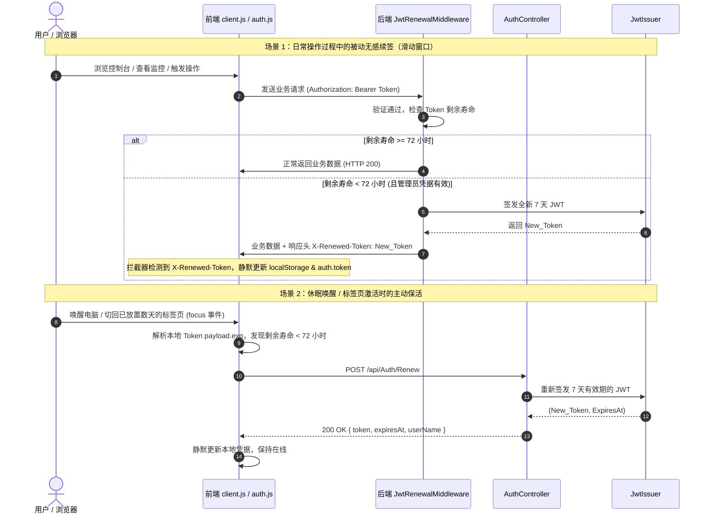

# JWT 有效期延长与滑动窗口自动续期方案

## 1. 目标与背景

在 `LinuxWebTool` 当前版本中，JWT（JSON Web Token）配置的默认生命周期为 **12 小时**（`ExpireHours = 12`）。
在实际运维管理与个人服务器（Homelab / NAS / 云主机）使用场景中，存在以下痛点：

1. **会话生命周期过短**：管理员下班回家、手机端隔夜查看或第二天上班打开管理后台时，登录凭据必然已过期，强制跳转登录页，打断正在监控的状态或操作流。
2. **缺乏无感续期机制**：无论用户是否处于持续活跃操作状态，到达 12 小时即刻硬性失效，缺乏主流管理系统的滑动会话（Sliding Session）机制。
3. **安全与便利性的平衡诉求**：作为私有化部署的单管理员/多凭据管理面板，既需要长效维持免登录体验（如 7~30 天），又需要在管理员显式改密/改用户名时，旧 Token 能够立即失效。

因此，本项目需要：
- 将默认有效时间由 12 小时提升至 **7 天（168 小时）**，并支持配置最高 30 天或任意时长；
- 引入**双轨滑动窗口自动续期体系**（响应头被动无感续期 + 前端休眠唤醒主动续期），只要用户持续使用即永不掉线，超时未访问则安全过期。

---

## 2. 可行性调研与技术选型

### 2.1 候选方案对比

| 方案 | 机制说明 | 优点 | 缺点 | 结论 |
|---|---|---|---|---|
| **方案 A：静态超长有效期** | 将 ExpireHours 直接改为 30 天或 180 天，不续期 | 实现极简，无额外网络调用 | 到期瞬间依然会强行断开；若 Token 泄漏，风险窗口过长且无法优雅刷新 | ❌ 体验不连贯 |
| **方案 B：OAuth2 双 Token (Access + Refresh)** | Access Token (15分钟) + Refresh Token (30天)，落库轮换 | 标准协议规范，支持细粒度吊销 | 需引入 Refresh Token 持久化表、并发刷新互斥锁、轮换冲突处理；对轻量级 AOT 单租户系统过于臃肿 | ❌ 复杂度过高 |
| **方案 C：滑动窗口滚动续期 (Sliding Window JWT)** | 基础有效期 7 天，剩余寿命 < 3 天时在正常请求中自动置换新 Token | 零额外存储开销、完全兼容 Native AOT、全透明无感置换、强密码学闭环 | 需要前后端轻量拦截器配合 | ✅ **最佳选择** |

### 2.2 方案 C 的安全性与正确性论证

1. **防重放与密钥持久化**：
   `LinuxWebTool` 已实现 `data/jwt-secret.key` 密钥文件持久化（64 字节高熵随机密钥）。即使后端程序平滑重启或升级，Token 仍能正常校验，不会引起异常登出。
2. **凭据联动失效保障（Security Stamp 独立安全戳记机制）**：
   - **防止指纹泄露**：JWT Payload 仅为 Base64Url 编码，明文对外可见。为防止密码散列特征泄露，系统严禁在 Token 中放置任何 `PasswordHash` 或其切片，而是采用符合 ASP.NET Core 官方工业标准的**独立随机安全戳记（Security Stamp）**。
   - **数据结构与解耦**：在 `admin.json` 中维护高熵随机 UUID `securityStamp`。签发 JWT 时仅注入 `stamp: Account.SecurityStamp`，Token 内部与密码/哈希算法完全脱钩，攻击者无法获取任何密码学特征。
   - **全链路秒级吊销**：每次管理员修改密码或修改用户名，`AdminCredentialService.UpdateCredential` 自动轮换 `SecurityStamp`。
   - **鉴权与续签双重门禁**：
     - 在 `AddJwtBearer` 的 `JwtBearerEvents.OnTokenValidated` 中比对 `stamp`：改密后旧 Token 的任何受保护 API 请求立即被判定为无效，直接返回 `401 Unauthorized` 并引导前端清除本地凭据退出登录；
     - 在 `JwtRenewalMiddleware` 与 `AuthController.Renew` 中联动核验 `stamp`：改密后旧 Token 绝无续期可能。
3. **并发安全与幂等性**：
   滑动窗口在 Token 剩余寿命小于阈值（例如 `< 72 小时`）时才触发置换。即使前端短时间内并发发出多个请求，后端多次返回新 Token，由于都是相同密钥生成的有效 JWT，前端无论保存哪一个均可合法通行，不会出现 Refresh Token 模式中的“二次刷新作废”并发竞态问题。

---

## 3. 架构与流程设计



---

## 4. 详细技术方案

### 4.1 后端核心设计

#### 1. 配置模型扩展 (`JwtOptions`)
在 `src/LinuxWebTool.Infrastructure/Features/Security/Adapters/JwtIssuer.cs` 中增加续期配置项：

```csharp
public sealed class JwtOptions
{
    public const string SectionName = "Jwt";

    public string SecretKey { get; set; } = string.Empty;
    public string Issuer { get; set; } = "LinuxWebTool";
    public string Audience { get; set; } = "LinuxWebTool";

    /// <summary>Token 基础有效时长（小时）。默认 168 小时（7 天）。</summary>
    public int ExpireHours { get; set; } = 168;

    /// <summary>触发自动续期的剩余时间阈值（小时）。默认 72 小时（3 天）。</summary>
    public int RefreshThresholdHours { get; set; } = 72;

    /// <summary>是否开启滑动窗口自动续期。默认 true。</summary>
    public bool EnableAutoRenewal { get; set; } = true;
}
```

#### 2. 签发器核验能力扩展 (`JwtIssuer`)
在 `JwtIssuer` 中提供判断是否满足续期条件的高性能解析方法：
- 解析当前 `ClaimsPrincipal` 中的 `exp` 声明；
- 若 `expiresAt - DateTimeOffset.UtcNow < TimeSpan.FromHours(_options.RefreshThresholdHours)` 且大于 0，则判定为需要续签；
- 输出当前有效的 `userName`。

#### 3. 滑动窗口续签中间件 (`JwtRenewalMiddleware`)
注册在 `UseAuthentication()` 与 `UseAuthorization()` 之后：
- 若请求已通过 JWT 认证，调用 `jwtIssuer.ShouldRenew(context.User, out var userName)`；
- 校验 `adminCredential.Account.UserName == userName`；
- 签发新 Token，注入以下响应头：
  - `X-Renewed-Token: <New_Token>`
  - `Access-Control-Expose-Headers: X-Renewed-Token, X-Token-Expires`
  - `X-Token-Expires: <ISO8601_Timestamp>`

#### 4. 主动续签端点 (`AuthController.cs`)
新增 `POST /api/Auth/Renew`（需 `[Authorize]`）：
- 验证当前用户主体仍为当前活跃管理员；
- 签发新 Token 并返回 `LoginResult(token, expiresAt, userName)`；
- 登记操作日志（`续签 Token`）。

#### 5. Native AOT 与路由契约注册
- 在 `EndpointsMapper.g.cs` 中注册 `group_AuthController.MapPost("Renew", ...)`；
- 在 `AppJsonSerializerContext.cs` 中确保 `LoginResult` 及响应类型均已完全注册；
- 保证契约符合 `LinuxArch012` 架构一致性校验。

---

### 4.2 前端核心设计

#### 1. 唯一请求层响应拦截 (`src/.../app/api/client.js`)
在 `http`、`httpUpload`、`httpDownload` 的统一响应处理管道中：
- 每次获取到 `response` 时，检查 `response.headers.get('x-renewed-token')`；
- 若存在新 Token 且与本地当前存储的值不同，则静默更新：
  ```javascript
  const renewedToken = response.headers.get('x-renewed-token');
  if (renewedToken && renewedToken !== localStorage.getItem(LS_KEYS.token)) {
    localStorage.setItem(LS_KEYS.token, renewedToken);
    auth.token = renewedToken;
  }
  ```

#### 2. 前端状态层主动续约 (`src/.../app/store/auth.js`)
- 提供 `renewToken()` 方法，调用 `POST /api/Auth/Renew`；
- 提供 `getTokenRemainingSeconds()` 解析 JWT Payload，无需额外依赖；
- 页面加载及窗口切回时（`window.addEventListener('focus', ...)`），若本地 Token 剩余有效时间小于 72 小时，自动在后台静默发起 `renewToken()`；
- 每小时执行一次心跳检查，确保长周期保持开机的仪表盘与监控页不会失效。

---

## 5. 落地执行清单

1. [x] 编制可行性与架构方案文档并归档于 `docs/jwt-expiration-and-auto-renewal-plan.md`；
2. [ ] 更新 `JwtOptions`，设置 `ExpireHours = 168`（7天），`RefreshThresholdHours = 72`；
3. [ ] 更新 `JwtIssuer.cs`，实现 `ShouldRenew` 与 UTC 签发逻辑；
4. [ ] 新增 `JwtRenewalMiddleware.cs`，在 WebHost 中间件管道中装配滑动续约；
5. [ ] 在 `AuthController.cs` 中增加 `POST /api/Auth/Renew` 端点；
6. [ ] 在 `EndpointsMapper.g.cs` 与 `app/config.js` 中同步路由声明；
7. [ ] 在前端 `client.js` 与 `auth.js` 中接入双轨无感续约机制；
8. [ ] 编写架构与集成功能测试并执行 `./scripts/verify-fast.ps1` 全量门禁验证。
