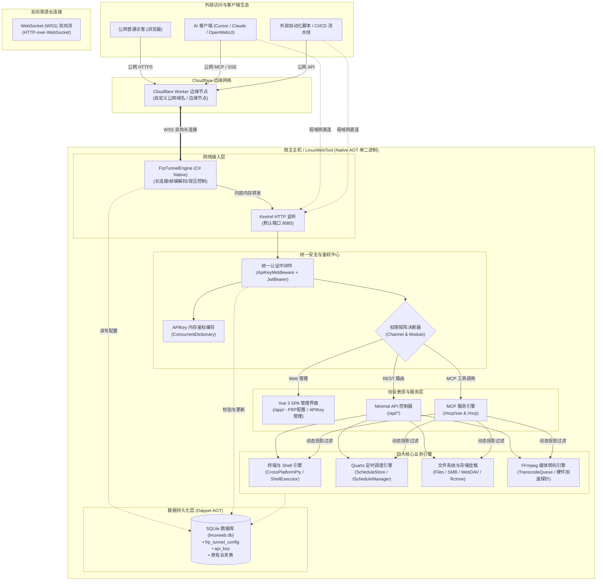
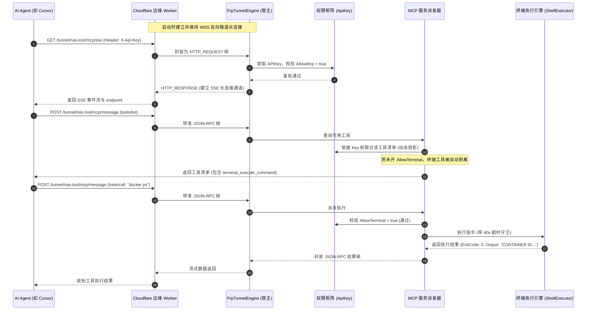

# WebLinuxTool 全功能演进综合架构预览方案

## 1. 方案全景与演进目标

针对以下三大核心扩展需求：
1. **集成 ProxyByCF FRP 反向穿透客户端功能并提供可视化配置页面**；
2. **将「终端、定时任务、文件管理、转码」四大核心能力封装为标准 MCP 服务对外提供**；
3. **构建覆盖「终端、定时任务、文件管理、转码」以及「是否允许 MCP、是否允许 API」的细粒度 APIKey 授权体系**。

本方案旨在保持 `LinuxWebTool` 既有的 **.NET 10 Native AOT 极致轻量性能、零外部运行时依赖（Zero-Dependency）、嵌入式单文件交付** 架构原则下，实现内网穿透能力、AI 智能体生态连接与机器间通信（M2M）安全管控的全面升级。

---

## 2. 系统综合架构拓扑图



---

## 3. 端到端典型调用时序 (End-to-End Sequence)

### 场景：外部 AI 智能体通过 FRP 穿透公网连接 MCP 并安全执行终端指令



---

## 4. 架构门禁与 Native AOT 规范审查 (Architecture Gates)

为确保本项目通过既有的自动化架构门禁（`docs/dev/architecture-gates.md` 与 `tests/LinuxWebTool.ArchitectureTests`），本次设计严格遵循以下规范：

| 架构门禁编号 | 门禁规则 | 本方案的对齐策略与保证 |
|---|---|---|
| **LinuxArch001** | `Contracts` 禁止引用第三方包与框架，仅纯 BCL | 所有新增 DTO（如 `FrpTunnelConfigDto`、`ApiKeyItemResponse`、MCP 参数模型）均置于 `Contracts.Models`，仅使用 C# 基础类型，零外部引用。 |
| **LinuxArch002 / 004** | 分层依赖单向性：Infrastructure 仅依赖 Contracts，下层不反向引用上层 | FRP 隧道核心引擎、APIKey 仓储置于 `Infrastructure`；MCP 端点与 Minimal API 控制器置于 `WebHost`。 |
| **LinuxArch007** | 命名空间必须与物理路径完全一致 | 新增文件命名空间严格与物理子目录保持一致（如 `LinuxWebTool.Infrastructure.Tunnel`、`LinuxWebTool.WebHost.Routes`）。 |
| **LinuxArch008** | AOT 响应类型必须为显式强类型 DTO，严禁匿名对象 | 所有的 REST 接口与 MCP 工具出参均设计为显式声明的 `record`，杜绝 `new { ... }` 投影。 |
| **LinuxArch009 / 012** | Controller Http 特性必须与 `EndpointsMapper.g.cs` 完全一致 | 新增的 `FrpTunnelController` 与 `ApiKeysController` 均在 `EndpointsMapper.g.cs` 中显式登记对应的 Minimal API 路由映射。 |
| **LinuxArch010** | 必须全面兼容 Native AOT，禁用反射 JSON 序列化 | 新增的所有 DTO 与请求响应实体均完整标注于 `AppJsonSerializerContext.cs`，源生成器自动产出序列化代码。 |

---

## 5. 数据库结构汇整 (Unified Database Migrations)

在 `DbSetup.cs` 中合并初始化两张核心扩展表：

```sql
-- 1. FRP 反向穿透配置表
CREATE TABLE IF NOT EXISTS frp_tunnel_config (
  Id TEXT PRIMARY KEY,
  ServerUrl TEXT NOT NULL,
  TunnelHost TEXT NOT NULL,
  ApiKey TEXT NOT NULL,
  LocalTargetUrl TEXT NOT NULL DEFAULT 'http://127.0.0.1:8080',
  AutoStart INTEGER NOT NULL DEFAULT 0,
  HeartbeatIntervalSeconds INTEGER NOT NULL DEFAULT 15,
  Status INTEGER NOT NULL DEFAULT 0,
  LastConnectedAt TEXT,
  LastDisconnectReason TEXT,
  UpdateTime TEXT NOT NULL
);

-- 2. API Key 凭据与权限矩阵表
CREATE TABLE IF NOT EXISTS api_key (
  Id TEXT PRIMARY KEY,
  Name TEXT NOT NULL,
  KeyPrefix TEXT NOT NULL,
  KeyHash TEXT NOT NULL UNIQUE,
  IsEnabled INTEGER NOT NULL DEFAULT 1,
  AllowApi INTEGER NOT NULL DEFAULT 1,
  AllowMcp INTEGER NOT NULL DEFAULT 1,
  AllowTerminal INTEGER NOT NULL DEFAULT 0,
  AllowSchedules INTEGER NOT NULL DEFAULT 0,
  AllowFiles INTEGER NOT NULL DEFAULT 0,
  AllowTranscode INTEGER NOT NULL DEFAULT 0,
  CreatedAt TEXT NOT NULL,
  LastUsedAt TEXT,
  ExpiresAt TEXT
);

CREATE INDEX IF NOT EXISTS idx_api_key_hash ON api_key(KeyHash);
```

---

## 6. 前端控制台视图新增与导航规划

在现有 Vue 3 SPA 前端（`wwwroot/app`）中新增两个主功能页面，并在侧边导航栏合理归类：

```
[ 控制大盘 (Dashboard) ]
[ 指令管理 (Commands)  ]
[ 终端连接 (Terminal)  ]
[ 定时任务 (Schedules) ]
[ 系统状态 (System)    ]
[ 文件浏览 (Files)      ]
[ 存储挂载 (Mounts)    ]
[ 媒体转码 (Transcode) ]
------------------------
[ 🌐 公网穿透 (Frp)     ]  <-- 新增视图: FrpView.js (路由 /frp)
[ 🔑 访问密钥 (Keys)    ]  <-- 新增视图: ApiKeysView.js (路由 /keys)
------------------------
[ 执行历史 (History)   ]
[ 审计日志 (Logs)      ]
```

### 6.1 `FrpView.js` 页面交互与视觉规格
- **穿透状态面板**：大字号展示连接状态与已连接时长，一键复制公网专属入口地址（如 `https://frp.example.com/tunnel/myapp/`）。
- **参数配置卡片**：网关 URL、隧道名称、API Key（掩码输入）、本地映射端口、自启动开关。
- **状态控制栏**：保存配置、立即启动、停止连接、断线重连测试。
- **实时调度日志框**：深色控制台窗口展示心跳往返与实时请求分发记录。

### 6.2 `ApiKeysView.js` 页面交互与视觉规格
- **密钥大盘表格**：展示密钥名称、前缀标识（`lwt_live_8f3a...`）、通道标签（`API`、`MCP`）、模块标签组（`终端`、`任务`、`文件`、`转码`）、启用开关、最后活跃时间。
- **新建向导弹窗**：支持勾选通道与模块权限矩阵，设置过期时间。
- **单次凭据复制弹窗**：创建成功后弹窗警示并展示明文 Key，内置一键复制，并自动生成 Cursor / Claude Desktop 配置片段。

---

## 7. 分阶段落地路线图 (Phased Implementation Roadmap)

```
┌─────────────────────────────────────────────────────────────────────────┐
│ 阶段一：APIKey 权限矩阵与双轨认证基础设施                                 │
│ • 建立 api_key 数据表与 ApiKeyStore 仓储                               │
│ • 实现 ApiKeyService (加盐哈希比对、内存并发缓存)                       │
│ • 升级 ApiKeyMiddleware (实现通道拦截与模块级拦截)                      │
│ • 实现 ApiKeysController 与 ApiKeysView.js 前端管理界面                │
└────────────────────────────────────┬────────────────────────────────────┘
                                     │
┌────────────────────────────────────▼────────────────────────────────────┐
│ 阶段二：四大核心模块工具化与 MCP 服务接入                                │
│ • 声明 16+ 个强类型 MCP Tool DTOs 并注册至 AppJsonSerializerContext   │
│ • 实现四大模块工具提供类 (TerminalTools, ScheduleTools, FileTools等)    │
│ • 实现 MCP 动态投影过滤 (根据当前 APIKey 过滤 tools/list)                │
│ • 挂载 /mcp/sse 与 /mcp 消息通道，验证 Cursor/Claude 联调                │
└────────────────────────────────────┬────────────────────────────────────┘
                                     │
┌────────────────────────────────────▼────────────────────────────────────┐
│ 阶段三：ProxyByCF FRP C# 原生反向穿透引擎集成                            │
│ • 建立 frp_tunnel_config 数据表与持久化仓储                            │
│ • 实现 FrpFrameCodec (JSON 控制帧与二进制切片零拷贝编解码)             │
│ • 实现 FrpTunnelEngine (状态机、ClientWebSocket、心跳保活、4002防踢)     │
│ • 实现 FrpTunnelService 托管后台服务与本地转发分发器                    │
│ • 实现 FrpTunnelController 与 FrpView.js 前端可视化视图                 │
└────────────────────────────────────┬────────────────────────────────────┘
                                     │
┌────────────────────────────────────▼────────────────────────────────────┐
│ 阶段四：全链路集成回归与 Native AOT 门禁验证                            │
│ • 执行 ArchitectureTests 验证分层依赖与命名空间契约                      │
│ • 执行 EndpointsMapper 校验确保所有新增路由映射闭环                     │
│ • 执行 Docker Native AOT 编译冒烟测试 (smoke-aot.ps1)                   │
│ • 模拟外网穿透下携带 APIKey 进行 MCP 远程调用的全链路验证              │
└─────────────────────────────────────────────────────────────────────────┘
```

---

## 8. 关联技术文档索引

为便于各模块的独立审阅与精准实施，已在 `docs/` 目录下完成各专属方案的归档：

1. **FRP 客户端专属技术方案**：[frp-tunnel-client-integration-plan.md](file:///e:/WorkProject/CSharp/PrivateProject/Web/WebToolForLinux/docs/frp-tunnel-client-integration-plan.md)
   - 包含 ProxyByCF 完整协议逆向解析、帧格式、心跳与背压流控、C# 原生状态机设计。
2. **家庭网关与 ProxyYARP 融合方案**：[proxyyarp-integration-and-home-gateway-plan.md](file:///e:/WorkProject/CSharp/PrivateProject/Web/WebToolForLinux/docs/proxyyarp-integration-and-home-gateway-plan.md)
   - 包含吸纳 ProxyYARP 代理库（YARP L7 反向代理、即席网站代理带 HTML/Cookie 改写、L4 TCP/UDP 端口转发）、单隧道穿透家庭全内网服务设计。
3. **MCP 服务与工具封装方案**：[mcp-server-and-tool-encapsulation-plan.md](file:///e:/WorkProject/CSharp/PrivateProject/Web/WebToolForLinux/docs/mcp-server-and-tool-encapsulation-plan.md)
   - 包含四大模块 16+ 个 MCP 工具的详细 JSON Schema 入参定义、返回值 DTO、Native AOT 双轨选型与安全沙箱防护。
4. **APIKey 授权与权限矩阵方案**：[apikey-authorization-and-permission-matrix-plan.md](file:///e:/WorkProject/CSharp/PrivateProject/Web/WebToolForLinux/docs/apikey-authorization-and-permission-matrix-plan.md)
   - 包含加盐哈希安全机制、通道与模块双层鉴权矩阵、动态工具投影过滤、中间件流水线与前端交互模型。
